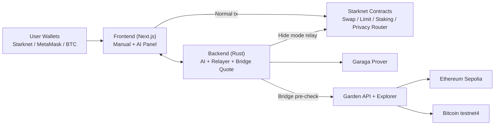

# CAREL Protocol Demo Guide
This guide covers the minimum setup and exact demo flows for showing CAREL Protocol on Starknet Sepolia.

## Table of Contents
- [Prerequisites](#prerequisites)
- [Minimum Setup for Demo](#minimum-setup-for-demo)
- [Architecture Snapshot (Current)](#architecture-snapshot-current)
- [Demo Video Script (3 Minutes)](#demo-video-script-3-minutes)
- [Demo Flow 1: Normal Mode Swap (Optional Smoke Check)](#demo-flow-1-normal-mode-swap-optional-smoke-check)
- [Demo Flow 2: Normal Mode Limit Order (Optional Smoke Check)](#demo-flow-2-normal-mode-limit-order-optional-smoke-check)
- [Demo Flow 3: Hide Mode (Private Swap)](#demo-flow-3-hide-mode-private-swap)
- [Demo Flow 4: Bitcoin Bridge](#demo-flow-4-bitcoin-bridge)
- [Demo Flow 5: AI Assistant (Garaga Required)](#demo-flow-5-ai-assistant-garaga-required)
- [Verifying On-chain](#verifying-on-chain)
- [Troubleshooting](#troubleshooting)

## Prerequisites
- Tooling: `Node.js >= 20`, `npm`, `Rust + cargo`, `PostgreSQL`, `Redis`.
- Wallets:
  - Starknet: Argent X or Braavos (funded on Sepolia).
  - EVM: MetaMask (ETH Sepolia funded).
  - BTC: UniSat or Xverse (BTC testnet funded).
- Faucet and funding references:
  - ETH Sepolia faucet: <https://www.alchemy.com/faucets/ethereum-sepolia>
  - BTC testnet4 faucet: <https://testnet4.dev/> and <https://testnet4.info/>
  - STRK Sepolia funding path (bridge ETH Sepolia): <https://sepolia.starkgate.starknet.io/>

## Minimum Setup for Demo
Use only the minimum env needed for demo execution.

Current demo policy:
- Garaga/private execution is mandatory for official demo runs.
- AI bridge is still executed on Level 2 (public provider flow); Level 3 bridge stays disabled.
- Battleship is temporarily disabled in frontend (`Coming Soon`) to avoid unstable demo paths.

```bash
# backend-rust/.env (minimum for demo focus)
PRIVATE_ACTION_EXECUTOR_ADDRESS=0x07e18b8314a17989a74ba12e6a68856a9e4791ce254d8491ad2b4addc7e5bf8e
HIDE_BALANCE_EXECUTOR_KIND=shielded_pool_v2
ZK_PRIVACY_ROUTER_ADDRESS=0x0682719dbe8364fc5c772f49ecb63ea2f2cf5aa919b7d5baffb4448bb4438d1f
STARKNET_SWAP_CONTRACT_ADDRESS=0x06f3e03be8a82746394c4ad20c6888dd260a69452a50eb3121252fdecacc6d28
LIMIT_ORDER_BOOK_ADDRESS=0x06b189eef1358559681712ff6e9387c2f6d43309e27705d26daff4e3ba1fdf8a
PRIVACY_AUTO_GARAGA_PROVER_CMD="python3 scripts/garaga_auto_prover.py"
GARAGA_ALLOW_PRECOMPUTED_PAYLOAD=true
GARAGA_DYNAMIC_BINDING=true
GARAGA_NULLIFIER_PUBLIC_INPUT_INDEX=0
GARAGA_COMMITMENT_PUBLIC_INPUT_INDEX=1
GARAGA_INTENT_HASH_PUBLIC_INPUT_INDEX=2
```

```bash
# frontend/.env.local (minimum for demo focus)
NEXT_PUBLIC_BACKEND_URL=http://127.0.0.1:8080
NEXT_PUBLIC_ZK_PRIVACY_ROUTER_ADDRESS=0x0682719dbe8364fc5c772f49ecb63ea2f2cf5aa919b7d5baffb4448bb4438d1f
NEXT_PUBLIC_PRIVATE_ACTION_EXECUTOR_ADDRESS=0x07e18b8314a17989a74ba12e6a68856a9e4791ce254d8491ad2b4addc7e5bf8e
NEXT_PUBLIC_HIDE_BALANCE_RELAYER_POOL_ENABLED=true
NEXT_PUBLIC_HIDE_BALANCE_PRIVATE_EXECUTOR_ENABLED=false
NEXT_PUBLIC_ENABLE_DEV_GARAGA_AUTOFILL=false
```

Start services:
```bash
cd backend-rust && cargo run
# new terminal
cd frontend && npm install && npm run dev
```

## Architecture Snapshot (Current)


Key for demo:
- Level 3 AI: Garaga/private execution path.
- Level 2 AI: bridge execution (`BTC<->WBTC`, `ETH<->WBTC`, `ETH<->BTC`) with provider pre-check before setup burn.

## Demo Video Script (3 Minutes)
Target story in 3 minutes: show normal manual trade, Garaga hide mode, AI execution, BTC native->WBTC bridge, ETH->WBTC bridge, then close with common issues + fixes.

### Timeline
| Time | Scene | What to show |
| --- | --- | --- |
| `00:00-00:20` | Intro | Wallets connected (Starknet + EVM + BTC), network = Sepolia/Testnet4, app at `http://localhost:3000` |
| `00:20-00:45` | Manual Trade (Normal) | Swap with Hide Mode OFF (example `STRK -> WBTC`), sign wallet, show tx hash |
| `00:45-01:15` | Garaga Hide Mode | Turn Hide Mode ON, run private swap, show payload exists in localStorage and private action tx |
| `01:15-01:40` | AI (Level 3) | `hide stake 100 USDT`, confirm setup signature + execute signature, show voyager tx link |
| `01:40-02:15` | AI Bridge 1 (Level 2) | `bridge btc 0.0005 to wbtc`, confirm, show order link + BTC deposit address |
| `02:15-02:40` | AI Bridge 2 (Level 2) | `bridge eth 0.005 to wbtc`, confirm MetaMask signature, show order link |
| `02:40-03:00` | Problems and Solutions | Show 3-4 quick error examples and how CAREL avoids bad burn with pre-check |

### Demo Commands to Type (copy-ready)
```text
hide stake 100 USDT
bridge btc 0.0005 to wbtc
bridge eth 0.005 to wbtc
```

### Problems and Solutions (for final 20 seconds)
| Problem shown in demo | One-line explanation | What to do |
| --- | --- | --- |
| `insufficient liquidity` / `amount outside allowed range` | Garden route is live and dynamic | Retry with another amount or retry later; pre-check stops before burn (`No CAREL was burned`) |
| `On-chain setup signature was not completed` | Setup popup was not confirmed | Click `Sign Execution Setup`, confirm wallet, retry same command |
| Wallet popup appears slowly | Extension cold-start / locked wallet / multiple wallet conflicts | Keep wallet unlocked, pin extension, and use one active Starknet wallet |
| Bridge order created but still `Not initiated` | BTC deposit not sent yet to returned address | Send BTC to the exact `deposit_address`, then track on Garden order link |

### Recording Tips (so 3 minutes stays clean)
- Prepare all wallets unlocked before recording.
- Keep one browser tab for app and one tab for explorer/order links.
- For BTC explorer DNS issues, prioritize the direct Garden order link in chat output.
- If a live bridge route fails, immediately switch to fallback amount:
  - `BTC -> WBTC`: try `0.0003` or `0.0005`
  - `ETH -> WBTC`: keep within quoted range (example that passed: `0.005`)

## Demo Flow 1: Normal Mode Swap (Optional Smoke Check)
1. Connect a Starknet wallet (Argent X or Braavos).
2. Open Swap in the frontend.
3. Keep Hide Mode OFF.
4. Select a Starknet pair and request quote.
5. Execute and sign from wallet.
6. Show on-chain result: direct `approve` + `execute_swap` call path.

## Demo Flow 2: Normal Mode Limit Order (Optional Smoke Check)
1. Open Limit Order page.
2. Keep Hide Mode OFF.
3. Create an order (`from`, `to`, amount, price, expiry).
4. Sign the order transaction from wallet.
5. Verify that call goes directly to `Limit Order Book` contract.
6. Optional: cancel order to show lifecycle end-to-end.

## Demo Flow 3: Hide Mode (Private Swap)
### Pre-check
- `NEXT_PUBLIC_HIDE_BALANCE_RELAYER_POOL_ENABLED=true`.
- `NEXT_PUBLIC_HIDE_BALANCE_PRIVATE_EXECUTOR_ENABLED=false`.
- Backend prover command active: `PRIVACY_AUTO_GARAGA_PROVER_CMD`.
- Wallet has enough balance for source token + gas.

### Steps
1. Open Swap and enable Hide Mode.
2. Submit swap from UI.
3. Frontend requests payload from `POST /api/v1/privacy/auto-submit`.
4. Backend binds payload (`nullifier`, `commitment`, `intent_hash`) and relays execution.
5. On-chain flow should include `submit_private_action` then `execute_private_swap`.

### Verify payload in browser console
```js
localStorage.getItem("trade_privacy_garaga_payload_v2")
```
Expected: non-null JSON with `nullifier`, `commitment`, `proof[]`, `public_inputs[]`.

### Verify on-chain calls
- In explorer, find transaction containing:
  - `submit_private_action` on `ZkPrivacyRouter`
  - `execute_private_swap` on `PrivateActionExecutor/ShieldedPoolV2`

### Verify nullifier usage
Use API check:
```bash
GET /api/v1/dark-pool/nullifier/0x{nullifier}
```
Expected response after usage: `{"used": true, ...}`.

## Demo Flow 4: Bitcoin Bridge
1. Connect BTC wallet (UniSat or Xverse) and source-chain wallet.
2. Use only supported bridge pairs: `ETH<->BTC`, `BTC<->WBTC`, `ETH<->WBTC`.
3. Submit bridge order from UI.
4. Follow Garden order-first flow: backend returns `deposit_address` (`result.to`).
5. Send BTC to that deposit address from BTC wallet.
6. Track status from bridge UI or backend status endpoint.

Notes:
- Bridge to `STRK` is disabled.
- `STRK/WBTC` should be demonstrated via Swap, not Bridge.

## Demo Flow 5: AI Assistant (Garaga Required)
1. Connect Starknet wallet and open AI assistant.
2. Switch to Level 3, then complete `Sign Execution Setup`.
3. Use private/garaga-safe commands (examples):
   - `hide swap 25 STRK to WBTC`
   - `hide stake 100 USDT`
   - `hide claim rewards USDT`
   - `limit order STRK/USDC amount 10 at 1.25 expiry 1d`
4. Confirm wallet signatures and track tx/order links shown by assistant.
5. For bridge demo, switch to Level 2 and use supported pairs only (`ETH<->BTC`, `BTC<->WBTC`, `ETH<->WBTC`).

## Verifying On-chain
### Explorer URLs
| Network | Explorer | URL |
| --- | --- | --- |
| Starknet Sepolia | Voyager | <https://sepolia.voyager.online/> |
| Starknet Sepolia | Starkscan | <https://sepolia.starkscan.co/> |
| Ethereum Sepolia | Etherscan | <https://sepolia.etherscan.io/> |
| BTC Testnet4 | mempool.space | <https://mempool.space/testnet4> |

### What to check per flow
| Flow | What to look for |
| --- | --- |
| Normal Swap | Wallet-signed tx with `approve` and swap execution on aggregator |
| Normal Limit Order | Direct create/cancel call on `Limit Order Book` |
| Hide Mode Swap | `submit_private_action` + `execute_private_swap`; payload persisted in localStorage |
| Bitcoin Bridge | Order created first, then BTC sent to returned deposit address |
| AI Level 3 (Garaga) | `submit_private_action` on router + private executor action; setup and execution signatures completed |

## Troubleshooting
| Symptom | Likely Cause | Fix |
| --- | --- | --- |
| Hide Mode button works but tx fails immediately | Router/executor env mismatch | Ensure frontend and backend point to the same Sepolia addresses |
| Payload is `null` in localStorage | Prover command or file config is missing | Recheck `PRIVACY_AUTO_GARAGA_PROVER_CMD` and restart backend |
| Explorer shows dummy proof (`0x1`) | Dev autofill or dummy payload path still active | Set `NEXT_PUBLIC_ENABLE_DEV_GARAGA_AUTOFILL=false` and use real payload config |
| Bridge order exists but no progress | BTC deposit not sent to returned address yet | Send BTC to `deposit_address` from wallet and refresh bridge status |
| AI bridge returns `insufficient liquidity` / range error | Live Garden quote cannot satisfy pair+amount now | Retry with adjusted amount or later; AI L2 pre-check stops before setup burn (`No CAREL was burned`) |
| AI says `On-chain setup signature was not completed...` | Setup popup (`Sign Execution Setup`) was not confirmed, or fresh setup action not finalized yet | Confirm setup popup first, then retry the same command; set `NEXT_PUBLIC_AI_REQUIRE_FRESH_SETUP_PER_EXECUTION=false` only if you want setup reuse behavior |
| AI stake fails with `wallet_addInvokeTransaction ... expected array` | Wallet rejected multicall payload schema | Retry once; frontend fallback path should request two signatures (`approve` then `stake`) |
| AI WBTC stake/claim blocked before setup (`Stake pre-check failed... No CAREL was burned`) | WBTC (Starknet) pool unavailable or not registered in `StakingBTC` | Run `smartcontract/scripts/09_register_staking_tokens.sh` or admin call `add_btc_token(<TOKEN_WBTC_ADDRESS>)`, then retry |
| AI stake/claim WBTC still reverts `Token BTC tidak didukung` | Older deployment/message path from `StakingBTC` contract | Treat it as WBTC allowlist issue and register WBTC token in `StakingBTC` |
| L3 hide stake/claim/limit returns `Shielded note funding failed: insufficient allowance` | Relayer executor has no ERC20 allowance from user yet | Frontend now asks wallet for relayer approve and retries automatically; confirm approve popup once |
| AI bridge command on L3 does not run | Bridge is intentionally kept on Level 2 | Use Level 2 for bridge, keep Level 3 for Garaga/private execution flows |
| Explorer shows `Created 6 hours ago` but `Completed in 10 secs` | Different metrics are being shown | `Created` is order age; `Completed in` is settlement duration once initiated |
| Swap quote is intermittent | RPC/provider rate limit | Retry after cooldown or switch RPC/provider |
| Battleship card shows `Coming Soon` | Feature is intentionally disabled for current demo build | Skip battleship in demo and focus on AI + swap/bridge/stake/limit flows |
