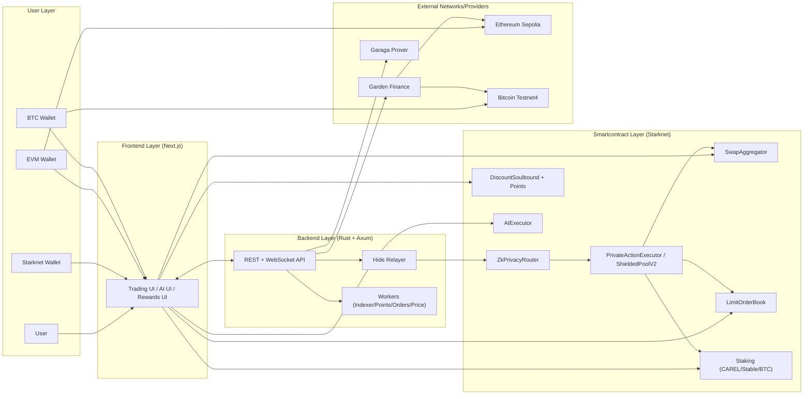
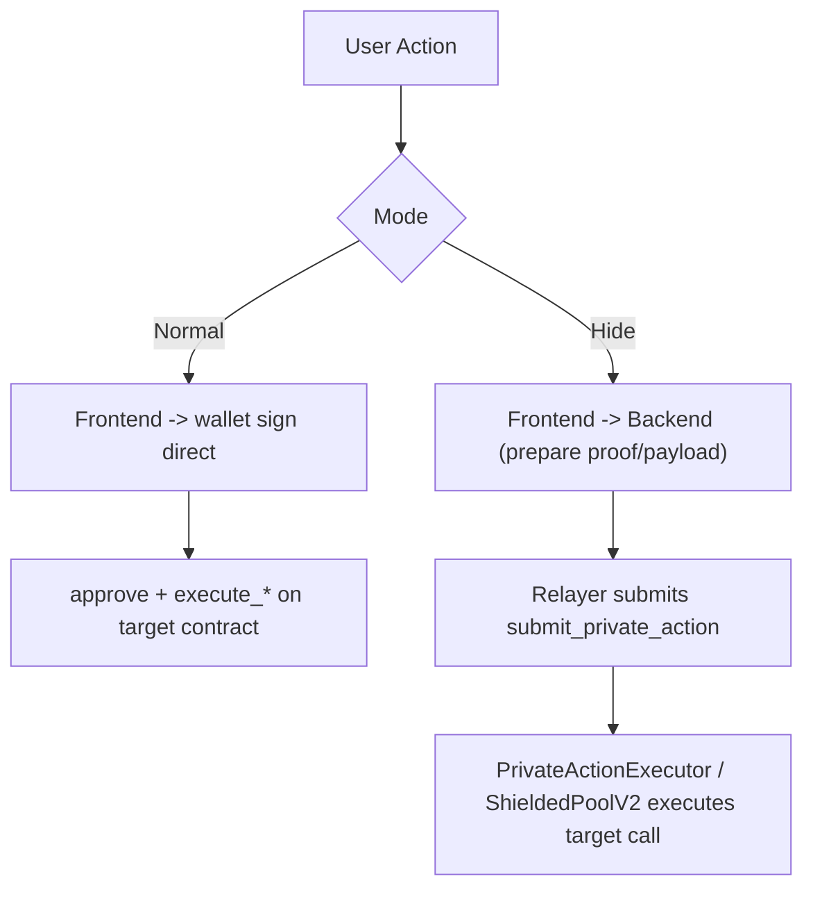
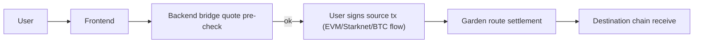

# CAREL Protocol Monorepo

CAREL adalah privacy-first DeFi execution layer di Starknet dengan dua mode eksekusi:
- Normal mode (wallet direct)
- Hide mode (Garaga proof + relayer + private executor)

README root ini menyatukan arsitektur **frontend + backend + smartcontract** dalam satu dokumen.

## Table of Contents
- [Scope](#scope)
- [Repository Structure](#repository-structure)
- [Unified Architecture (Frontend + Backend + Smartcontract)](#unified-architecture-frontend--backend--smartcontract)
- [Execution Modes](#execution-modes)
- [Bridge Path](#bridge-path)
- [MVP Proof Transactions](#mvp-proof-transactions)
- [Test Status](#test-status)
- [Key Deployed Addresses (Starknet Sepolia)](#key-deployed-addresses-starknet-sepolia)
- [Quick Start](#quick-start)
- [Documentation Map](#documentation-map)
- [Current Constraints](#current-constraints)
- [Development Plan](#development-plan)

## Scope
- Monorepo ini mencakup:
  - Frontend Next.js (`frontend/`)
  - Backend Rust/Axum (`backend-rust/`)
  - Smart contracts Cairo (`smartcontract/`)
- Fokus deployment saat ini: Starknet Sepolia testnet.

## Repository Structure
| Path | Stack | Purpose |
| --- | --- | --- |
| `frontend/` | Next.js 16 | UI trading, hide mode UX, wallets, AI panel, rewards |
| `backend-rust/` | Rust + Axum | API, relayer hide mode, workers, indexer, bridge orchestration |
| `smartcontract/` | Cairo + Scarb/Snforge | Core protocol, trading, staking, privacy router, private executor |

## Runtime Profile Policy
Supaya tidak bingung saat audit/juri:

- Profil runtime untuk demo bukti tx (normal/hide/bridge) mengikuti:
  - `frontend/.env.local`
  - `backend-rust/.env`
- `smartcontract/.env` tetap dipakai sebagai katalog deployment smartcontract (lebih luas, termasuk kontrak lama/opsional).
- Konsekuensi: sebagian alamat bisa berbeda antar dokumen jika konteksnya beda (katalog deployment vs runtime profile aktif).

## Unified Architecture (Frontend + Backend + Smartcontract)


## Execution Modes


Ringkasan:
- Normal mode: sender on-chain adalah wallet user.
- Hide mode: sender on-chain adalah relayer path; call dieksekusi via `submit_private_action`.
- Relayer menandatangani transaksi dengan akun backend (konfigurasi backend signer), bukan private key milik AI model.
- Hide mode aktif untuk: swap, stake, limit order.
- Bridge tetap di public/L2 path (bukan hide path).

## Bridge Path


Catatan bridge saat ini:
- Pair aktif testnet: `ETH<->BTC`, `BTC<->WBTC`, `ETH<->WBTC`.
- Bridge ke `STRK` dinonaktifkan.
- Pre-check quote dilakukan sebelum burn/setup agar gagal liquidity tidak membakar CAREL.

## MVP Proof Transactions
- Normal Swap: https://sepolia.voyager.online/tx/0x22a53b1af0f7d62e19569a99b38d67e9165faad2804ca50a1b0a53f289bab98
- Hide Swap: https://sepolia.voyager.online/tx/0x71b6c99287c78b082d105dc7169faa56b419a3e2568b3ea9a70ef1ff653a2d2
- Normal Stake: https://sepolia.voyager.online/tx/0x3ffda88b060ad41b752e8410b13b567c2cca3aa1e32b29f60cf75d9f8b42d60
- Hide Stake: https://sepolia.voyager.online/tx/0x5fcac3b4578ebe8cf32dde9b0c6ab2390f1f1aa6bea731c3f779575abbdd4cf
- Normal Limit: https://sepolia.voyager.online/tx/0x737c40659dc5c7872ab1a89222d879bca68163b890a61f09b1875d52e4747a6
- Hide Limit: https://sepolia.voyager.online/tx/0x523c9721e57f69fddff4ed3be3935cce3b5782ca2c3b454df565c0be6b22ba3
- BTC bridge tx: https://mempool.space/testnet4/tx/d26a8f5d0213b4448722cde81e1f47e68b8efbd00c56ce4802e39c9b0898db4c
- Garden order: https://testnet-explorer.garden.finance/order/237be68816b9144b9d3533ca3ec8c4eb1e7c00b1649e9ec216d89469fd014e70
- ETH bridge tx: https://sepolia.etherscan.io/tx/0xab25b9261dc9f703e44cb89a34831ff03024b8fe89e32cce4a7e58b5d6dcdef3

## Test Status
Status terkini dari report lokal:

| Module | Result | Source |
| --- | --- | --- |
| Backend (`backend-rust`) | `188/188` pass | `backend-rust/BE_TEST_REPORT.md` |
| Smartcontract core (`smartcontract`) | `172/172` pass | `smartcontract/SC_TEST_REPORT.md` |
| Smartcontract hide executor (`private_executor_lite`) | `12/12` pass | `smartcontract/SC_TEST_REPORT.md` |

Total automated tests lulus: **372/372**.

Catatan frontend test/build:
- Detail ada di `frontend/FE_TEST_REPORT.md`.
- Issue terakhir: Node version dan ESLint config frontend.

## Key Deployed Addresses (Starknet Sepolia)
Alamat runtime penting yang dipakai lintas FE/BE/SC saat ini:

| Contract | Address |
| --- | --- |
| Swap Aggregator | `0x06f3e03be8a82746394c4ad20c6888dd260a69452a50eb3121252fdecacc6d28` |
| Bridge Aggregator | `0x047ed770a6945fc51ce3ed32645ed71260fae278421826ee4edabeae32b755d5` |
| Limit Order Book | `0x06b189eef1358559681712ff6e9387c2f6d43309e27705d26daff4e3ba1fdf8a` |
| Staking CAREL | `0x06ed000cdf98b371dbb0b8f6a5aa5b114fb218e3c75a261d7692ceb55825accb` |
| Staking Stablecoin | `0x014f58753338f2f470c397a1c7ad1cfdc381a951b314ec2d7c9aec06a73a0aff` |
| Staking BTC | `0x01fa14e91abade76d753d718640a14540032c307832a435f8781d446b288cdf8` |
| ZK Privacy Router | `0x0682719dbe8364fc5c772f49ecb63ea2f2cf5aa919b7d5baffb4448bb4438d1f` |
| PrivateActionExecutor / ShieldedPoolV2 | `0x060549e87e71903ffe1e6449aaa1e77d941de1a5117be3beabd0026d847c61fb` |
| DiscountSoulbound | `0x05b4c1e3578fd605b44b1950c749f01b2f652b8fd7a77135801d8d31af6fe809` |
| AIExecutor | `0x00d8ada9eb26d133f9f2656ac1618d8cdf9fcefe6c8e292cf9b7ee580b72a690` |
| PrivacyIntermediary | `0x0246cd17157819eb614e318d468270981d10e6b6e99bcaa7ca4b43d53de810ab` |

## Quick Start
```bash
docker compose up -d postgres redis

# terminal 1
cd backend-rust
cargo run

# terminal 2
cd frontend
npm install
npm run dev
```

Open: `http://localhost:3000`

## Documentation Map
| Area | Document |
| --- | --- |
| Frontend main doc | `frontend/README.md` |
| Frontend deploy | `frontend/DEPLOY_TESTNET.md` |
| Frontend test report | `frontend/FE_TEST_REPORT.md` |
| Backend main doc | `backend-rust/README.md` |
| Backend test report | `backend-rust/BE_TEST_REPORT.md` |
| Smartcontract main doc | `smartcontract/README.md` |
| Smartcontract deploy | `smartcontract/DEPLOY_TESTNET.md` |
| Smartcontract test report | `smartcontract/SC_TEST_REPORT.md` |
| Smartcontract scripts | `smartcontract/scripts/README.md` |
| Security checklist | `smartcontract/security_audit_checklist.md` |
| Analisis bukti tx | `docs/README_ANALISIS_BUKTI_TX_MVP.md` |
| Audit env runtime MVP | `docs/ENV_RUNTIME_AUDIT_MVP.md` |

## Current Constraints
- Fokus masih testnet-first (Starknet Sepolia).
- Hide mode mengurangi linkability tetapi metadata publik blockchain tetap ada.
- Bridge sangat bergantung provider eksternal dan likuiditas dinamis.
- Battleship di frontend masih nonaktif sementara (`Coming Soon`).
- Belum ada proxy upgrade path; perubahan kontrak memerlukan redeploy + migrasi.

## Development Plan
1. Frontend hardening: ESLint + CI, env runtime validator, onboarding/wizard demo.
2. Backend hardening: observability relayer, RPC failover, queue isolation worker.
3. Smartcontract hardening: optimasi gas AI/TWAP, audit eksternal, strategi upgrade/migration.
4. Product expansion: bridge providers tambahan (LayerSwap/Atomiq), aktivasi kembali Battleship stabil.
