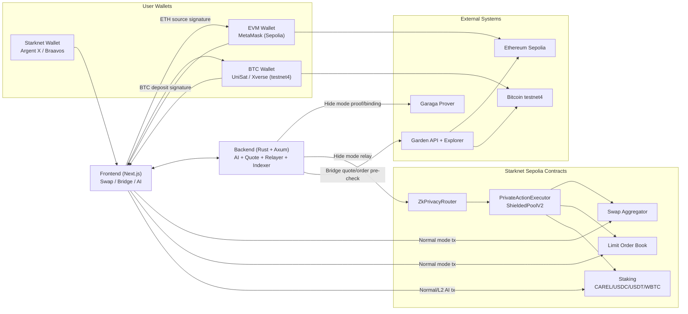

# CAREL Protocol Monorepo
This README covers the monorepo at a high level so you can quickly find the right component and documentation.
Current integrated status on this branch: `145/145` tests passing.

## Table of Contents
- [Monorepo Layout](#monorepo-layout)
- [Architecture](#architecture)
- [Transaction Modes](#transaction-modes)
- [Deployed Contracts (Starknet Sepolia)](#deployed-contracts-starknet-sepolia)
- [Quick Start](#quick-start)
- [Documentation Map](#documentation-map)
- [Tokenomics Visual Guide](#tokenomics-visual-guide)
- [Current Constraints](#current-constraints)

## Monorepo Layout
| Path | Stack | Purpose |
| --- | --- | --- |
| `frontend/` | Next.js | User UI for trading, privacy flows, wallets, and game interactions |
| `backend-rust/` | Rust + Axum | API, relayer logic, proof orchestration, indexer, and workers |
| `smartcontract/` | Cairo | Starknet contracts for trading, privacy, staking, and gamification |

## Architecture


Architecture notes:
- Level 3 AI execution follows Garaga/private path (`submit_private_action` -> private executor).
- Bridge execution stays on Level 2 and uses provider pre-check to prevent failed setup burn when route/liquidity is unavailable.

## Transaction Modes
| Mode | Signing Path | On-chain Execution | Supported Flows |
| --- | --- | --- | --- |
| Normal Mode | User wallet signs directly | `approve + execute` on target contract | Swap, Bridge, Limit Order, Stake |
| Hide Mode | User triggers from UI, backend relays | `submit_private_action` via `ZkPrivacyRouter` then private executor call | Swap, Limit Order, Stake on Starknet L2 |

Demo policy (current):
- Official demo should run in Garaga/private path (Hide Mode) for all supported commands.
- AI bridge remains Level 2 (public bridge flow with provider pre-check); Level 3 bridge is intentionally disabled.
- Battleship is temporarily disabled in frontend (`Coming Soon`) until stability fixes are completed.

Hide Mode notes:
- Hide Mode reduces linkability, but does not remove all public-chain metadata.
- Hide Mode is not used for Bridge.
- Bridge to `STRK` is disabled; use `STRK/WBTC` through Swap.
- Active bridge pairs: `ETH<->BTC`, `BTC<->WBTC`, `ETH<->WBTC`.

AI Bridge notes (Level 2):
- Before on-chain setup/signature, frontend runs live bridge quote pre-check (`/api/v1/bridge/quote`).
- If provider returns amount-range error, route unavailable, or `insufficient liquidity`, execution is stopped early and CAREL is not burned.
- Bridge source signing is chain-specific:
  - `ETH` source uses MetaMask (`evm approval + initiate` when required).
  - `WBTC` source uses Starknet wallet (`approve + initiate` when required).
  - `BTC` source creates order first, then user sends BTC deposit to returned Garden address.
- Liquidity is dynamic and can change per minute; the same pair/amount may fail now and pass later.

AI execution setup notes (Level 2/3):
- For on-chain AI commands (`swap`, `bridge`, `stake`, `claim`, `limit`, `cancel order`), frontend resolves AI setup signature first (`Sign Execution Setup`).
- Default behavior requires a fresh setup signature each execution (`NEXT_PUBLIC_AI_REQUIRE_FRESH_SETUP_PER_EXECUTION=true` in frontend).
- If user does not confirm setup popup, command stops with:
  - `On-chain setup signature was not completed: A fresh on-chain signature is required for this execution. Please confirm the wallet popup, then retry.`
- Optional: set `NEXT_PUBLIC_AI_REQUIRE_FRESH_SETUP_PER_EXECUTION=false` to reuse latest pending setup and reduce repeated setup prompts.
- If wallet rejects multicall payload format (`wallet_addInvokeTransaction ... expected array`), frontend automatically falls back to separate signatures (approve first, then execution call).
- WBTC staking uses Starknet `WBTC` token (not native BTC). Frontend now pre-checks WBTC pool availability before setup/signature, so failure stops early with `No CAREL was burned`.
- New `BTCStaking` deployments now set default WBTC allowlist in constructor (via `TOKEN_WBTC_ADDRESS` / `TOKEN_BTC_ADDRESS` in deploy script).
- If WBTC is not registered on `StakingBTC` (`add_btc_token`), contract-side revert may appear as `Token BTC tidak didukung` on older deployments.
- In L3 hide-mode relayer flows, if backend reports `Shielded note funding failed: insufficient allowance`, frontend now auto-requests wallet `approve` to relayer executor, then retries action.

AI feature status (current):
- Level 2 (`1 CAREL/execution`): `swap`, `bridge`, `stake`, `claim rewards`, `limit order`, `cancel order`.
- Level 3 (`2 CAREL/execution`): Garaga/private execution for swap/stake/claim/limit/cancel + unstake/portfolio/alerts. Bridge is kept on Level 2.
- Example commands:
  - `swap 25 STRK to WBTC`
  - `bridge ETH 0.005 to WBTC`
  - `stake 100 USDT`
  - `claim rewards USDT`
  - `limit order STRK/USDC amount 10 at 1.25 expiry 1d`
  - `cancel order <id>`

## Deployed Contracts (Starknet Sepolia)
| Contract | Address |
| --- | --- |
| `ZkPrivacyRouter` | `0x0682719dbe8364fc5c772f49ecb63ea2f2cf5aa919b7d5baffb4448bb4438d1f` |
| `PrivateActionExecutor / ShieldedPoolV2` | `0x07e18b8314a17989a74ba12e6a68856a9e4791ce254d8491ad2b4addc7e5bf8e` |
| `Swap Aggregator` | `0x06f3e03be8a82746394c4ad20c6888dd260a69452a50eb3121252fdecacc6d28` |
| `Limit Order Book` | `0x06b189eef1358559681712ff6e9387c2f6d43309e27705d26daff4e3ba1fdf8a` |
| `BattleshipGaraga` | `0x0102fb7ec16af1e8918ac2c4dbdd4473fec2c638fa54bfed0dc2edd2dca4fc97` |
| `StakingCarel` | `0x06ed000cdf98b371dbb0b8f6a5aa5b114fb218e3c75a261d7692ceb55825accb` |
| `StakingStablecoin` | `0x014f58753338f2f470c397a1c7ad1cfdc381a951b314ec2d7c9aec06a73a0aff` |
| `StakingBTC` | `0x01fa14e91abade76d753d718640a14540032c307832a435f8781d446b288cdf8` |

## Quick Start
Running a demo? See [DEMO.md](DEMO.md) for a focused walkthrough.

```bash
docker compose up -d postgres redis
cd backend-rust && cargo run
# new terminal
cd frontend && npm install && npm run dev
# open http://localhost:3000
```

Connectivity note:
- Default dev flow is local frontend (`:3000`) to local backend (`:8080`).
- If frontend is deployed on Vercel while backend is still local, use ngrok tunnel temporarily.
- Full connectivity modes and exact ngrok/Vercel steps are documented in [`frontend/README.md`](frontend/README.md#backend-connectivity-modes).

## Documentation Map
| Document | Scope |
| --- | --- |
| [`DEMO.md`](DEMO.md) | Live demo walkthrough and on-chain verification steps |
| [`frontend/README.md`](frontend/README.md) | Frontend setup, env config, wallets, Hide Mode checks |
| [`backend-rust/README.md`](backend-rust/README.md) | Backend architecture, env variables, API and services |
| [`smartcontract/README.md`](smartcontract/README.md) | Contract catalog, structure, build/test commands |
| [`smartcontract/DEPLOY_TESTNET.md`](smartcontract/DEPLOY_TESTNET.md) | Starknet Sepolia deployment order and wiring |
| [`TOKENOMICS.md`](TOKENOMICS.md) | Root tokenomics guide (architecture + 3-year unlock summary) |
| [`docs/carel_tokenomics_visuals.md`](docs/carel_tokenomics_visuals.md) | Plain-English explanation of tokenomics architecture and 3-year unlock chart |
| [`smartcontract/security_audit_checklist.md`](smartcontract/security_audit_checklist.md) | Security status, assumptions, and open hardening items |

## Tokenomics Visual Guide
- Read first: [`TOKENOMICS.md`](TOKENOMICS.md)
- Mermaid-only version: architecture + tokenomics allocation + 3-year projection.
- Backward compatibility doc: [`docs/carel_tokenomics_visuals.md`](docs/carel_tokenomics_visuals.md)

## Current Constraints
- Network and addresses in this repo are testnet-first (Starknet Sepolia).
- Mock Garaga verifier is acceptable for testnet only; never use it on mainnet.
- TWAP and AI rate-limit gas are above target; optimization is still in progress.
- Battleship runtime state is currently in backend memory and not fully on-chain yet.
- No proxy upgrade path is implemented; upgrades require redeploy plus state migration.
