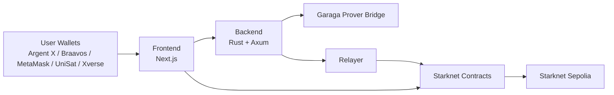

# CAREL Protocol Monorepo
This README covers the monorepo at a high level so you can quickly find the right component and documentation.
Current integrated status on this branch: `145/145` tests passing.

## Table of Contents
- [Monorepo Layout](#monorepo-layout)
- [Architecture](#architecture)
- [Transaction Modes](#transaction-modes)
- [Deployed Contracts (Starknet Sepolia)](#deployed-contracts-starknet-sepolia)
- [Quick Start](#quick-start)
- [Documentation Map](#documentation-map)
- [Current Constraints](#current-constraints)

## Monorepo Layout
| Path | Stack | Purpose |
| --- | --- | --- |
| `frontend/` | Next.js | User UI for trading, privacy flows, wallets, and game interactions |
| `backend-rust/` | Rust + Axum | API, relayer logic, proof orchestration, indexer, and workers |
| `smartcontract/` | Cairo | Starknet contracts for trading, privacy, staking, and gamification |

## Architecture


## Transaction Modes
| Mode | Signing Path | On-chain Execution | Supported Flows |
| --- | --- | --- | --- |
| Normal Mode | User wallet signs directly | `approve + execute` on target contract | Swap, Bridge, Limit Order, Stake |
| Hide Mode | User triggers from UI, backend relays | `submit_private_action` via `ZkPrivacyRouter` then private executor call | Swap, Limit Order, Stake on Starknet L2 |

Hide Mode notes:
- Hide Mode reduces linkability, but does not remove all public-chain metadata.
- Hide Mode is not used for Bridge.
- Bridge to `STRK` is disabled; use `STRK/WBTC` through Swap.
- Active bridge pairs: `ETH<->BTC`, `BTC<->WBTC`, `ETH<->WBTC`.

## Deployed Contracts (Starknet Sepolia)
| Contract | Address |
| --- | --- |
| `ZkPrivacyRouter` | `0x0682719dbe8364fc5c772f49ecb63ea2f2cf5aa919b7d5baffb4448bb4438d1f` |
| `PrivateActionExecutor / ShieldedPoolV2` | `0x07e18b8314a17989a74ba12e6a68856a9e4791ce254d8491ad2b4addc7e5bf8e` |
| `Swap Aggregator` | `0x06f3e03be8a82746394c4ad20c6888dd260a69452a50eb3121252fdecacc6d28` |
| `Limit Order Book` | `0x06b189eef1358559681712ff6e9387c2f6d43309e27705d26daff4e3ba1fdf8a` |
| `BattleshipGaraga` | `0x04ea26d455d6d79f185a728ac59cac029a6a5bf2a3ca3b4b75f04b4e8c267dd2` |
| `StakingCarel` | `0x06ed000cdf98b371dbb0b8f6a5aa5b114fb218e3c75a261d7692ceb55825accb` |
| `StakingStablecoin` | `0x014f58753338f2f470c397a1c7ad1cfdc381a951b314ec2d7c9aec06a73a0aff` |
| `StakingBTC` | `0x030098330968d105bf0a0068011b3f166e595582828dbbfaf8e5e204420b1f3b` |

## Quick Start
Running a demo? See [DEMO.md](DEMO.md) for a focused walkthrough.

```bash
docker compose up -d postgres redis
cd backend-rust && cargo run
# new terminal
cd frontend && npm install && npm run dev
# open http://localhost:3000
```

## Documentation Map
| Document | Scope |
| --- | --- |
| [`DEMO.md`](DEMO.md) | Live demo walkthrough and on-chain verification steps |
| [`frontend/README.md`](frontend/README.md) | Frontend setup, env config, wallets, Hide Mode checks |
| [`backend-rust/README.md`](backend-rust/README.md) | Backend architecture, env variables, API and services |
| [`smartcontract/README.md`](smartcontract/README.md) | Contract catalog, structure, build/test commands |
| [`smartcontract/DEPLOY_TESTNET.md`](smartcontract/DEPLOY_TESTNET.md) | Starknet Sepolia deployment order and wiring |
| [`smartcontract/security_audit_checklist.md`](smartcontract/security_audit_checklist.md) | Security status, assumptions, and open hardening items |

## Current Constraints
- Network and addresses in this repo are testnet-first (Starknet Sepolia).
- Mock Garaga verifier is acceptable for testnet only; never use it on mainnet.
- TWAP and AI rate-limit gas are above target; optimization is still in progress.
- Battleship runtime state is currently in backend memory and not fully on-chain yet.
- No proxy upgrade path is implemented; upgrades require redeploy plus state migration.
