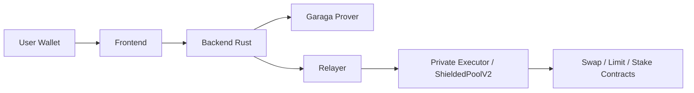

# CAREL Protocol Monorepo

Monorepo CAREL Protocol untuk trading Web3 + privacy mode berbasis Garaga di Starknet.

README ini sengaja ringkas: hanya hal paling penting untuk jalan dan test.

## Full Project Description (500 Words, English)
CAREL Protocol is a privacy-first DeFi monorepo that combines a trading interface, a Rust backend, and Cairo smart contracts into one stack. The goal is to demonstrate real user flows on Starknet Sepolia while keeping the architecture modular for future hardening. Users can connect wallets, get quotes, execute swaps, open limit orders, stake assets, monitor portfolios, and use gamified utilities such as points, NFT discounts, referrals, and Battleship. The repository is split into three packages: a Next.js frontend, a Rust Axum backend, and a smart contract package for protocol and privacy logic.

The trading system supports two execution paths. In Normal mode, users sign transactions directly from wallets, and calls go to target contracts through approve-and-execute flows. In Hide mode, users still start from the same UI, but execution is routed through a relayer and private executor contracts. This path uses Garaga proof payloads and intent binding to reduce direct linkage between user interaction and final execution sequence. Hide mode currently focuses on Starknet L2 actions such as swap, limit order, and stake, while bridge operations stay on the normal path for provider compatibility. The backend enforces mode-specific checks, prepares on-chain call bundles, and returns structured errors when dependencies are missing.

The backend is built for long-running service behavior, not only request-response APIs. It includes modules for auth, trading endpoints, privacy orchestration, portfolio reads, notifications, and game APIs. Background workers handle indexing, prices, point calculations, and scheduled tasks. PostgreSQL stores durable state, Redis supports cache and websocket fanout, and RPC readers handle Starknet interaction. The codebase includes resilience for unstable RPC periods, fallback behavior for non-critical reads, and logs to diagnose transient failures. This operational focus makes local demos realistic and gives a clear path toward cloud deployment.

On-chain functionality is organized around modular Cairo contracts. Core contracts cover token economics, swap and limit order infrastructure, staking pools, discount NFTs, and reward storage. Privacy contracts include router and executor components for hide-mode flows, plus verifier integrations for Garaga-backed proof checks. The monorepo also includes Battleship contracts and APIs, where game setup and turn actions can be proof-gated and submitted on-chain. This provides a non-financial use case for the same cryptographic toolchain used by the trading privacy layer.

The growth system is built into protocol behavior. Points are awarded from successful activity, referral logic can grant bonuses, and NFT tiers can reduce fees under on-chain rules. Portfolio views combine balances, history, and status indicators across assets and chains. The AI assistant provides guided commands and can be extended from read-only help to paid action execution with wallet-confirmed permissions. Together, these modules form a complete privacy-aware DeFi application where frontend UX, backend orchestration, and blockchain settlement operate as one coherent system. The structure also keeps layers independent, so teams can iterate fast without breaking shared interfaces.

For builders and judges, this repository is practical: run locally, test normal and hide flows, inspect transaction hashes, and map every UI action to contract calls. That traceability is central to debugging, demos, and security review workflows.

## Yang Ada di Repo Ini
- `frontend/` : Next.js app (swap, bridge, limit order, stake, portfolio, AI, battleship).
- `backend-rust/` : API + relayer + services + indexer.
- `smartcontract/` : Cairo contracts (core protocol + privacy + battleship).

## Mode Transaksi

| Mode | Signature | Jalur On-chain | Fitur |
|---|---|---|---|
| Normal | User wallet sign | `approve + execute` langsung | Swap, Bridge, Limit Order, Stake |
| Hide | User trigger dari UI, backend relayer submit | `submit_private_* + execute_private_*` via executor | Swap, Limit Order, Stake (Starknet L2) |

Catatan penting:
- Hide mode tidak dipakai untuk Bridge.
- Pair `STRK/WBTC` pakai Swap Starknet (bukan Bridge).

## Arsitektur Ringkas



## Kontrak Sepolia Aktif (Current)
- `BattleshipGaraga`  
  `0x04ea26d455d6d79f185a728ac59cac029a6a5bf2a3ca3b4b75f04b4e8c267dd2`
- `ZkPrivacyRouter`  
  `0x0682719dbe8364fc5c772f49ecb63ea2f2cf5aa919b7d5baffb4448bb4438d1f`
- `PrivateActionExecutor / Hide Executor`  
  `0x07e18b8314a17989a74ba12e6a68856a9e4791ce254d8491ad2b4addc7e5bf8e`
- `Swap Aggregator`  
  `0x06f3e03be8a82746394c4ad20c6888dd260a69452a50eb3121252fdecacc6d28`
- `Limit Order Book`  
  `0x06b189eef1358559681712ff6e9387c2f6d43309e27705d26daff4e3ba1fdf8a`

## Quick Start (Local)
1. Start database + redis.
```bash
sudo service postgresql start
sudo service redis-server start
```
2. Jalankan backend.
```bash
cd backend-rust
cargo run
```
3. Jalankan frontend (terminal baru).
```bash
cd frontend
npm install
npm run dev
```
4. Buka `http://localhost:3000`.

Atau pakai script cepat:
```bash
./scripts/quick-start.sh
```

## Hide Mode Checklist (Wajib)
- Frontend:
  - `NEXT_PUBLIC_ZK_PRIVACY_ROUTER_ADDRESS`
  - `NEXT_PUBLIC_PRIVATE_ACTION_EXECUTOR_ADDRESS`
  - `NEXT_PUBLIC_HIDE_BALANCE_RELAYER_POOL_ENABLED=true`
  - `NEXT_PUBLIC_ENABLE_DEV_GARAGA_AUTOFILL=false`
- Backend:
  - `PRIVACY_AUTO_GARAGA_PROVER_CMD` atau payload file real
  - `HIDE_BALANCE_EXECUTOR_KIND` sesuai executor aktif
  - `PRIVATE_ACTION_EXECUTOR_ADDRESS` sesuai kontrak aktif

## Battleship (Garaga)
- UI battleship sudah aktif di frontend.
- Contract `BattleshipGaraga` sudah deploy di Sepolia.
- Flow game: create/join -> commit board -> fire/respond -> timeout/game over.

## Limitasi yang Perlu Diketahui
- Hide mode meningkatkan unlinkability, tapi metadata publik chain (timing/fee/transfer info) tidak bisa 100% hilang.
- Bridge route mengikuti provider availability (contoh Garden bisa reject pair tertentu di testnet).
- RPC rate limit dapat memengaruhi quote/indexer/balance read.

## Dokumentasi Teknis Detail
- Backend: `backend-rust/README.md`
- Frontend: `frontend/README.md`
- Smart contract: `smartcontract/README.md`

## License
MIT. See `LICENSE`.
