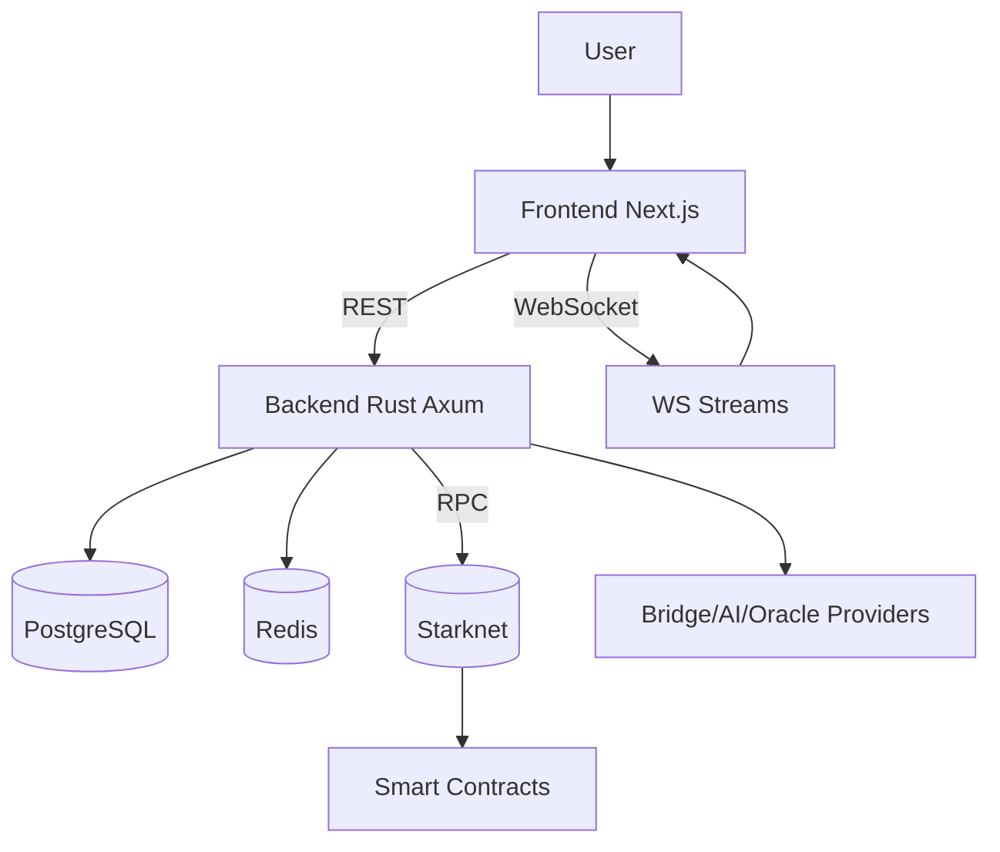
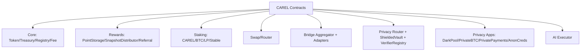
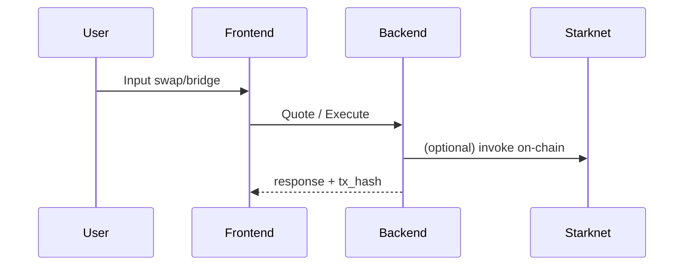
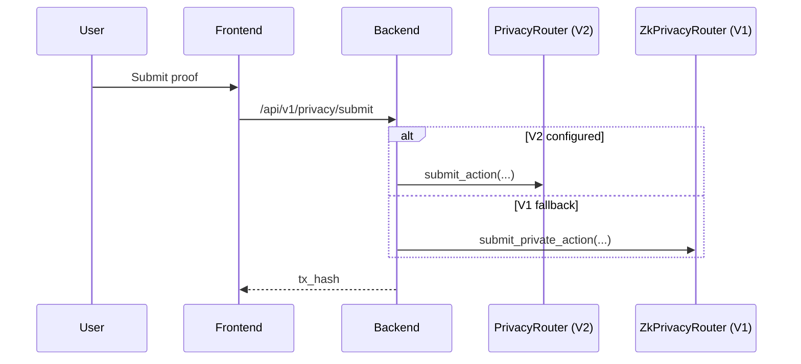

# ZkCarel / CAREL Protocol Monorepo

Monorepo ini berisi smart contract Cairo (Starknet), backend Rust (Axum + PostgreSQL + Redis), dan frontend Next.js. Semua modul saling terhubung untuk swap, bridge, staking, rewards, privacy (ZK), AI assistant, dan analytics.

**Isi utama**
- `smartcontract/`: Cairo contracts untuk CAREL Protocol.
- `backend-rust/`: API + background services + indexer.
- `frontend/`: Next.js App Router untuk UI.
- `docs/`: catatan perencanaan dan tambahan dokumen.

**Dokumen pendukung**
- Smart contract detail: `smartcontract/README.md`
- Deploy testnet: `smartcontract/DEPLOY_TESTNET.md`
- Backend detail: `backend-rust/README.md`
- Frontend detail: `frontend/README.md`

**Arsitektur (Gambar)**


**Arsitektur On-Chain (Ringkas)**


**Alur User (Gambar)**
Swap/Bridge (simplified)


Privacy Router (V2/V1)


**Alur Teknis (Ringkas)**
Points & Rewards
- Backend menghitung points dari aktivitas dan menyimpan di DB.
- Opsional: backend sinkronisasi ke `PointStorage` (on-chain).
- `SnapshotDistributor` memakai merkle root untuk claim rewards.

Event Indexer
- Backend indexer membaca events dari kontrak on-chain.
- Alamat kontrak diambil dari `.env` dan placeholder `0x0000...` akan di-skip.

AI Level 2/3
- Backend memvalidasi `action_id` lewat `AIExecutor.get_pending_actions_page(...)`.

Price Oracle
- Backend memanggil `PriceOracle.get_price(...)` via Starknet RPC untuk price feed.
- Pastikan `PriceOracle` dideploy dengan `PRAGMA_ORACLE_ADDRESS` valid, atau `get_price` akan gagal.
- Pair ID Pragma memakai `str_to_felt("TOKEN/USD")` (contoh: `STRK/USD`, `USDC/USD`).
- CAREL tidak ada di daftar asset Pragma saat ini, jadi gunakan fallback price untuk CAREL.
- Semua harga dinormalisasi ke skala 1e8 (8 decimals) di `PriceOracle`.

**Struktur Direktori**
```
backend-rust/    # Rust API + background services + indexer
frontend/        # Next.js UI
smartcontract/   # Cairo contracts + tests + scripts
docs/            # dokumentasi tambahan
```

**Environment & Konfigurasi**
Backend `.env` (minimum untuk boot):
- `DATABASE_URL`
- `STARKNET_RPC_URL`
- `ETHEREUM_RPC_URL`
- `BACKEND_PRIVATE_KEY`, `BACKEND_PUBLIC_KEY`
- `JWT_SECRET`

Backend `.env` (wajib untuk integrasi on-chain penuh):
- `CAREL_TOKEN_ADDRESS`
- `SNAPSHOT_DISTRIBUTOR_ADDRESS`
- `POINT_STORAGE_ADDRESS`
- `PRICE_ORACLE_ADDRESS`
- `LIMIT_ORDER_BOOK_ADDRESS`
- `AI_EXECUTOR_ADDRESS`
- `BRIDGE_AGGREGATOR_ADDRESS`
- `ZK_PRIVACY_ROUTER_ADDRESS`
- `PRIVATE_BTC_SWAP_ADDRESS`
- `DARK_POOL_ADDRESS`
- `PRIVATE_PAYMENTS_ADDRESS`
- `ANONYMOUS_CREDENTIALS_ADDRESS`

Opsional:
- `PRIVACY_ROUTER_ADDRESS` (V2)
- `STAKING_CAREL_ADDRESS`
- `TREASURY_ADDRESS`
- `REFERRAL_SYSTEM_ADDRESS`
- `BRIDGE_PROVIDER_IDS`
- `ORACLE_ASSET_IDS` (format `TOKEN:0x...` untuk `TOKEN/USD`)

Frontend `.env.local`:
```
NEXT_PUBLIC_BACKEND_URL=http://localhost:8080
NEXT_PUBLIC_BACKEND_WS_URL=ws://localhost:8080
```

Catatan tipe data:
- Beberapa response numerik dapat berupa `number` atau `string` (contoh: analytics/limit order/OHLCV). UI perlu memperlakukan sebagai numeric.

**Run Lokal (Quickstart)**
Backend:
```bash
cd backend-rust
cargo run
```
Frontend:
```bash
cd frontend
npm install
npm run dev
```

**Deploy Testnet (Ringkas)**
- Ikuti langkah detail di `smartcontract/DEPLOY_TESTNET.md`.
- Setelah deploy, isi `.env` backend dengan alamat kontrak terbaru.
- V2 PrivacyRouter sudah deploy di Sepolia; pastikan `PRIVACY_ROUTER_ADDRESS` terisi di backend.

**Testnet Addresses (Sepolia)**
Deployer/Admin wallet:
`0x0289f797b9c2dc6c661fd058968d9ba39d01c7547f8259f01b7bce55696d0ff0`

```env
CAREL_TOKEN_ADDRESS=0x0517f60f4ec4e1b2b748f0f642dfdcb32c0ddc893f777f2b595a4e4f6df51545
SNAPSHOT_DISTRIBUTOR_ADDRESS=0x04fcc58ba819766fe19b8f7a96ed5bd7b7558e8ad62f495815e825d8e8f822dd
POINT_STORAGE_ADDRESS=0x0501e74ab48e605ef81348a087d21c95ea5d43694ee1a60d6ca1e9186be54029
PRICE_ORACLE_ADDRESS=0x06d3bed050b11afad71022e9ea4d5401366b9c01ef8387df22de6155e6c6977a
LIMIT_ORDER_BOOK_ADDRESS=0x0734bbb72aeffc57b4123298237d9ca3081095d8f8a75e8e68a1b0eb02306191
STAKING_CAREL_ADDRESS=0x06ed000cdf98b371dbb0b8f6a5aa5b114fb218e3c75a261d7692ceb55825accb
TREASURY_ADDRESS=0x0351e9882d322ab41239eb925f22d3a598290bda6a3a2e7ce560dcff8a119c7d
REFERRAL_SYSTEM_ADDRESS=0x040bfc6214d3204c53898c730285d79d6e7cd2cd987e3ecde048b330ed3a2d06
AI_EXECUTOR_ADDRESS=0x03adfb85bf6b60eed5c21de8303659a14ab62f6162d6d4ba18100b4d7d53b8fe
BRIDGE_AGGREGATOR_ADDRESS=0x047ed770a6945fc51ce3ed32645ed71260fae278421826ee4edabeae32b755d5
ZK_PRIVACY_ROUTER_ADDRESS=0x00694e35433fe3ce49431e1816f4d4df9ab6d550a3f73f8f07f9c2cc69b6891b
PRIVATE_BTC_SWAP_ADDRESS=0x006faaf4bbd1f3139b4b409e1bdea0eada42901674e1f6abe2699ece84a181a3
DARK_POOL_ADDRESS=0x03bec062a2789e399999e088a662e8d8d11e168e9c734e57dd333615baeb1385
PRIVATE_PAYMENTS_ADDRESS=0x00e9efd7e5cb33f1d8eb4779c8fe68d1836141feb826b18d132c8ca1da391b94
ANONYMOUS_CREDENTIALS_ADDRESS=0x040a454139f2df866b3ea34247d67126f8a6a8e61e5e9ac3b3ed27ad12e1d57d
SHIELDED_VAULT_ADDRESS=0x07e09754f159ee7bce0b1d297315eea6bb22bc912e92741a7e8c793ef24a6abb
VERIFIER_REGISTRY_ADDRESS=0x02e3aa26983b1c9cca8f8092b59eb18ba4877ed27eb6a80b36ef09175f352046
PRIVACY_ROUTER_ADDRESS=0x0133e0c11f4df0a77d6a3b46e301f402c6fa6817e9a8d79c2dc0cd45f244c364
PRAGMA_ORACLE_ADDRESS=0x36031daa264c24520b11d93af622c848b2499b66b41d611bac95e13cfca131a
CHAINLINK_ORACLE_ADDRESS=0x0
ORACLE_ASSET_IDS=BTC:18669995996566340,ETH:19514442401534788,STRK:6004514686061859652,USDT:6148333044652921668,USDC:6148332971638477636,CAREL:0
```

**Smartcontract .env (Wajib vs Opsional)**
Wajib (harus terisi untuk core + V2 privacy):
- `OWNER_ADDRESS`, `DEPLOYER_ADDRESS`, `TREASURY_ADDRESS`, `DEV_WALLET`, `BACKEND_SIGNER`
- `CAREL_TOKEN_ADDRESS`
- `TREASURY_CONTRACT_ADDRESS`
- `POINT_STORAGE_ADDRESS`
- `STAKING_CAREL_ADDRESS`
- `SNAPSHOT_DISTRIBUTOR_ADDRESS`
- `REFERRAL_SYSTEM_ADDRESS`
- `AI_EXECUTOR_ADDRESS`
- `BRIDGE_AGGREGATOR_ADDRESS`
- `KEEPER_NETWORK_ADDRESS`
- `PRICE_ORACLE_ADDRESS`
- `PRIVACY_ROUTER_ADDRESS`
- `SHIELDED_VAULT_ADDRESS`
- `VERIFIER_REGISTRY_ADDRESS`
- `ZK_PRIVACY_ROUTER_ADDRESS` (legacy fallback, tetap ada di backend)

Opsional (boleh kosong jika fitur tidak dipakai):
- Governance: `GOVERNANCE_ADDRESS`, `TIMELOCK_ADDRESS`
- Staking lain: `STAKING_BTC_ADDRESS`, `STAKING_LP_ADDRESS`, `STAKING_STABLECOIN_ADDRESS`
- NFT/Rewards: `LEADERBOARD_VIEW_ADDRESS`, `DISCOUNT_SOULBOUND_ADDRESS`, `MERKLE_VERIFIER_ADDRESS`, `NFT_CONTRACT_ADDRESS`, `REWARDS_ESCROW_ADDRESS`
- Core tambahan: `VESTING_MANAGER_ADDRESS`, `FEE_COLLECTOR_ADDRESS`, `REGISTRY_ADDRESS`, `MULTISIG_ADDRESS`, `ACCESS_CONTROL_ADDRESS`, `EMERGENCY_PAUSE_ADDRESS`, `CAREL_PROTOCOL_ADDRESS`, `TWAP_ORACLE_ADDRESS`
- Bridge/Swap tambahan: `SWAP_AGGREGATOR_ADDRESS`, `BTC_NATIVE_BRIDGE_ADDRESS`, `PRIVATE_SWAP_ADDRESS`, `ROUTER_ADDRESS`
- Verifier lain: `AI_SIGNATURE_VERIFIER_ADDRESS`, `TONGO_VERIFIER_ADDRESS`, `SEMAPHORE_VERIFIER_ADDRESS`, adapters, mock verifiers
- Oracles eksternal: `PRAGMA_ORACLE_ADDRESS`, `CHAINLINK_ORACLE_ADDRESS` (testnet boleh `0x0`)

**API Ringkas**
- Auth: `POST /api/v1/auth/connect`
- Swap: `POST /api/v1/swap/quote`, `POST /api/v1/swap/execute`
- Bridge: `POST /api/v1/bridge/quote`, `POST /api/v1/bridge/execute`
- Privacy: `POST /api/v1/privacy/submit`
- Private BTC Swap: `POST /api/v1/private-btc-swap/initiate`, `POST /api/v1/private-btc-swap/finalize`
- Dark Pool: `POST /api/v1/dark-pool/order`, `POST /api/v1/dark-pool/match`
- Private Payments: `POST /api/v1/private-payments/submit`, `POST /api/v1/private-payments/finalize`
- Anonymous Credentials: `POST /api/v1/credentials/submit`
- WebSocket: `/ws/notifications`, `/ws/prices`, `/ws/orders`

**Catatan Keamanan**
- Gunakan multisig untuk admin roles.
- Backend signer harus sesuai konfigurasi on-chain.
- Simpan key sensitif di secret manager atau env terproteksi.
