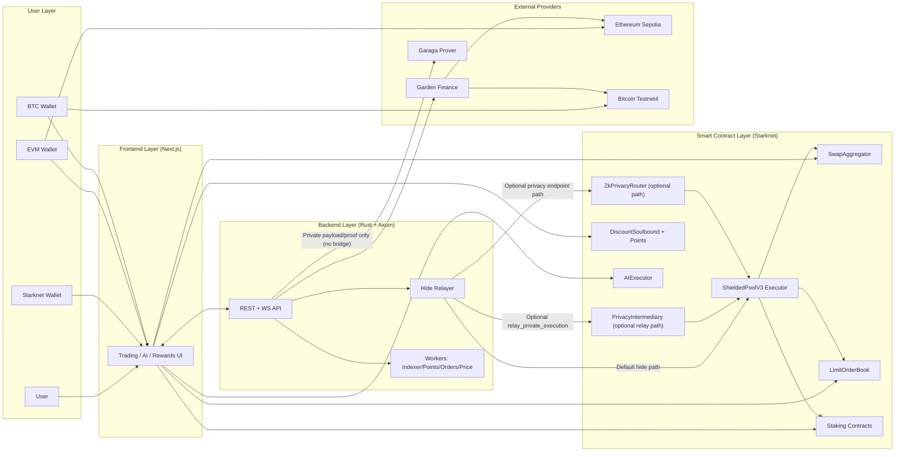
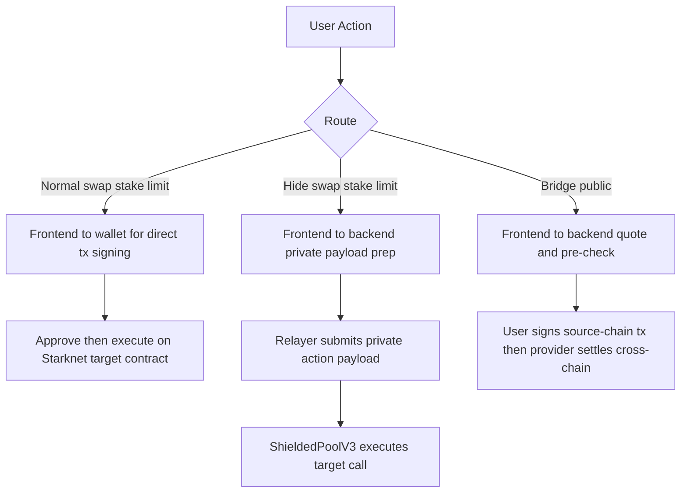
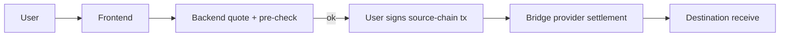

# CAREL Protocol Monorepo

CAREL Protocol runs on Starknet with two execution paths:
- Normal mode (direct wallet execution)
- Hide mode (relayer execution with ZK-bound private action payload)

This README explains how `frontend/`, `backend-rust/`, and `smartcontract/` work together.

## Table of Contents
- [Scope](#scope)
- [Repository Structure](#repository-structure)
- [Runtime Profile Policy](#runtime-profile-policy)
- [Public Testnet Deployment](#public-testnet-deployment)
- [Unified Architecture (FE + BE + SC)](#unified-architecture-fe--be--sc)
- [Execution Modes](#execution-modes)
- [Bridge Path](#bridge-path)
- [Hackathon Eligibility and Judging Alignment](#hackathon-eligibility-and-judging-alignment)
- [Submission Checklist (Hackathon)](#submission-checklist-hackathon)
- [Proof Transactions](#proof-transactions)
- [Test Status](#test-status)
- [Runtime Addresses (Starknet Sepolia)](#runtime-addresses-starknet-sepolia)
- [Quick Start](#quick-start)
- [Documentation Map](#documentation-map)
- [Current Constraints](#current-constraints)
- [Roadmap](#roadmap)

## Scope
- Monorepo modules: frontend app (`frontend/`), backend API/relayer (`backend-rust/`), Cairo contracts (`smartcontract/`).
- Deployment target in this repo: Starknet Sepolia testnet.
- Public testnet topology:
  - Frontend: Vercel
  - Backend: Railway
- Hide-mode baseline in this file: `ShieldedPoolV3` migration profile (`v3 default`, `v2 redeem-only`).

## Repository Structure
| Path | Stack | Purpose |
| --- | --- | --- |
| `frontend/` | Next.js 16 | Trading UI, wallet UX, AI panel, rewards UI |
| `backend-rust/` | Rust + Axum | API, relayer, workers, bridge orchestration |
| `smartcontract/` | Cairo + Scarb/Snforge | Protocol contracts, privacy layer, executor contracts |

## Runtime Profile Policy
Use this split to avoid profile drift:
- Runtime profile source for active FE/BE execution flow:
  - `backend-rust/.env`
  - `frontend/.env.local` (overrides `frontend/.env`)
- Smart contract catalog source (deployment inventory):
  - `smartcontract/.env`
- If values differ across documents, treat them as either:
  - `runtime profile` (active app execution), or
  - `catalog profile` (deployment inventory/history).

## Public Testnet Deployment
Current public testnet endpoints:

| Surface | URL | Notes |
| --- | --- | --- |
| Frontend demo | `https://carel-protocol.vercel.app` | Primary UI for demo and hackathon submission |
| Backend API | `https://zkcarelprotocol-production.up.railway.app` | Rust/Axum backend + relayer runtime |
| Backend health | `https://zkcarelprotocol-production.up.railway.app/health` | Returns runtime connectivity status for DB + Redis |

Frontend runtime env in Vercel:
- `NEXT_PUBLIC_BACKEND_URL=https://zkcarelprotocol-production.up.railway.app`
- `NEXT_PUBLIC_BACKEND_WS_URL=wss://zkcarelprotocol-production.up.railway.app`

Backend runtime notes:
- Railway is the active backend runtime for public testnet.
- Vercel frontend must be included in backend `CORS_ALLOWED_ORIGINS`.
- Hide mode and AI-assisted execution depend on backend relayer/prover availability.

## Unified Architecture (FE + BE + SC)

```mermaid
flowchart LR
  subgraph USER["User Layer"]
    U["User"]
    SW["Starknet Wallet"]
    EW["EVM Wallet"]
    BW["BTC Wallet"]
  end

  subgraph FE["Frontend Layer (Next.js)"]
    UI["Trading / AI / Rewards UI"]
  end

  subgraph BE["Backend Layer (Rust + Axum)"]
    API["REST + WS API"]
    REL["Hide Relayer"]
    WRK["Workers: Indexer/Points/Orders/Price"]
  end

  subgraph SC["Smart Contract Layer (Starknet)"]
    SWAP["SwapAggregator"]
    LOB["LimitOrderBook"]
    STAKE["Staking Contracts"]
    ZK["ZkPrivacyRouter (optional path)"]
    PI["PrivacyIntermediary (optional relay path)"]
    EXEC["ShieldedPoolV3 Executor"]
    NFT["DiscountSoulbound + Points"]
    AI["AIExecutor"]
  end

  subgraph EXT["External Providers"]
    ETH["Ethereum Sepolia"]
    BTC["Bitcoin Testnet4"]
    GARDEN["Garden Finance"]
    GARAGA["Garaga Prover"]
  end

  U --> UI
  SW --> UI
  EW --> UI
  BW --> UI

  UI <--> API
  API --> WRK
  API --> REL
  API -->|"Private payload/proof only (no bridge)"| GARAGA
  API --> GARDEN

  UI --> SWAP
  UI --> LOB
  UI --> STAKE
  UI --> NFT
  UI --> AI

  REL -->|"Default hide path"| EXEC
  REL -->|"Optional relay_private_execution"| PI
  PI --> EXEC
  REL -->|"Optional privacy endpoint path"| ZK
  ZK --> EXEC
  EXEC --> SWAP
  EXEC --> LOB
  EXEC --> STAKE

  EW --> ETH
  BW --> BTC
  GARDEN --> ETH
  GARDEN --> BTC
```

## Execution Modes

```mermaid
flowchart TD
  A["User Action"] --> B{"Route"}
  B -->|Normal swap stake limit| C["Frontend to wallet for direct tx signing"]
  B -->|Hide swap stake limit| D["Frontend to backend private payload prep"]
  B -->|Bridge public| H["Frontend to backend quote and pre-check"]
  C --> E["Approve then execute on Starknet target contract"]
  D --> F["Relayer submits private action payload"]
  F --> G["ShieldedPoolV3 executes target call"]
  H --> I["User signs source-chain tx then provider settles cross-chain"]
```

Execution notes:
- Normal mode: on-chain sender is the user wallet.
- Hide mode: on-chain sender is the relayer account.
- Hide mode relayer signing key is backend-managed (`BACKEND_PRIVATE_KEY`), not an AI provider key.
- Active hide-mode scope: swap, stake, limit order.
- Garaga scope in current MVP: private/hide execution only (`swap`, `stake`, `limit order`), not bridge settlement.
- Bridge route remains public cross-chain flow (not the hide executor path in current MVP).

## Bridge Path

```mermaid
flowchart LR
  U["User"] --> FE["Frontend"]
  FE --> Q["Backend quote + pre-check"]
  Q -->|ok| SIG["User signs source-chain tx"]
  SIG --> G["Bridge provider settlement"]
  G --> DST["Destination receive"]
```

AI level routing for bridge commands:
- Bridge commands in AI are executed through **Level 2** in the current MVP/runtime profile.
- Level 3 is reserved for Garaga/private execution flows (`hide swap`, `hide stake`, `hide limit`) and does not run public Garden bridge by default.
- Backend default is `AI_LEVEL3_BRIDGE_ENABLED=false`.

Current testnet bridge pairs:
- `ETH <-> BTC`
- `BTC <-> WBTC`
- `ETH <-> WBTC`

## Hackathon Eligibility and Judging Alignment
### Stage One (Tahap Pertama)
Focus: basic eligibility and track alignment.

Track alignment in this repository:
- Bitcoin track: BTC-related bridge and private BTC roadmap under `bridge` and `private_btc_swap` modules.
- Privacy track: ZK payload flow (`nullifier`, `commitment`, proof/public inputs), relayer path, and private executor.
- Open innovation track: integrated FE/BE/SC execution system with AI-assisted flow and loyalty module.

### Stage Two (Tahap Kedua)
Equal-weight judging criteria:
- Technology Execution: build quality and reliability.
- Innovation: originality and technical differentiation.
- Impact: real user/problem relevance.
- Presentation: clarity of explanation and demo evidence.
- Progress: measurable work completed during hackathon.

Evidence mapping:

| Criterion | Evidence in Repo |
| --- | --- |
| Technology Execution | `backend-rust/BE_TEST_REPORT.md`, `smartcontract/SC_TEST_REPORT.md`, runtime flow docs |
| Innovation | hide-mode relayer + ZK binding, AI-assisted execution, loyalty/points integration |
| Impact | unified execution flow (swap/bridge/stake/limit) and failure pre-check path |
| Presentation | architecture docs + README structure + demo proof links |
| Progress | deployment updates, runtime env audits, and test reports dated during hackathon cycle |

## Submission Checklist (Hackathon)
Required submission assets:
- Project description
- Demo video (max 3 minutes)
- Functional demo URL (`https://carel-protocol.vercel.app`)
- Public code repository
- README
- Starknet wallet address
- Optional: pitch deck

Language requirement:
- English content, or content with English translation.

## Proof Transactions
Transaction links are listed here for auditability.

Note:
- Scope clarification: demo-flow proof links are historical MVP evidence and are not the full deployment footprint.

### Latest Deployment/Upgrade Transactions (Feb 26-27, 2026)
- Garaga verifier declare: https://sepolia.voyager.online/tx/0x3077ad4d20d1b9acc70fc18af1be0356b3e2c5a803f3ac4b83766523616b51f
- Garaga verifier deploy: https://sepolia.voyager.online/tx/0x0261ba1337d96733010f049591f5c65a3f33a080006d76f7dca4de958e8b0b66
- AI Executor deploy: https://sepolia.voyager.online/tx/0x057ee4fb05d584d4d5dc1fd54ceed57a6e5638b3fe8f2e8de6f222b66b6c2b9a
- AI Executor config 1: https://sepolia.voyager.online/tx/0x00c473fff1062e048d407b8e378337ce2f86489487cf31f5346ea2ebdb9eba46
- AI Executor config 2: https://sepolia.voyager.online/tx/0x002bb9b874a213c2b20d03acf8827e3db1912ead8abea5934e5aa0640e076a61
- AI Executor config 3: https://sepolia.voyager.online/tx/0x046c27a0f32d84dd42f3094a90c0b90f2e3501d63518ee5f93e9f7bc08180ae8
- AI Executor config 4: https://sepolia.voyager.online/tx/0x075f6f5bb1ae646a31f5f0373749b4fe99c164b05cfcfe0ac52ad3fd6e4e9462
- AI Executor config 5: https://sepolia.voyager.online/tx/0x0722f5eea40ab5fd4b89f96484ca373cfbf31a5fc5c1a92dd218c29739c08cd0
- AI Executor config 6: https://sepolia.voyager.online/tx/0x0105bcf4255238c6aac5e02d66e6ee39f65ba41f060530f54b6cae3553bb4423
- CAREL burner grant: https://sepolia.voyager.online/tx/0x0745212c6e5a3cab6f62f8111aa946ef4bafd5b540b7d68dbbc70c9eee8e3158

### Historical MVP Demo-Flow Links (Feb 23-25, 2026)
- Normal Swap: https://sepolia.voyager.online/tx/0x22a53b1af0f7d62e19569a99b38d67e9165faad2804ca50a1b0a53f289bab98
- Hide Swap: https://sepolia.voyager.online/tx/0x71b6c99287c78b082d105dc7169faa56b419a3e2568b3ea9a70ef1ff653a2d2
- Normal Stake: https://sepolia.voyager.online/tx/0x3ffda88b060ad41b752e8410b13b567c2cca3aa1e32b29f60cf75d9f8b42d60
- Hide Stake: https://sepolia.voyager.online/tx/0x5fcac3b4578ebe8cf32dde9b0c6ab2390f1f1aa6bea731c3f779575abbdd4cf
- Normal Limit: https://sepolia.voyager.online/tx/0x737c40659dc5c7872ab1a89222d879bca68163b890a61f09b1875d52e4747a6
- Hide Limit: https://sepolia.voyager.online/tx/0x523c9721e57f69fddff4ed3be3935cce3b5782ca2c3b454df565c0be6b22ba3
- BTC bridge tx: https://mempool.space/testnet4/tx/d26a8f5d0213b4448722cde81e1f47e68b8efbd00c56ce4802e39c9b0898db4c
- Garden order: https://testnet-explorer.garden.finance/order/237be68816b9144b9d3533ca3ec8c4eb1e7c00b1649e9ec216d89469fd014e70
- ETH bridge tx: https://sepolia.etherscan.io/tx/0xab25b9261dc9f703e44cb89a34831ff03024b8fe89e32cce4a7e58b5d6dcdef3

### Deployment/Wiring Transaction Scope (Beyond 9 Demo Links)
- Contract deployment order itself is 22 contracts (`smartcontract/DEPLOY_TESTNET.md`), so at least 22 deploy transactions.
- Additional documented upgrades/wiring include:
  - Real Garaga verifier redeploy (February 27, 2026): declare `0x3077ad4d20d1b9acc70fc18af1be0356b3e2c5a803f3ac4b83766523616b51f`, deploy `0x0261ba1337d96733010f049591f5c65a3f33a080006d76f7dca4de958e8b0b66`.
  - AI Executor upgrade (February 26, 2026): deploy `0x057ee4fb05d584d4d5dc1fd54ceed57a6e5638b3fe8f2e8de6f222b66b6c2b9a`, plus 6 config tx and 1 CAREL burner grant tx (listed in `smartcontract/DEPLOY_TESTNET.md`).
  - V2 privacy wiring script maps 32 verifier actions and wires up to 36 contracts/modules (30 default + 6 optional external modules).
  - Staking token registration script adds 4 invoke tx (USDC, USDT, STRK, WBTC).
- Documented deploy+wiring activity commonly exceeds 100 tx across full setup/redeploy cycles (not counting RPC retry attempts).
- Quick explorer check by deployer wallet: `https://sepolia.voyager.online/contract/[DEPLOYER_ADDRESS]`.

## Test Status
Latest local report snapshot (2026-03-05):

| Module | Result | Source |
| --- | --- | --- |
| Backend (`backend-rust`) | `208/208` pass | `backend-rust/BE_TEST_REPORT.md` |
| Smartcontract core (`smartcontract`) | `172/172` pass | `smartcontract/SC_TEST_REPORT.md` |
| Private executor suite (`private_executor_lite`) | `22/22` pass | `smartcontract/SC_TEST_REPORT.md` |
| Frontend (`frontend`) | `lint: pass (0 warnings), build: pass on Node 20.11.1` | `frontend/FE_TEST_REPORT.md` |

Total reported automated tests (BE + SC): `402/402`.

## Runtime Addresses (Starknet Sepolia)
Runtime addresses below follow `backend-rust/.env` (V3 baseline profile):

| Contract | Address |
| --- | --- |
| Swap Aggregator | `0x06f3e03be8a82746394c4ad20c6888dd260a69452a50eb3121252fdecacc6d28` |
| Bridge Aggregator | `0x047ed770a6945fc51ce3ed32645ed71260fae278421826ee4edabeae32b755d5` |
| Limit Order Book | `0x06b189eef1358559681712ff6e9387c2f6d43309e27705d26daff4e3ba1fdf8a` |
| Staking CAREL | `0x06ed000cdf98b371dbb0b8f6a5aa5b114fb218e3c75a261d7692ceb55825accb` |
| Staking Stablecoin | `0x014f58753338f2f470c397a1c7ad1cfdc381a951b314ec2d7c9aec06a73a0aff` |
| Staking WBTC (contract: `StakingBTC`) | `0x01fa14e91abade76d753d718640a14540032c307832a435f8781d446b288cdf8` |
| ZK Privacy Router | `0x0682719dbe8364fc5c772f49ecb63ea2f2cf5aa919b7d5baffb4448bb4438d1f` |
| PrivacyIntermediary | `0x0246cd17157819eb614e318d468270981d10e6b6e99bcaa7ca4b43d53de810ab` |
| Private Action Executor (V3 runtime) | `0x0112a5f60db409d74c4e67b5c29c85c7fbeefffccf9762a37460a42854cc74c2` |
| DiscountSoulbound | `0x05b4c1e3578fd605b44b1950c749f01b2f652b8fd7a77135801d8d31af6fe809` |
| AIExecutor | `0x00d8ada9eb26d133f9f2656ac1618d8cdf9fcefe6c8e292cf9b7ee580b72a690` |

## Quick Start
Public testnet usage:
- Open frontend: `https://carel-protocol.vercel.app`
- Backend health check: `https://zkcarelprotocol-production.up.railway.app/health`

Local development:
```bash
docker compose up -d postgres redis

# terminal 1
cd backend-rust
cargo run

# terminal 2
cd frontend
npm install
npm run dev
```

Open: `http://localhost:3000`

## Documentation Map
| Area | Document |
| --- | --- |
| Frontend technical README | `frontend/README.md` |
| Backend technical README | `backend-rust/README.md` |
| Smartcontract technical README | `smartcontract/README.md` |
| Frontend deployment | `frontend/DEPLOY_TESTNET.md` |
| Backend tests | `backend-rust/BE_TEST_REPORT.md` |
| Smartcontract tests | `smartcontract/SC_TEST_REPORT.md` |
| Runtime env audit | `docs/ENV_RUNTIME_AUDIT_MVP.md` |
| V3 go-live checklist | `docs/PRODUCTION_GO_LIVE_CHECKLIST_V3_2026-02-27.md` |

## Current Constraints
- Testnet-first deployment posture.
- Hide mode reduces linkability but does not hide public chain metadata.
- Bridge path depends on third-party provider uptime/liquidity.
- No proxy-based upgrade path in current contracts; upgrades require redeploy/migration.

## Roadmap
- Short term:
  - Complete V3 operational hardening and observability.
  - Keep V2 as redeem-only during migration window.
- Mid term:
  - Expand privacy telemetry and failure analytics.
  - Increase bridge provider redundancy.
- Post-hackathon plan:
  - Shadow Bridge (hide-mode BTC native to wBTC) as a dedicated roadmap stream.
