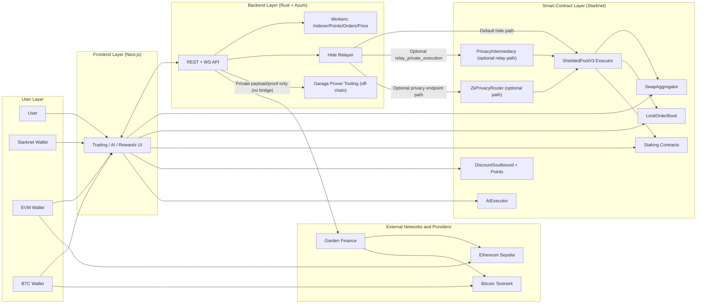
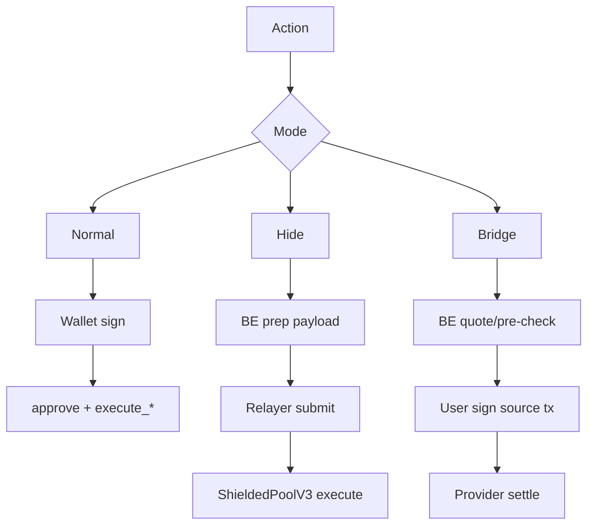
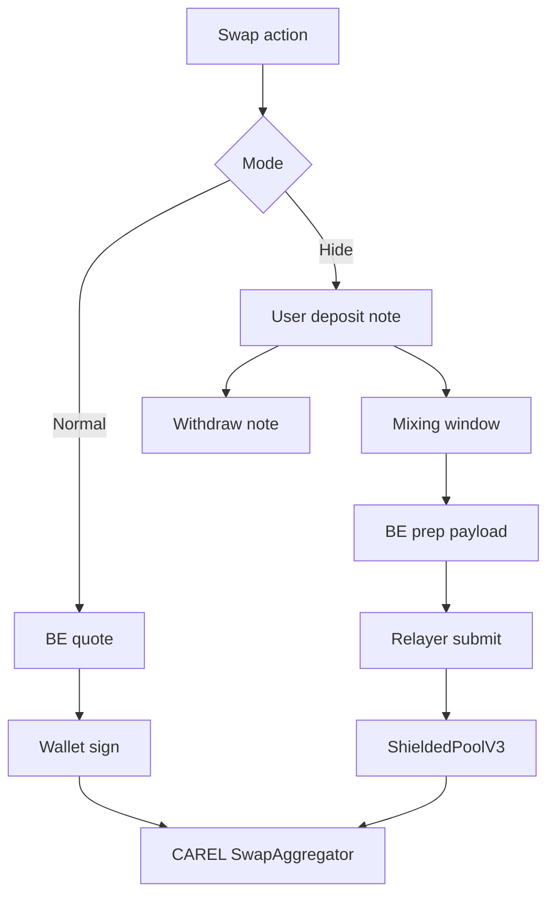
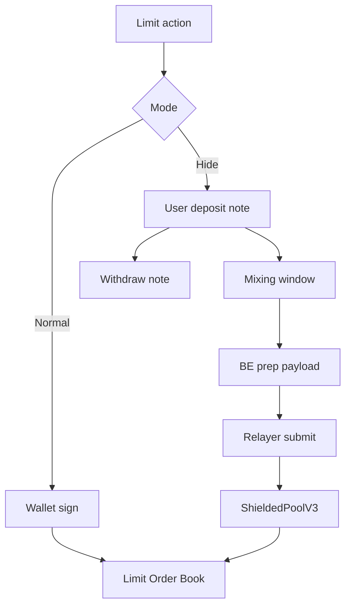
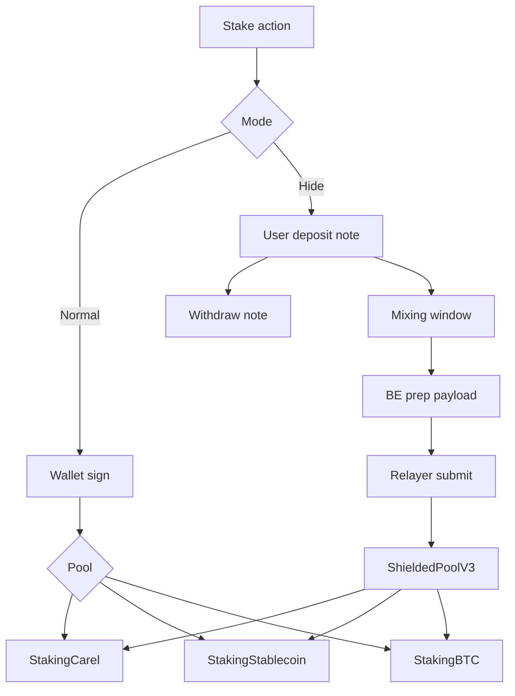
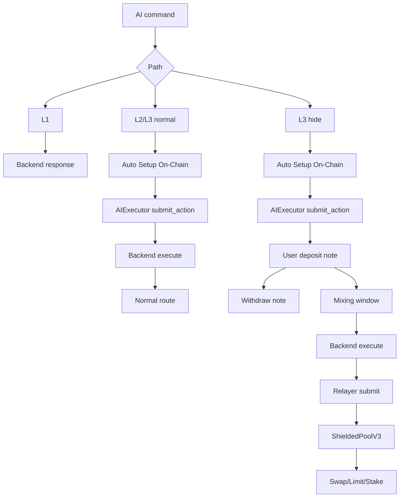
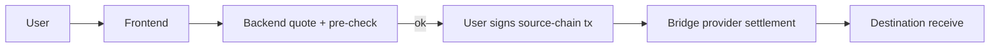

# CAREL Protocol Monorepo

CAREL Protocol runs on Starknet with two execution paths:
- Normal mode (direct wallet execution)
- Hide mode (relayer execution with ZK-bound private action payload)

This README explains how `frontend/`, `backend-rust/`, and `smartcontract/` work together.

## Table of Contents
- [Scope](#scope)
- [Repository Structure](#repository-structure)
- [Runtime Profile Policy](#runtime-profile-policy)
- [Public Testnet Deployment](#public-testnet-deployment)
- [Unified Architecture (FE + BE + SC)](#unified-architecture-fe--be--sc)
- [Execution Modes](#execution-modes)
- [Core Action Paths](#core-action-paths)
- [Bridge Path](#bridge-path)
- [Test Status](#test-status)
- [Runtime Addresses (Starknet Sepolia)](#runtime-addresses-starknet-sepolia)
- [Quick Start](#quick-start)
- [Documentation Map](#documentation-map)
- [Current Constraints](#current-constraints)
- [Roadmap](#roadmap)

## Scope
- Monorepo modules: frontend app (`frontend/`), backend API/relayer (`backend-rust/`), Cairo contracts (`smartcontract/`).
- Deployment target in this repo: Starknet Sepolia testnet.
- Public testnet topology:
  - Frontend: Vercel
  - Backend: Railway
- Hide-mode baseline in this file: `ShieldedPoolV3` migration profile (`v3 default`, `v2 redeem-only`).

## Repository Structure
| Path | Stack | Purpose |
| --- | --- | --- |
| `frontend/` | Next.js 16 | Trading UI, wallet UX, AI panel, rewards UI |
| `backend-rust/` | Rust + Axum | API, relayer, workers, bridge orchestration |
| `smartcontract/` | Cairo + Scarb/Snforge | Protocol contracts, privacy layer, executor contracts |

## Runtime Profile Policy
Use this split to avoid profile drift:
- Runtime profile source for active FE/BE execution flow:
  - `backend-rust/.env`
  - `frontend/.env.local` (overrides `frontend/.env`)
- Smart contract catalog source (deployment inventory):
  - `smartcontract/.env`
- If values differ across documents, treat them as either:
  - `runtime profile` (active app execution), or
  - `catalog profile` (deployment inventory/history).

## Public Testnet Deployment
Current public testnet endpoints:

| Surface | URL | Notes |
| --- | --- | --- |
| Frontend demo | `https://carel-protocol.vercel.app` | Primary UI for demo and hackathon submission |
| Backend API | `https://zkcarelprotocol-production.up.railway.app` | Rust/Axum backend + relayer runtime |
| Backend health | `https://zkcarelprotocol-production.up.railway.app/health` | Returns runtime connectivity status for DB + Redis |

Frontend runtime env in Vercel:
- `NEXT_PUBLIC_BACKEND_URL=https://zkcarelprotocol-production.up.railway.app`
- `NEXT_PUBLIC_BACKEND_WS_URL=wss://zkcarelprotocol-production.up.railway.app`

Backend runtime notes:
- Railway is the active backend runtime for public testnet.
- Vercel frontend must be included in backend `CORS_ALLOWED_ORIGINS`.
- Hide mode and AI-assisted execution depend on backend relayer/prover availability.

## Unified Architecture (FE + BE + SC)

```mermaid
flowchart LR
  subgraph USER["User Layer"]
    U["User"]
    SW["Starknet Wallet"]
    EW["EVM Wallet"]
    BW["BTC Wallet"]
  end

  subgraph FE["Frontend Layer (Next.js)"]
    UI["Trading / AI / Rewards UI"]
  end

  subgraph BE["Backend Layer (Rust + Axum)"]
    API["REST + WS API"]
    REL["Hide Relayer"]
    WRK["Workers: Indexer/Points/Orders/Price"]
    PROVER["Garaga Prover Tooling (off-chain)"]
  end

  subgraph SC["Smart Contract Layer (Starknet)"]
    SWAP["SwapAggregator"]
    LOB["LimitOrderBook"]
    STAKE["Staking Contracts"]
    ZK["ZkPrivacyRouter (optional path)"]
    PI["PrivacyIntermediary (optional relay path)"]
    EXEC["ShieldedPoolV3 Executor"]
    NFT["DiscountSoulbound + Points"]
    AI["AIExecutor"]
  end

  subgraph EXT["External Networks and Providers"]
    ETH["Ethereum Sepolia"]
    BTC["Bitcoin Testnet4"]
    GARDEN["Garden Finance"]
  end

  U --> UI
  SW --> UI
  EW --> UI
  BW --> UI

  UI <--> API
  API --> WRK
  API --> REL
  API -->|"Private payload/proof only (no bridge)"| PROVER
  API --> GARDEN

  UI --> SWAP
  UI --> LOB
  UI --> STAKE
  UI --> NFT
  UI --> AI

  REL -->|"Default hide path"| EXEC
  REL -->|"Optional relay_private_execution"| PI
  PI --> EXEC
  REL -->|"Optional privacy endpoint path"| ZK
  ZK --> EXEC
  EXEC --> SWAP
  EXEC --> LOB
  EXEC --> STAKE

  EW --> ETH
  BW --> BTC
  GARDEN --> ETH
  GARDEN --> BTC
```

## Execution Modes

```mermaid
flowchart TD
  A["Action"] --> B{"Mode"}

  B --> C["Normal"]
  C --> C1["Wallet sign"]
  C1 --> C2["approve + execute_*"]

  B --> D["Hide"]
  D --> D1["BE prep payload"]
  D1 --> D2["Relayer submit"]
  D2 --> D3["ShieldedPoolV3 execute"]

  B --> H["Bridge"]
  H --> H1["BE quote/pre-check"]
  H1 --> H2["User sign source tx"]
  H2 --> H3["Provider settle"]
```

Execution notes:
- Normal mode: on-chain sender is the user wallet.
- Hide mode: on-chain sender is the relayer account.
- Hide mode relayer signing key is backend-managed (`BACKEND_PRIVATE_KEY`), not an AI provider key.
- Active hide-mode scope: swap, stake, limit order.
- Garaga scope in current MVP: private/hide execution only (`swap`, `stake`, `limit order`), not bridge settlement.
- Bridge route remains public cross-chain flow (not the hide executor path in current MVP).

## Core Action Paths
These show the normal-path targets. Hide mode reaches the same target contracts through `ShieldedPoolV3`.

- `SwapAggregator` here is CAREL's routing contract, not an external DEX.
- `Limit Order Book` is the runtime/UI name used in app flows.
- Staking routes target `StakingCarel`, `StakingStablecoin`, or `StakingBTC`.
- Normal mode still earns points and can use an active NFT discount.
- Hide mode uses `deposit_fixed_v3` first. After deposit, user can still withdraw the note if not proceeding. If continuing, the note waits the mixing window/cooldown, then the relayer executes through `ShieldedPoolV3`. Hide mode still earns points, can use NFT discount, and adds hide-tier bonus points.

### Swap

```mermaid
flowchart TD
  A[Swap action] --> B{Mode}
  B -->|Normal| N1[BE quote]
  N1 --> N2[Wallet sign]
  N2 --> SWAP[CAREL SwapAggregator]

  B -->|Hide| H1[User deposit note]
  H1 --> HW[Withdraw note]
  H1 --> H2[Mixing window]
  H2 --> H3[BE prep payload]
  H3 --> H4[Relayer submit]
  H4 --> H5[ShieldedPoolV3]
  H5 --> SWAP
```

### Limit Order

```mermaid
flowchart TD
  A[Limit action] --> B{Mode}
  B -->|Normal| N1[Wallet sign]
  N1 --> LOB[Limit Order Book]

  B -->|Hide| H1[User deposit note]
  H1 --> HW[Withdraw note]
  H1 --> H2[Mixing window]
  H2 --> H3[BE prep payload]
  H3 --> H4[Relayer submit]
  H4 --> H5[ShieldedPoolV3]
  H5 --> LOB
```

### Staking

```mermaid
flowchart TD
  A[Stake action] --> B{Mode}
  B -->|Normal| N1[Wallet sign]
  N1 --> P1{Pool}
  P1 --> S1[StakingCarel]
  P1 --> S2[StakingStablecoin]
  P1 --> S3[StakingBTC]

  B -->|Hide| H1[User deposit note]
  H1 --> HW[Withdraw note]
  H1 --> H2[Mixing window]
  H2 --> H3[BE prep payload]
  H3 --> H4[Relayer submit]
  H4 --> H5[ShieldedPoolV3]
  H5 --> S1
  H5 --> S2
  H5 --> S3
```

### AI

```mermaid
flowchart TD
  A[AI command] --> B{Path}

  B --> C[L1]
  C --> C1[Backend response]

  B --> D[L2/L3 normal]
  D --> D1[Auto Setup On-Chain]
  D1 --> D2[AIExecutor submit_action]
  D2 --> D3[Backend execute]
  D3 --> D4[Normal route]

  B --> E[L3 hide]
  E --> E1[Auto Setup On-Chain]
  E1 --> E2[AIExecutor submit_action]
  E2 --> E3[User deposit note]
  E3 --> EW[Withdraw note]
  E3 --> E4[Mixing window]
  E4 --> E5[Backend execute]
  E5 --> E6[Relayer submit]
  E6 --> E7[ShieldedPoolV3]
  E7 --> E8[Swap/Limit/Stake]
```

AI notes:
- `L1` is backend-only and does not use an on-chain execution path.
- `L2` and `L3` use `AIExecutor` setup/action flow before executable commands run.
- `L3 hide` follows the same note + cooldown + relayer path as hide swap/stake/limit.
- A deposited hide note can still be withdrawn before the relayer execution path is used.
- AI bridge stays on `Level 2` in the current runtime profile.

## Bridge Path

```mermaid
flowchart LR
  U["User"] --> FE["Frontend"]
  FE --> Q["Backend quote + pre-check"]
  Q -->|ok| SIG["User signs source-chain tx"]
  SIG --> G["Bridge provider settlement"]
  G --> DST["Destination receive"]
```

AI level routing for bridge commands:
- Bridge commands in AI are executed through **Level 2** in the current MVP/runtime profile.
- Level 3 is reserved for Garaga/private execution flows (`hide swap`, `hide stake`, `hide limit`) and does not run public Garden bridge by default.
- Backend default is `AI_LEVEL3_BRIDGE_ENABLED=false`.

Current testnet bridge pairs:
- `ETH <-> BTC`
- `BTC <-> WBTC`
- `ETH <-> WBTC`

Testnet note:
- Bridge providers on testnet often run out of liquidity, so route availability can be intermittent.

## Test Status
Latest local report snapshot (2026-03-05):

| Module | Result | Source |
| --- | --- | --- |
| Backend (`backend-rust`) | `208/208` pass | `docs/test_reports.md` |
| Smartcontract core (`smartcontract`) | `172/172` pass | `docs/test_reports.md` |
| Private executor suite (`private_executor_lite`) | `22/22` pass | `docs/test_reports.md` |
| Frontend (`frontend`) | `lint: pass (0 warnings), build: pass on Node 20.11.1` | `docs/test_reports.md` |

Total reported automated tests (BE + SC): `402/402`.

## Runtime Addresses (Starknet Sepolia)
Runtime addresses below follow `backend-rust/.env` (V3 baseline profile):

| Contract | Address |
| --- | --- |
| Swap Aggregator | `0x06f3e03be8a82746394c4ad20c6888dd260a69452a50eb3121252fdecacc6d28` |
| Bridge Aggregator | `0x047ed770a6945fc51ce3ed32645ed71260fae278421826ee4edabeae32b755d5` |
| Limit Order Book | `0x06b189eef1358559681712ff6e9387c2f6d43309e27705d26daff4e3ba1fdf8a` |
| Staking CAREL | `0x06ed000cdf98b371dbb0b8f6a5aa5b114fb218e3c75a261d7692ceb55825accb` |
| Staking Stablecoin | `0x014f58753338f2f470c397a1c7ad1cfdc381a951b314ec2d7c9aec06a73a0aff` |
| Staking WBTC (contract: `StakingBTC`) | `0x01fa14e91abade76d753d718640a14540032c307832a435f8781d446b288cdf8` |
| ZK Privacy Router | `0x0682719dbe8364fc5c772f49ecb63ea2f2cf5aa919b7d5baffb4448bb4438d1f` |
| PrivacyIntermediary | `0x0246cd17157819eb614e318d468270981d10e6b6e99bcaa7ca4b43d53de810ab` |
| Private Action Executor (V3 runtime) | `0x0112a5f60db409d74c4e67b5c29c85c7fbeefffccf9762a37460a42854cc74c2` |
| DiscountSoulbound | `0x05b4c1e3578fd605b44b1950c749f01b2f652b8fd7a77135801d8d31af6fe809` |
| AIExecutor | `0x00d8ada9eb26d133f9f2656ac1618d8cdf9fcefe6c8e292cf9b7ee580b72a690` |

## Quick Start
Public testnet usage:
- Open frontend: `https://carel-protocol.vercel.app`
- Backend health check: `https://zkcarelprotocol-production.up.railway.app/health`

Local development:
```bash
docker compose up -d postgres redis

# terminal 1
cd backend-rust
cargo run

# terminal 2
cd frontend
npm install
npm run dev
```

Open: `http://localhost:3000`

## Documentation Map
| Area | Document |
| --- | --- |
| Docs index | `docs/README.md` |
| Frontend technical README | `frontend/README.md` |
| Backend technical README | `backend-rust/README.md` |
| Smartcontract technical README | `smartcontract/README.md` |
| Frontend deployment | `frontend/DEPLOY_TESTNET.md` |
| Cross-layer deploy guide | `docs/deploy_testnet.md` |
| Test reports | `docs/test_reports.md` |
| Runtime env audit | `docs/env_runtime_audit_mvp.md` |
| V3 go-live checklist | `docs/production_go_live_checklist_v3_2026-02-27.md` |
| Hackathon submission and proof links | `docs/hackathon_submission_evidence.md` |

## Current Constraints
- Testnet-first deployment posture.
- Hide mode reduces linkability but does not hide public chain metadata.
- Bridge path depends on third-party provider uptime/liquidity.
- No proxy-based upgrade path in current contracts; upgrades require redeploy/migration.

## Roadmap
- Short term:
  - Complete V3 operational hardening and observability.
  - Keep V2 as redeem-only during migration window.
- Mid term:
  - Expand privacy telemetry and failure analytics.
  - Increase bridge provider redundancy.
- Post-hackathon plan:
  - Shadow Bridge (hide-mode BTC native to wBTC) as a dedicated roadmap stream.
  - Sumo Login integration as a dedicated auth/privacy roadmap stream.
  - Battleship as a dedicated gameplay/privacy roadmap stream.
