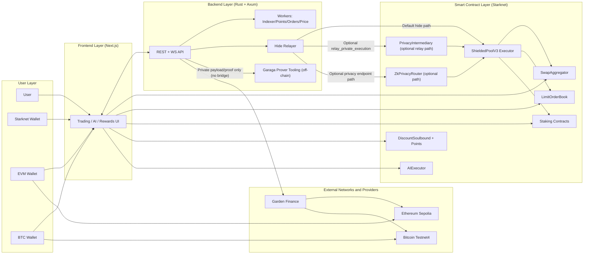
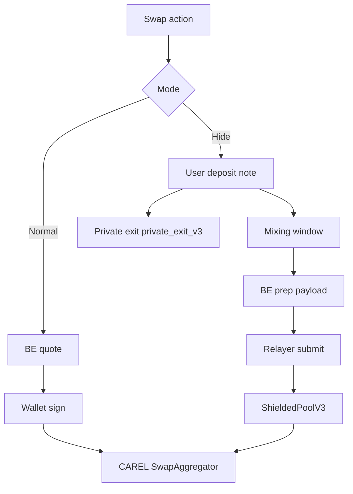
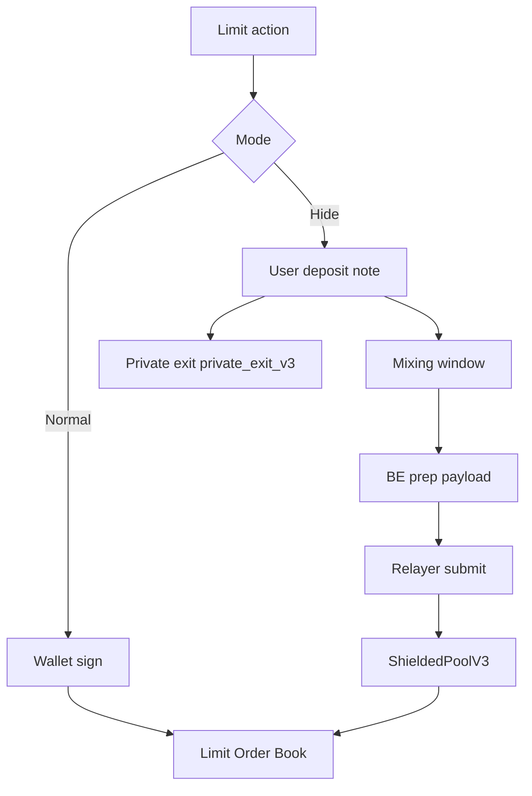
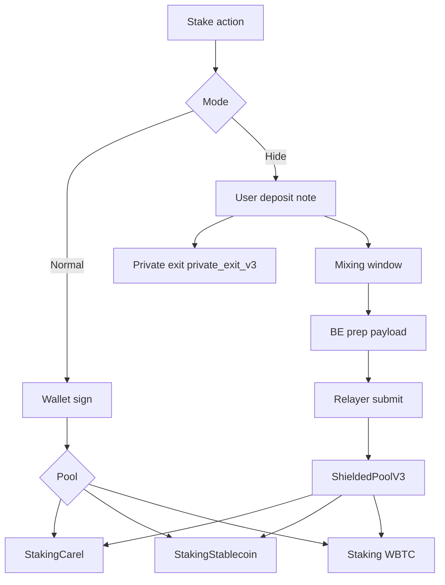
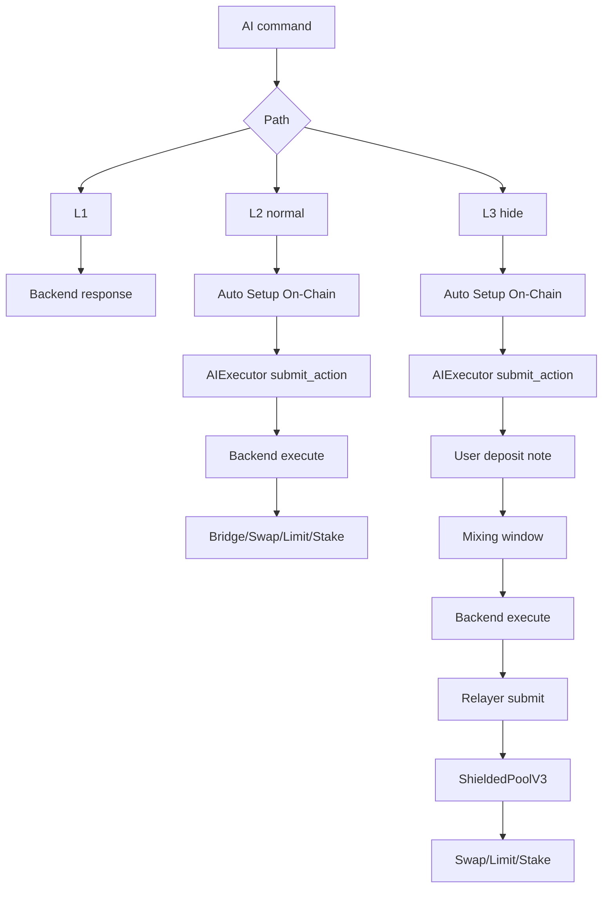
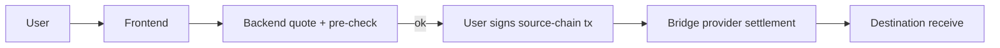

# CAREL Protocol Monorepo

CAREL Protocol runs on Starknet with two execution paths:
- Normal mode (direct wallet execution)
- Hide mode (relayer execution with ZK-bound private action payload)

This README explains how `frontend/`, `backend-rust/`, and `smartcontract/` work together.

## Table of Contents
- [Scope](#scope)
- [Repository Structure](#repository-structure)
- [Runtime Profile Policy](#runtime-profile-policy)
- [Public Testnet Deployment](#public-testnet-deployment)
- [Unified Architecture (FE + BE + SC)](#unified-architecture-fe--be--sc)
- [Core Action Paths](#core-action-paths)
- [Bridge Path](#bridge-path)
- [Test Status](#test-status)
- [Runtime Addresses (Starknet Sepolia)](#runtime-addresses-starknet-sepolia)
- [Quick Start](#quick-start)
- [Documentation Map](#documentation-map)
- [Current Constraints](#current-constraints)
- [Roadmap](#roadmap)

## Scope
- Monorepo modules: frontend app (`frontend/`), backend API/relayer (`backend-rust/`), Cairo contracts (`smartcontract/`).
- Deployment target in this repo: Starknet Sepolia testnet.
- Public testnet topology:
  - Frontend: Vercel
  - Backend: Railway
- Hide-mode baseline in this file: `ShieldedPoolV3` migration profile (`v3 default`, `v2 redeem-only`).

## Repository Structure
| Path | Stack | Purpose |
| --- | --- | --- |
| `frontend/` | Next.js 16 | Trading UI, wallet UX, AI panel, rewards UI |
| `backend-rust/` | Rust + Axum | API, relayer, workers, bridge orchestration |
| `smartcontract/` | Cairo + Scarb/Snforge | Protocol contracts, privacy layer, executor contracts |

## Runtime Profile Policy
Use this split to avoid profile drift:
- Runtime profile source for active FE/BE execution flow:
  - `backend-rust/.env`
  - `frontend/.env.local` (overrides `frontend/.env`)
- Smart contract catalog source (deployment inventory):
  - `smartcontract/starknet/.env` (current)
  - `docs/runtime_addresses_archive.md` (legacy snapshots)
- If values differ across documents, treat them as either:
  - `runtime profile` (active app execution), or
  - `catalog profile` (deployment inventory/history).

## Public Testnet Deployment
Current public testnet endpoints:

| Surface | URL | Notes |
| --- | --- | --- |
| Frontend demo | `https://carel-protocol.vercel.app` | Primary UI for demo and hackathon submission |
| Backend API | `https://zkcarelprotocol-production.up.railway.app` | Rust/Axum backend + relayer runtime |
| Backend health | `https://zkcarelprotocol-production.up.railway.app/health` | Returns runtime connectivity status for DB + Redis |

Frontend runtime env in Vercel:
- `NEXT_PUBLIC_BACKEND_URL=https://zkcarelprotocol-production.up.railway.app`
- `NEXT_PUBLIC_BACKEND_WS_URL=wss://zkcarelprotocol-production.up.railway.app`

Backend runtime notes:
- Railway is the active backend runtime for public testnet.
- Vercel frontend must be included in backend `CORS_ALLOWED_ORIGINS`.
- Hide mode and AI-assisted execution depend on backend relayer/prover availability.

## Unified Architecture (FE + BE + SC)

```mermaid
flowchart LR
  subgraph USER["User Layer"]
    U["User"]
    SW["Starknet Wallet"]
    EW["EVM Wallet"]
    BW["BTC Wallet"]
  end

  subgraph FE["Frontend Layer (Next.js)"]
    UI["Trading / AI / Rewards UI"]
  end

  subgraph BE["Backend Layer (Rust + Axum)"]
    API["REST + WS API"]
    REL["Hide Relayer"]
    WRK["Workers: Indexer/Points/Orders/Price"]
    PROVER["Garaga Prover Tooling (off-chain)"]
  end

  subgraph SC["Smart Contract Layer (Starknet)"]
    SWAP["SwapAggregator"]
    LOB["LimitOrderBook"]
    STAKE["Staking Contracts"]
    ZK["ZkPrivacyRouter (optional path)"]
    PI["PrivacyIntermediary (optional relay path)"]
    EXEC["ShieldedPoolV3 Executor"]
    NFT["DiscountSoulbound + Points"]
    AI["AIExecutor"]
  end

  subgraph EXT["External Networks and Providers"]
    ETH["Ethereum Sepolia"]
    BTC["Bitcoin Testnet4"]
    GARDEN["Garden Finance"]
  end

  U --> UI
  SW --> UI
  EW --> UI
  BW --> UI

  UI <--> API
  API --> WRK
  API --> REL
  API -->|"Private payload/proof only (no bridge)"| PROVER
  API --> GARDEN

  UI --> SWAP
  UI --> LOB
  UI --> STAKE
  UI --> NFT
  UI --> AI

  REL -->|"Default hide path"| EXEC
  REL -->|"Optional relay_private_execution"| PI
  PI --> EXEC
  REL -->|"Optional privacy endpoint path"| ZK
  ZK --> EXEC
  EXEC --> SWAP
  EXEC --> LOB
  EXEC --> STAKE

  EW --> ETH
  BW --> BTC
  GARDEN --> ETH
  GARDEN --> BTC
```

## Core Action Paths
These show the normal-path targets. Hide mode reaches the same target contracts through `ShieldedPoolV3`.

- `SwapAggregator` here is CAREL's routing contract, not an external DEX.
- `Limit Order Book` is the runtime/UI name used in app flows.
- WBTC staking uses the `WBTCStaking` contract.
- Normal mode still earns points and can use an active NFT discount.
- Hide mode uses `deposit_fixed_v3` first. After deposit, the user can exit the note via `private_exit_v3` (requires a ZK proof) if not proceeding. If continuing, the note waits the mixing window/cooldown, then the relayer executes through `ShieldedPoolV3`. Hide mode still earns points, can use NFT discount, and adds hide-tier bonus points.

Privacy note (important):
- Starknet calldata and ERC20 transfers are public. Hide mode does **not** hide trade parameters (token pair, amount, route).
- Deposits/exits/payouts still create public token transfers (depositor/recipient and denomination tier remain observable).
- Hide mode focuses on reducing linkability between deposits and later spends (commitment vs nullifier) and enforcing proof-bound execution.

### Swap

```mermaid
flowchart TD
  A[Swap action] --> B{Mode}
  B -->|Normal| N1[BE quote]
  N1 --> N2[Wallet sign]
  N2 --> SWAP[CAREL SwapAggregator]

  B -->|Hide| H1[User deposit note]
  H1 --> HW[Private exit private_exit_v3]
  H1 --> H2[Mixing window]
  H2 --> H3[BE prep payload]
  H3 --> H4[Relayer submit]
  H4 --> H5[ShieldedPoolV3]
  H5 --> SWAP
```

### Limit Order

```mermaid
flowchart TD
  A[Limit action] --> B{Mode}
  B -->|Normal| N1[Wallet sign]
  N1 --> LOB[Limit Order Book]

  B -->|Hide| H1[User deposit note]
  H1 --> HW[Private exit private_exit_v3]
  H1 --> H2[Mixing window]
  H2 --> H3[BE prep payload]
  H3 --> H4[Relayer submit]
  H4 --> H5[ShieldedPoolV3]
  H5 --> LOB
```

### Staking

```mermaid
flowchart TD
  A[Stake action] --> B{Mode}
  B -->|Normal| N1[Wallet sign]
  N1 --> P1{Pool}
  P1 --> S1[StakingCarel]
  P1 --> S2[StakingStablecoin]
  P1 --> S3[Staking WBTC]

  B -->|Hide| H1[User deposit note]
  H1 --> HW[Private exit private_exit_v3]
  H1 --> H2[Mixing window]
  H2 --> H3[BE prep payload]
  H3 --> H4[Relayer submit]
  H4 --> H5[ShieldedPoolV3]
  H5 --> S1
  H5 --> S2
  H5 --> S3
```

### AI

```mermaid
flowchart TD
  A[AI command] --> B{Path}

  B --> C[L1]
  C --> C1[Backend response]

  B --> D[L2 normal]
  D --> D1[Auto Setup On-Chain]
  D1 --> D2[AIExecutor submit_action]
  D2 --> D3[Backend execute]
  D3 --> D4[Bridge/Swap/Limit/Stake]

  B --> E[L3 hide]
  E --> E1[Auto Setup On-Chain]
  E1 --> E2[AIExecutor submit_action]
  E2 --> E3[User deposit note]
  E3 --> E4[Mixing window]
  E4 --> E5[Backend execute]
  E5 --> E6[Relayer submit]
  E6 --> E7[ShieldedPoolV3]
  E7 --> E8[Swap/Limit/Stake]
```

AI notes:
- `L1` is backend-only and does not use an on-chain execution path.
- `L2` can run normal `bridge`, `swap`, `limit order`, and `stake` execution.
- `L2` and `L3` use `AIExecutor` setup/action flow before executable commands run.
- Public `bridge` stays routed through `L2` in the current runtime unless `AI_LEVEL3_BRIDGE_ENABLED=true`.
- `L3 hide` follows the note + cooldown + relayer path before private execution.
- The current AI hide path does not expose note withdrawal in the AI UI.

## Bridge Path

```mermaid
flowchart LR
  U["User"] --> FE["Frontend"]
  FE --> Q["Backend quote + pre-check"]
  Q -->|ok| SIG["User signs source-chain tx"]
  SIG --> G["Bridge provider settlement"]
  G --> DST["Destination receive"]
```

Current AI bridge behavior:
- AI bridge uses the same public bridge flow as manual bridge: backend quote/pre-check, user signature, then provider settlement.
- In the current runtime profile, AI bridge requests are routed through **Level 2**.
- `Level 3` is the private/hide path for Garaga-backed `swap`, `stake`, and `limit order`, not the default public bridge path.
- Backend default is `AI_LEVEL3_BRIDGE_ENABLED=false`.

Current testnet bridge pairs:
- `ETH <-> BTC`
- `BTC <-> WBTC`
- `ETH <-> WBTC`

Testnet note:
- Bridge providers on testnet often run out of liquidity, so route availability can be intermittent.

## Points, Multipliers, and NFT Discount
Points are tracked per epoch in separate runtime buckets, not as a single raw counter. The backend keeps `swap_points`, `bridge_points`, `stake_points`, `referral_points`, and `social_points`, then syncs the resulting epoch total on-chain to `PointStorage`.

Runtime point rules:
- Base product rates are `10` points/USD for swap, `12` for limit order, `15` for ETH bridge, `25` for BTC/WBTC bridge, and `3` for stake before pool-specific multipliers.
- Stake action multipliers are product-specific: `CAREL` uses `2x / 3x / 5x` at `>=100 / >=1,000 / >=10,000`, `WBTC` uses `1.5x`, `USDT` / `USDC` / `STRK` use `1x`, and LP staking uses `5x`.
- AI level bonus is `+20%` on `L2` and `+40%` on `L3`.
- Swap, limit order, and stake preview paths add a hide-only USDT-equivalent tier bonus of `+5% / +10% / +20% / +30% / +50%` at `>=5 / >=10 / >=50 / >=100 / >=250`.
- After bucket updates, the backend recomputes `total_points = (swap + bridge + stake + referral + social) * staking_multiplier * nft_factor`, where the CAREL staking multiplier is `1x / 2x / 3x / 5x` for `<100 / >=100 / >=1,000 / >=10,000` staked CAREL.

Discount NFT behavior:
- `DiscountSoulbound` is minted with points, not CAREL.
- Default tiers are Bronze `5,000 points -> 5% / 5 uses`, Silver `15,000 -> 10% / 7 uses`, Gold `50,000 -> 25% / 10 uses`, Platinum `150,000 -> 35% / 15 uses`, and Onyx `500,000 -> 50% / 20 uses`.
- `use_discount` consumes usage, not the NFT itself. Once usage is exhausted, runtime treats the NFT discount as inactive until recharge or remint. Default on-chain recharge cost is currently `0`.

On-chain rewards boundary:
- `PointStorage` stores per-user epoch totals, producer/consumer permissions, epoch finalization, and proportional `convert_points_to_carel` conversion.
- `SnapshotDistributor` handles Merkle-root reward claims and mints CAREL with a `5%` total claim fee split (`2.5%` treasury, `2.5%` dev).
- `ReferralSystem` records referral relationships and credits referral bonus points into `PointStorage`.
- AI level bonus, hide preview bonus, and epoch multiplier application are runtime/backend rules; the rewards contracts store or consume the derived values.

## Test Status
Latest local report snapshot (2026-03-05):

| Module | Result | Source |
| --- | --- | --- |
| Backend (`backend-rust`) | `208/208` pass | `docs/test_reports.md` |
| Smartcontract core (`smartcontract`) | `172/172` pass | `docs/test_reports.md` |
| Private executor suite (`private_executor_lite`) | `22/22` pass | `docs/test_reports.md` |
| Frontend (`frontend`) | `lint: pass (0 warnings), build: pass on Node 20.11.1` | `docs/test_reports.md` |

Total reported automated tests (BE + SC): `402/402`.

## Runtime Addresses (Starknet Sepolia)
Snapshot updated **18 March 2026** from `smartcontract/starknet/.env`.
Full inventory: `docs/runtime_addresses_sepolia_2026-03-18.md`.
Legacy V3 baseline: `docs/runtime_addresses_archive.md`.

| Contract | Address |
| --- | --- |
| CAREL Token | `0x0517f60f4ec4e1b2b748f0f642dfdcb32c0ddc893f777f2b595a4e4f6df51545` |
| Swap Aggregator | `0x03a62618aac9871ba9c2588f91b2397c511b74bc2b4eb9848de1e1fd0807f349` |
| Limit Order Book | `0x002b900401690afde0571675dbf982c5f52b68235cdfe7b04f0f0868ab24a2a8` |
| Staking CAREL | `0x07341f7062470231d58e5eb6420b58469391b4756d82d091ab69c30936ca7d46` |
| Staking Stablecoin | `0x03be7d988a8b0379915517db9b5d3272714229e1db53d4eb7cc3d551272981c7` |
| Staking WBTC (contract: `WBTCStaking`) | `0x00d5611d4cff0a794e475fc6771b88c329c74adb67481fdddfc3f083bd5fa578` |
| Privacy Router V4 | `0x0514361b7584954bada37cdaa923ef172722a74644fccae12c1443ae229b4065` |
| ShieldedPoolV4 | `0x00897405ab38dfe26ae10fdc8a28599291b29bb09060f667761c03edf578061f` |
| PrivacyIntermediary | `0x060c253818ae440583fae490baf688eb0ea5e0d4149da138b0c38d4564e65e2d` |
| AIExecutor | `0x031cc1d55f9e98f8a970b13dd72d09f8104a6875416da2f7bbb37243f9503dbf` |
| AIPlanRouter | `0x02cdffa746555b68279cf4fafd1ba5da6f2b08058cc5eb4a95fb5dcd03987420` |
| PointStorage | `0x05d3b87e47d008c48a5058cd2ff10893459c227f6c2b587674435931709c1dd1` |
| SnapshotDistributor | `0x040d1832545f7daa7e37f224175f8b6fd0984fd60b7d294ba790ec25094ca854` |
| ReferralSystem | `0x0106f99977e2961bdde5dc338607da00ba0da98abfd4b0dfcbe9953e7d14964c` |
| DiscountSoulbound | `0x0338ef369a49c73e1840c520540c9bd29322896269f0e089848d32cdd1afa042` |
| PriceOracle | `0x075c1746af30d08b9c08c6eb525c22fcb9eaa95adc74aee3d2b94eb7e319065f` |
| ShadowBridgeReceiver | `0x023a6858cde73047f5fb1baaf87b3249a8eed06b318b56c6289ea67f8457005f` |
| CarelMultiFaucet | `0x0277964147d63e375e50d3e660a86575221eb89442fa5fbf472d9a2990e0b448` |

## Quick Start
Public testnet usage:
- Open frontend: `https://carel-protocol.vercel.app`
- Backend health check: `https://zkcarelprotocol-production.up.railway.app/health`

Local development:
```bash
docker compose up -d postgres redis

# terminal 1
cd backend-rust
cargo run

# terminal 2
cd frontend
npm install
npm run dev
```

Open: `http://localhost:3000`

Full Docker local run:
```bash
# make sure frontend/.env and backend-rust/.env are filled locally
docker compose up --build -d postgres redis backend frontend
```

Useful Docker commands:
```bash
docker compose ps
docker compose logs -f backend
docker compose logs -f frontend
docker compose down
```

## Documentation Map
| Need | Document |
| --- | --- |
| Full docs index | `docs/README.md` |
| Frontend module README | `frontend/README.md` |
| Backend module README | `backend-rust/README.md` |
| Smartcontract module README | `smartcontract/README.md` |
| Runtime architecture and mode behavior | `docs/architecture_mvp_modes.md` |
| Testnet deploy and wiring guide | `docs/deploy_testnet.md` |
| Runtime address inventory (current) | `docs/runtime_addresses_sepolia_2026-03-18.md` |
| Runtime address archive (legacy) | `docs/runtime_addresses_archive.md` |
| Runtime env and active binding audit | `docs/env_runtime_audit_mvp.md` |
| Consolidated backend/frontend/smartcontract test results | `docs/test_reports.md` |
| AI architecture and Garaga notes | `docs/ai_architecture.md` |
| AI prepare/sign/submit/execute run snapshot | `docs/ai_e2e_prepare_sign_submit_execute_2026-02-26.md` |
| MVP UAT checklist | `docs/mvp_uat_testnet.md` |
| V3 go-live checklist | `docs/production_go_live_checklist_v3_2026-02-27.md` |
| Internal security review checklist | `docs/security_audit_checklist.md` |
| Hackathon submission evidence and proof links | `docs/hackathon_submission_evidence.md` |
| Tokenomics guide | `docs/tokenomics.md` |

## Current Constraints
- Testnet-first deployment posture.
- Hide mode reduces linkability between deposit and execution, but does **not** hide calldata, token transfers, or trade amounts/pairs.
- Bridge path depends on third-party provider uptime/liquidity.
- No proxy-based upgrade path in current contracts; upgrades require redeploy/migration.

## Roadmap
- Short term:
  - Complete V3 operational hardening and observability.
  - Keep V2 as redeem-only during migration window.
- Mid term:
  - Complete external security audit for `ShieldedPoolV3`, relayer-facing execution, and related runtime surfaces.
  - Expand privacy telemetry and failure analytics.
  - Increase bridge provider redundancy.
  - Add stronger liquidity-aware routing and fallback handling for bridge providers.
- Post-hackathon plan:
  - CAREL DEX as a dedicated native liquidity and trading roadmap stream.
  - Shadow Bridge (hide-mode BTC native to wBTC) as a dedicated roadmap stream.
  - Sumo Login integration as a dedicated auth/privacy roadmap stream.
  - Battleship as a dedicated gameplay/privacy roadmap stream.
  - Persist gameplay/runtime state more cleanly across recovery and restart paths.
