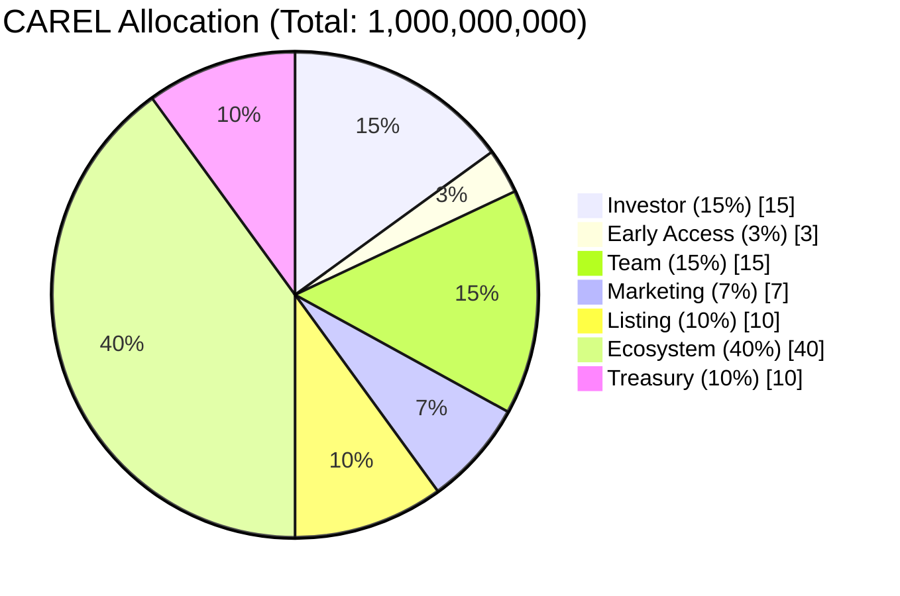
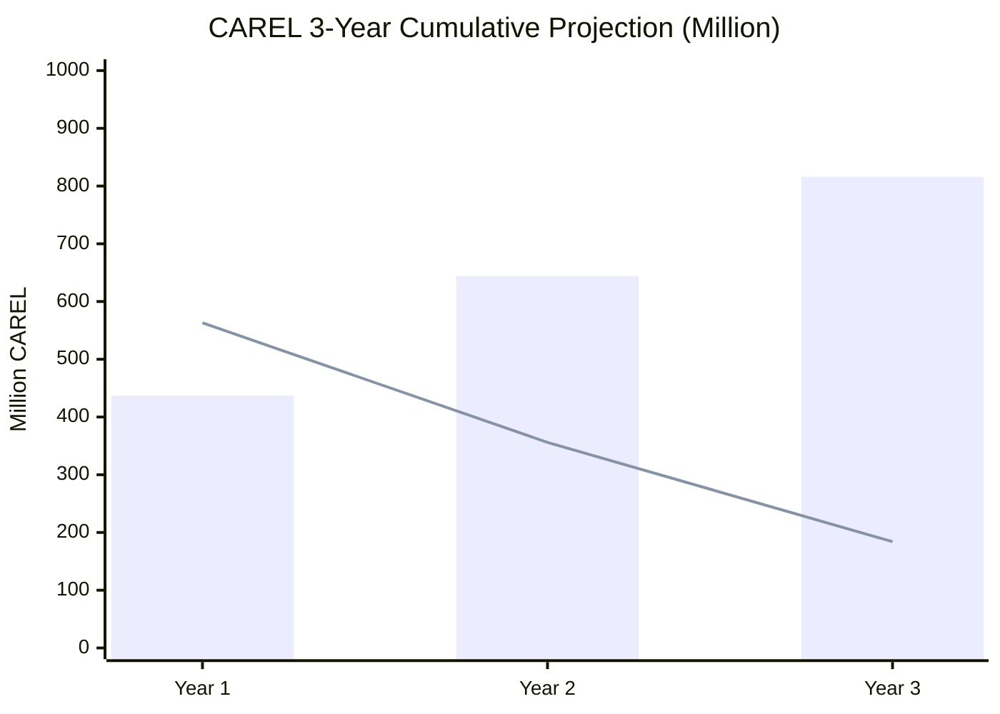

# CAREL Tokenomics (Root Guide, Mermaid)

This is the primary tokenomics guide at repo root, using Mermaid-only diagrams.

## 1) Architecture (Mermaid)

```mermaid
flowchart LR
    subgraph CORE["Core Contracts (smartcontract/src/core)"]
        TOKEN["Token (CAREL)\n- 1B hard cap\n- role-based mint/burn"]
        VEST["VestingManager\n- setup_tokenomics\n- release() -> mint()"]
        FEE["FeeCollector\n- swap/bridge/mev fee collection\n- split routing"]
        TREASURY["Treasury\n- receive_fee\n- burn policy\n- fund_rewards"]
        REWARDS["Rewards Pool / Staking"]
    end

    subgraph GOV["Governance (smartcontract/src/governance)"]
        GOVERNANCE["Governance\npropose / vote / execute"]
        TIMELOCK["Timelock\nqueue / execute / cancel"]
    end

    subgraph PRIV["Privacy"]
        ROUTER["PrivacyRouter\nsubmit_private_*"]
    end

    PROTOCOL["Protocol actions\nSwap / Bridge / MEV"] --> FEE
    FEE --> TREASURY
    TREASURY --> REWARDS
    TREASURY -->|burn path| TOKEN
    VEST -->|release() mint| TOKEN
    GOVERNANCE --> TIMELOCK
    TIMELOCK --> TOKEN
    TIMELOCK --> VEST
    TIMELOCK --> FEE
    TIMELOCK --> TREASURY
    ROUTER -. private actions .-> TOKEN
    ROUTER -. private actions .-> VEST
    ROUTER -. private actions .-> FEE
    ROUTER -. private actions .-> TREASURY
    ROUTER -. private actions .-> GOVERNANCE
    ROUTER -. private actions .-> TIMELOCK
```

## 2) Token Allocation (Mermaid)



## 3) 3-Year Unlock Projection (Mermaid)



Interpretation:
- `bar` = unlocked cumulative supply
- `line` = remaining locked supply

## 4) Key Numbers

- Year 1 unlocked: `437M`, locked: `563M`
- Year 2 unlocked: `644M`, locked: `356M`
- Year 3 unlocked: `816M`, locked: `184M`

## 5) Assumptions

- `setup_tokenomics(..., release_immediate=true)`
- periodic `release()` is executed

## 6) Contract Sources

- Supply cap: `smartcontract/src/core/token.cairo:75`
- Allocation constants: `smartcontract/src/core/vesting_manager.cairo:134`
- Allocation constants: `smartcontract/src/core/vesting_manager.cairo:140`
- Ecosystem monthly release (`6,000,000`): `smartcontract/src/core/vesting_manager.cairo:141`
- Ecosystem period (`66 months`): `smartcontract/src/core/vesting_manager.cairo:142`
