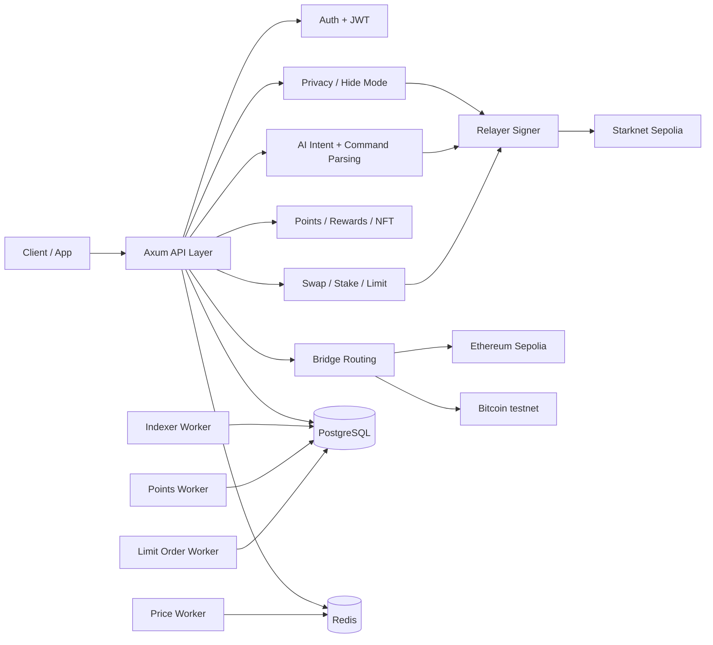

# CAREL Backend (Rust + Axum)

Backend ini menangani API, relayer hide mode, indexing on-chain events, points/rewards processing, dan integrasi bridge/oracle untuk CAREL Protocol.

## Table of Contents
- Scope
- Repository Structure
- Runtime Architecture
- API Domains
- Background Workers
- Build and Test
- Run Local
- Runtime Profile
- Environment Variables
- Environment Audit Split
- Signer Semantics
- AI Production Guardrails
- Deployment Notes
- Current Constraints
- Development Plan

## Scope
- Runtime: Rust (`axum`, `tokio`).
- Storage: PostgreSQL (`sqlx`) dan Redis.
- Chain integration: Starknet Sepolia, Ethereum Sepolia, BTC testnet (provider dependent).
- Fokus backend:
  - API layer untuk auth, trading, privacy, rewards, social, AI.
  - Relayer path untuk hide mode (`swap`, `limit order`, `stake`).
  - Worker untuk indexer, prices, points, dan order execution.

## Repository Structure
```text
backend-rust/
  src/
    api/                    # HTTP route handlers
    services/               # Business logic
    integrations/           # External providers (bridge/social)
    websocket/              # Realtime channels
    indexer/                # Block/event indexer
    models/                 # Domain models
    db/                     # DB access
    main.rs                 # App bootstrap
    config.rs               # Env parsing and runtime config
  migrations/               # SQL migrations
  scripts/                  # Prover, smoke test, utilities
  Cargo.toml                # Rust crate manifest
  .env.testnet.example      # Example env for testnet
  BE_TEST_REPORT.md         # Backend test report
```

## Runtime Architecture


## API Domains
Primary modules under `src/api/`:
- `auth`, `wallet`, `profile`, `admin`
- `swap`, `stake`, `limit_order`, `bridge`, `market`
- `privacy`, `onchain_privacy`, `private_btc_swap`, `private_payments`, `anonymous_credentials`, `dark_pool`
- `rewards`, `nft`, `leaderboard`, `referral`, `analytics`, `transactions`, `deposit`, `faucet`
- `ai`, `battleship`, `social`, `notifications`, `charts`, `webhooks`, `health`

## Background Workers
Core background components:
- Indexing: `src/services/event_indexer.rs`, `src/indexer/`
- Route/price logic: `src/services/route_optimizer.rs`, `src/services/price_guard.rs`, `src/services/price_chart_service.rs`
- Rewards/points: `src/services/point_calculator.rs`, `src/services/snapshot_manager.rs`, `src/services/nft_discount.rs`
- Trading execution: `src/services/limit_order_executor.rs`, `src/services/liquidity_aggregator.rs`
- Privacy verification: `src/services/privacy_verifier.rs`

## Build and Test
Build:
```bash
cd backend-rust
cargo build
```

Run all tests:
```bash
cd backend-rust
cargo test
```

Latest local result (Feb 25, 2026):
- `188 passed, 0 failed`

Detailed report: `backend-rust/BE_TEST_REPORT.md`.

## Run Local
```bash
cd backend-rust
cp .env.testnet.example .env
cargo run
```

Default bind:
- `HOST=0.0.0.0`
- `PORT` default template: `3000`
- Runtime repo saat ini (`backend-rust/.env`): `8080`

## Runtime Profile
Untuk jalur bukti MVP yang dipakai frontend:
- Backend runtime profile aktif ada di `backend-rust/.env`.
- Frontend runtime profile aktif ada di `frontend/.env.local`.
- Pastikan `NEXT_PUBLIC_BACKEND_URL`/`NEXT_PUBLIC_BACKEND_WS_URL` mengarah ke backend runtime yang benar (`HOST` + `PORT` atau public tunnel URL aktif).
- Contoh lokal dari template: backend `PORT=3000` dengan `NEXT_PUBLIC_BACKEND_URL=http://localhost:3000`.
- Contoh local-docker yang umum di repo ini: backend `PORT=8080` dengan `NEXT_PUBLIC_BACKEND_URL=http://localhost:8080`.

## Environment Variables
Use `backend-rust/.env.testnet.example` as baseline.

Minimum required groups:
- Boot and security:
  - `DATABASE_URL`
  - `STARKNET_RPC_URL`
  - `ETHEREUM_RPC_URL`
  - `BACKEND_PRIVATE_KEY`
  - `BACKEND_PUBLIC_KEY`
  - `BACKEND_ACCOUNT_ADDRESS` (required for on-chain signer flows)
  - `JWT_SECRET`
- Core on-chain bindings:
  - `CAREL_TOKEN_ADDRESS`
  - `POINT_STORAGE_ADDRESS`
  - `SNAPSHOT_DISTRIBUTOR_ADDRESS`
  - `PRICE_ORACLE_ADDRESS`
  - `LIMIT_ORDER_BOOK_ADDRESS`
  - `AI_EXECUTOR_ADDRESS`
  - `AI_SIGNATURE_VERIFIER_ADDRESS`
  - `BRIDGE_AGGREGATOR_ADDRESS`
- Hide mode bindings:
  - `PRIVATE_ACTION_EXECUTOR_ADDRESS`
  - `PRIVACY_INTERMEDIARY_ADDRESS`
  - `HIDE_BALANCE_EXECUTOR_KIND=shielded_pool_v2`
  - `ZK_PRIVACY_ROUTER_ADDRESS`

Recommended optional:
- `STARKNET_API_RPC_POOL`, `STARKNET_INDEXER_RPC_POOL`, `STARKNET_WALLET_RPC_POOL`
- `PRIVACY_AUTO_GARAGA_PROVER_CMD`
- `GARAGA_DYNAMIC_BINDING=true`
- `GARDEN_APP_ID`

Real prover command (production testnet):
- `GARAGA_ALLOW_PRECOMPUTED_PAYLOAD=false`
- `GARAGA_PROVE_CMD="python3 scripts/garaga_auto_prover.py --prove"`
- `GARAGA_REAL_PROVER_CMD="python3 /opt/garaga-real-prover/prove.py --context \"$GARAGA_CONTEXT_PATH\" --proof \"$GARAGA_PROOF_PATH\" --public-inputs \"$GARAGA_PUBLIC_INPUTS_PATH\""`
- Pastikan file prover real benar-benar ada; jika lokasi berbeda, ganti path `/opt/garaga-real-prover/prove.py` sesuai host/container Anda.

## Environment Audit Split
Audit ini memisahkan variabel dari `backend-rust/.env` berdasarkan pemakaian kode runtime saat ini.

### 1) Active MVP (dipakai flow utama FE/BE)
- `STARKNET_SWAP_CONTRACT_ADDRESS`
- `BRIDGE_AGGREGATOR_ADDRESS`
- `LIMIT_ORDER_BOOK_ADDRESS`
- `STAKING_CAREL_ADDRESS`
- `STAKING_STABLECOIN_ADDRESS`
- `STAKING_BTC_ADDRESS`
- `DISCOUNT_SOULBOUND_ADDRESS`
- `AI_EXECUTOR_ADDRESS`
- `ZK_PRIVACY_ROUTER_ADDRESS`
- `PRIVATE_ACTION_EXECUTOR_ADDRESS`
- `CAREL_TOKEN_ADDRESS`
- `POINT_STORAGE_ADDRESS`
- `SNAPSHOT_DISTRIBUTOR_ADDRESS`
- `PRICE_ORACLE_ADDRESS`

### 2) Backend-only optional (tidak dipakai frontend saat ini)
- `PRIVATE_BTC_SWAP_ADDRESS`
- `DARK_POOL_ADDRESS`
- `PRIVATE_PAYMENTS_ADDRESS`
- `ANONYMOUS_CREDENTIALS_ADDRESS`
- `BATTLESHIP_GARAGA_ADDRESS`

### 3) Script-only / prover tooling
- `GARAGA_PRECOMPUTED_PAYLOAD_PATH`
- `GARAGA_ALLOW_PRECOMPUTED_PAYLOAD`
- `GARAGA_DYNAMIC_BINDING`
- `GARAGA_PROVE_CMD`
- `GARAGA_VK_PATH`
- `GARAGA_PROOF_PATH`
- `GARAGA_PUBLIC_INPUTS_PATH`
- `GARAGA_TIMEOUT_SECS`
- `GARAGA_UVX_CMD`
- `GARAGA_REAL_PROVER_CMD`

### 4) Currently unused in backend runtime
- `FAUCET_WALLET_PRIVATE_KEY`
- `INDEXER_DIAGNOSTICS`

Catatan:
- `RUST_LOG` tetap dipakai secara implicit oleh `tracing_subscriber::EnvFilter::try_from_default_env()`.
- Audit detail lintas FE/BE ada di `docs/ENV_RUNTIME_AUDIT_MVP.md`.

## Signer Semantics
Supaya tidak ambigu:
- `BACKEND_PRIVATE_KEY` = private key akun backend/relayer Starknet (bukan API key LLM/AI model).
- `BACKEND_ACCOUNT_ADDRESS` = account contract address pasangan key tersebut.
- `BACKEND_PUBLIC_KEY` = public key signer backend.
- Di kontrak, role signer backend biasanya direferensikan sebagai `BACKEND_SIGNER` (lihat `smartcontract/.env`).

## AI Production Guardrails
Saat `ENVIRONMENT=production|prod|mainnet`, backend sekarang fail-fast jika konfigurasi AI tidak aman:
- Wajib terisi valid: `AI_EXECUTOR_ADDRESS`, `AI_SIGNATURE_VERIFIER_ADDRESS`, `BACKEND_ACCOUNT_ADDRESS`, `TREASURY_ADDRESS`.
- Wajib ada minimal 1 provider key AI: `LLM_API_KEY` / `OPENAI_API_KEY` / `CAIRO_CODER_API_KEY` / `GEMINI_API_KEY`.
- `AI_EXECUTOR_AUTO_DISABLE_SIGNATURE_VERIFICATION` harus `false`.
- Mode verifier default sekarang `account` (real Starknet account signature). Jika tetap pakai mode legacy `allowlist` di production, wajib eksplisit set:
  - `AI_SIGNATURE_VERIFIER_MODE=allowlist`
  - `AI_ALLOWLIST_VERIFIER_ACCEPT_RISK=true`

## Deployment Notes
- Apply migrations before production run:
```bash
cd backend-rust
sqlx migrate run
```
- Verify env consistency with deployed contract addresses before startup.
- For testnet smoke test, use:
```bash
cd backend-rust
bash scripts/smoke_test_api.sh
```

## Current Constraints
- Hide mode privacy still inherits public chain metadata leakage (timing/fees/graph).
- Bridge behavior depends on external provider uptime and API limits.
- RPC quota instability can impact indexer and quote latency.
- Some advanced privacy flows still rely on strict prover payload correctness.

## Development Plan
- Short-term
  - Improve RPC failover and backpressure handling.
  - Tighten validation and observability for hide mode relayer paths.
  - Expand API smoke tests for high-impact endpoints.
- Mid-term
  - Strengthen worker isolation (indexer vs API hot path).
  - Add richer telemetry for bridge route quality and failure causes.
  - Improve replay/nullifier analytics for privacy operations.
- Long-term
  - Production hardening for multi-region RPC strategy.
  - Deeper queue-based execution model for burst traffic.
  - Formal runbook for incident response and recovery.
