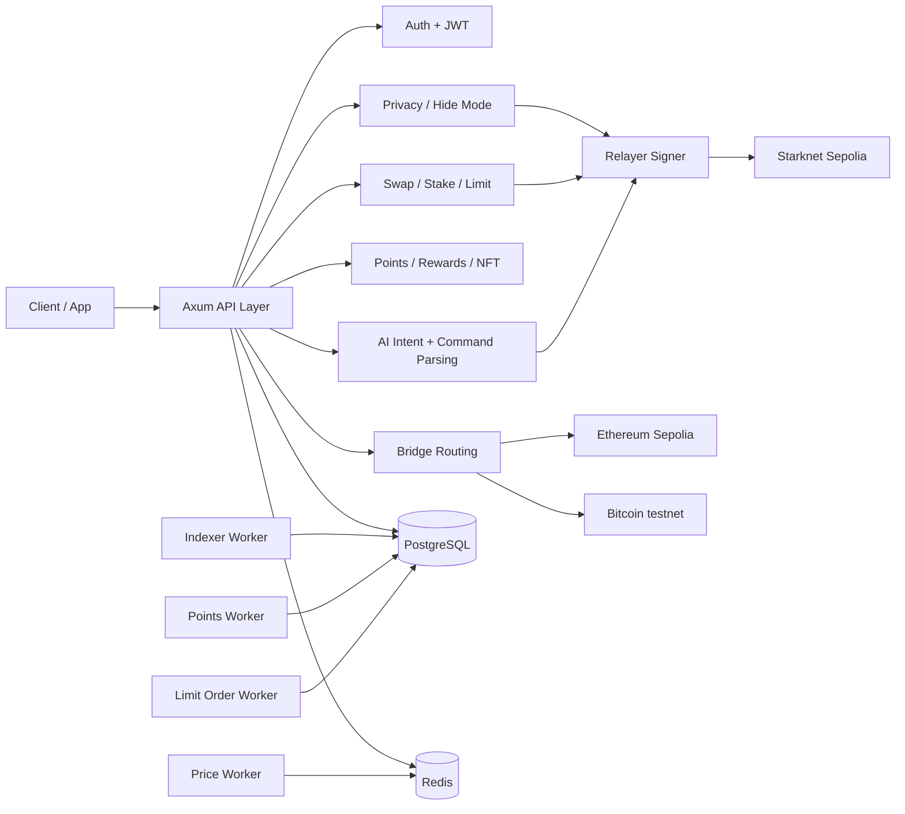

# CAREL Backend (Rust + Axum)

Backend service for CAREL Protocol.
This README is backend-only and covers API modules, relayer flow, workers, runtime profile, deployment notes, and current limits.

## Table of Contents
- [Scope](#scope)
- [Repository Structure](#repository-structure)
- [Runtime Architecture](#runtime-architecture)
- [API Domains](#api-domains)
- [Background Workers](#background-workers)
- [Build and Test](#build-and-test)
- [Run Local](#run-local)
- [Runtime Profile](#runtime-profile)
- [Environment Variables](#environment-variables)
- [V3 Migration Profile](#v3-migration-profile)
- [Environment Audit Split](#environment-audit-split)
- [Signer Semantics](#signer-semantics)
- [AI Production Guardrails](#ai-production-guardrails)
- [Planned Shadow Bridge V4 (Not Yet Delivered)](#planned-shadow-bridge-v4-not-yet-delivered)
- [Deployment Notes](#deployment-notes)
- [Current Constraints](#current-constraints)
- [Development Plan](#development-plan)

## Scope
- Runtime: Rust (`axum`, `tokio`).
- Storage: PostgreSQL (`sqlx`) and Redis.
- Networks: Starknet Sepolia, Ethereum Sepolia, Bitcoin testnet (provider dependent).
- Core responsibilities:
  - API layer for auth, trading, bridge, privacy, rewards, AI.
  - Relayer path for hide mode (`swap`, `limit order`, `stake`).
  - Background workers for indexing, pricing, points, and execution support.

## Repository Structure
```text
backend-rust/
  src/
    api/                    # HTTP route handlers
    services/               # Business logic
    integrations/           # External providers (bridge/social)
    websocket/              # Realtime channels
    indexer/                # Block/event indexer
    models/                 # Domain models
    db/                     # DB access
    main.rs                 # App bootstrap
    config.rs               # Env parsing and runtime config
  migrations/               # SQL migrations
  scripts/                  # Prover and smoke-test utilities
  Cargo.toml                # Rust crate manifest
  .env.testnet.example      # Example env profile
  ../docs/test_reports.md   # Consolidated test report
```

## Runtime Architecture

```mermaid
flowchart LR
    CLIENT["Client / App"] --> API["Axum API Layer"]

    API --> AUTH["Auth + JWT"]
    API --> TRADE["Swap / Stake / Limit"]
    API --> PRIV["Privacy / Hide Mode"]
    API --> REWARD["Points / Rewards / NFT"]
    API --> BRIDGE["Bridge Routing"]
    API --> AI["AI Intent + Command Parsing"]

    PRIV --> RELAYER["Relayer Signer"]
    TRADE --> RELAYER
    AI --> RELAYER

    API --> PG[("PostgreSQL")]
    API --> REDIS[("Redis")]

    INDEXER["Indexer Worker"] --> PG
    PRICE["Price Worker"] --> REDIS
    POINTS["Points Worker"] --> PG
    LIMITEXEC["Limit Order Worker"] --> PG

    RELAYER --> STARKNET["Starknet Sepolia"]
    BRIDGE --> ETH["Ethereum Sepolia"]
    BRIDGE --> BTC["Bitcoin testnet"]
```

## API Domains
Main modules under `src/api/`:
- `auth`, `wallet`, `profile`, `admin`
- `swap`, `stake`, `limit_order`, `bridge`, `market`
- `privacy`, `onchain_privacy`, `private_btc_swap`, `private_payments`, `anonymous_credentials`, `dark_pool`
- `rewards`, `nft`, `leaderboard`, `referral`, `analytics`, `transactions`, `deposit`, `faucet`
- `ai`, `battleship`, `social`, `notifications`, `charts`, `webhooks`, `health`

## Background Workers
Main background components:
- Indexing: `src/services/event_indexer.rs`, `src/indexer/`
- Route/price logic: `src/services/route_optimizer.rs`, `src/services/price_guard.rs`, `src/services/price_chart_service.rs`
- Rewards/points: `src/services/point_calculator.rs`, `src/services/snapshot_manager.rs`, `src/services/nft_discount.rs`
- Trading execution support: `src/services/limit_order_executor.rs`, `src/services/liquidity_aggregator.rs`
- Privacy verification: `src/services/privacy_verifier.rs`

## Build and Test
Build:
```bash
cd backend-rust
cargo build
```

Run tests:
```bash
cd backend-rust
cargo test
```

Latest recorded local snapshot (2026-03-05):
- `208 passed, 0 failed`

Detailed report: `../docs/test_reports.md`.

## Run Local
```bash
cd backend-rust
cp .env.testnet.example .env
cargo run
```

If shell-exported vars override `.env`, use a clean env shell:
```bash
cd backend-rust
env -i HOME="$HOME" PATH="$PATH" TERM="$TERM" bash -lc 'set -a; source .env; set +a; cargo run'
```

Binary notes:
- Main API runtime binary: `carel-backend`
- `src/bin/ai_e2e_tools.rs` is an internal CLI utility, not the API server.

## Runtime Profile
For active FE/BE execution flow:
- Backend runtime profile: `backend-rust/.env`
- Frontend runtime profile: `frontend/.env.local` (plus fallback to `frontend/.env`)

Backend endpoint alignment:
- Ensure `NEXT_PUBLIC_BACKEND_URL` and `NEXT_PUBLIC_BACKEND_WS_URL` point to this backend runtime.
- Typical local values:
  - `PORT=3000` or `PORT=8080` depending on profile.

## Environment Variables
Use `backend-rust/.env.testnet.example` as baseline.

Minimum required groups:

- Boot/security:
  - `DATABASE_URL`
  - `STARKNET_RPC_URL`
  - `ETHEREUM_RPC_URL`
  - `BACKEND_PRIVATE_KEY`
  - `BACKEND_PUBLIC_KEY`
  - `BACKEND_ACCOUNT_ADDRESS`
  - `JWT_SECRET`

- Core on-chain bindings:
  - `CAREL_TOKEN_ADDRESS`
  - `POINT_STORAGE_ADDRESS`
  - `SNAPSHOT_DISTRIBUTOR_ADDRESS`
  - `PRICE_ORACLE_ADDRESS`
  - `LIMIT_ORDER_BOOK_ADDRESS`
  - `AI_EXECUTOR_ADDRESS`
  - `AI_SIGNATURE_VERIFIER_ADDRESS`
  - `BRIDGE_AGGREGATOR_ADDRESS`

- Hide mode bindings:
  - `PRIVATE_ACTION_EXECUTOR_ADDRESS`
  - `PRIVACY_INTERMEDIARY_ADDRESS`
  - `HIDE_BALANCE_RELAYER_POOL_ENABLED=true`
  - `HIDE_BALANCE_RELAYER_POOL_LIMIT_ENABLED=true`
  - `HIDE_BALANCE_EXECUTOR_KIND=shielded_pool_v3`
  - `HIDE_BALANCE_POOL_VERSION_DEFAULT=v3`
  - `HIDE_BALANCE_V2_REDEEM_ONLY=true`
  - `HIDE_BALANCE_MIN_NOTE_AGE_SECS=3600`
  - `HIDE_BALANCE_MAX_USES_PER_DAY=3`
  - `ZK_PRIVACY_ROUTER_ADDRESS`

Recommended optional keys:
- `STARKNET_API_RPC_POOL`, `STARKNET_INDEXER_RPC_POOL`, `STARKNET_WALLET_RPC_POOL`
- `PRIVACY_AUTO_GARAGA_PROVER_CMD`
- `GARAGA_DYNAMIC_BINDING=true`
- `GARDEN_APP_ID`
- `AI_LEVEL3_BRIDGE_ENABLED=false` (default; keep bridge on AI Level 2 for current public provider flow)

## V3 Migration Profile
Active hide-mode baseline in backend runtime:
- `HIDE_BALANCE_EXECUTOR_KIND=shielded_pool_v3`
- `HIDE_BALANCE_POOL_VERSION_DEFAULT=v3`
- `HIDE_BALANCE_V2_REDEEM_ONLY=true`

Operational notes:
- New notes should be routed to V3.
- V2 stays deployed for legacy note redemption during migration window.
- FE payloads should include V3-compatible fields (`note_version=v3`, `root`, `nullifier`, `proof`, `public_inputs`).

## Environment Audit Split
Audit of `backend-rust/.env` (runtime usage):

### 1) Active MVP keys
- `STARKNET_SWAP_CONTRACT_ADDRESS`
- `BRIDGE_AGGREGATOR_ADDRESS`
- `LIMIT_ORDER_BOOK_ADDRESS`
- `STAKING_CAREL_ADDRESS`
- `STAKING_STABLECOIN_ADDRESS`
- `STAKING_BTC_ADDRESS`
- `DISCOUNT_SOULBOUND_ADDRESS`
- `AI_EXECUTOR_ADDRESS`
- `ZK_PRIVACY_ROUTER_ADDRESS`
- `PRIVATE_ACTION_EXECUTOR_ADDRESS`
- `CAREL_TOKEN_ADDRESS`
- `POINT_STORAGE_ADDRESS`
- `SNAPSHOT_DISTRIBUTOR_ADDRESS`
- `PRICE_ORACLE_ADDRESS`

### 2) Backend-only optional keys
- `PRIVATE_BTC_SWAP_ADDRESS`
- `DARK_POOL_ADDRESS`
- `PRIVATE_PAYMENTS_ADDRESS`
- `ANONYMOUS_CREDENTIALS_ADDRESS`
- `BATTLESHIP_GARAGA_ADDRESS`

### 3) Prover/tooling keys
- `GARAGA_PRECOMPUTED_PAYLOAD_PATH`
- `GARAGA_ALLOW_PRECOMPUTED_PAYLOAD`
- `GARAGA_DYNAMIC_BINDING`
- `GARAGA_PROVE_CMD`
- `GARAGA_VK_PATH`
- `GARAGA_PROOF_PATH`
- `GARAGA_PUBLIC_INPUTS_PATH`
- `GARAGA_TIMEOUT_SECS`
- `GARAGA_UVX_CMD`
- `GARAGA_REAL_PROVER_CMD`

### 4) Currently unused keys in runtime logic
- `FAUCET_WALLET_PRIVATE_KEY`
- `INDEXER_DIAGNOSTICS`

Cross-layer env audit reference: `docs/env_runtime_audit_mvp.md`.

## Signer Semantics
Signer keys:
- `BACKEND_PRIVATE_KEY`: Starknet relayer private key.
- `BACKEND_ACCOUNT_ADDRESS`: Starknet account contract for that signer.
- `BACKEND_PUBLIC_KEY`: corresponding public key.
- These are unrelated to LLM provider API keys.

## AI Production Guardrails
When `ENVIRONMENT=production|prod|mainnet`, backend enforces fail-fast checks:
- Must be set and valid: `AI_EXECUTOR_ADDRESS`, `AI_SIGNATURE_VERIFIER_ADDRESS`, `BACKEND_ACCOUNT_ADDRESS`, `TREASURY_ADDRESS`.
- At least one provider key required: `LLM_API_KEY` or `OPENAI_API_KEY` or `CAIRO_CODER_API_KEY` or `GEMINI_API_KEY`.
- `AI_EXECUTOR_AUTO_DISABLE_SIGNATURE_VERIFICATION` must be `false`.
- Default verifier mode is `account`.
- If using legacy allowlist mode in production, explicit risk flags are required.

## Planned Shadow Bridge V4 (Not Yet Delivered)
Planned backend stream (roadmap only, not shipped yet):
- Private BTC-native to wBTC route in hide mode.
- Denomination-tier quote path to reduce amount-correlation.
- Multi-stage order state machine (`created` -> `source_seen` -> `source_finalized` -> `zk_verifying` -> destination states).
- Referral and loyalty hooks at post-redeem stage.
- Retry queue + DLQ + auto-refund operational controls.

Planned endpoint surface for this stream:
- `GET /api/v1/bridge/quote`
- `POST /api/v1/bridge/execute`
- `GET /api/v1/bridge/status/:order_id`
- `POST /api/v1/referral/generate`
- `POST /api/v1/referral/validate`
- `GET /api/v1/referral/stats/:code`

## Deployment Notes
Run migrations before deployment:
```bash
cd backend-rust
sqlx migrate run
```

Optional API smoke test:
```bash
cd backend-rust
bash scripts/smoke_test_api.sh
```

## Current Constraints
- Hide mode reduces linkability but public chain metadata remains observable.
- Bridge quality depends on external provider uptime, API limits, and liquidity.
- RPC quota/availability can affect indexer and quote latency.
- Advanced privacy flows remain sensitive to prover payload correctness.

## Development Plan
- Short term:
  - Improve RPC failover and backpressure handling.
  - Tighten relayer-path validation and observability.
  - Expand smoke tests for high-impact APIs.
- Mid term:
  - Strengthen worker isolation from API hot path.
  - Add richer bridge-route telemetry and failure classification.
  - Improve nullifier/replay analytics.
- Long term:
  - Multi-region runtime hardening.
  - Queue-centric execution model for burst traffic.
  - Incident runbook and recovery automation.
