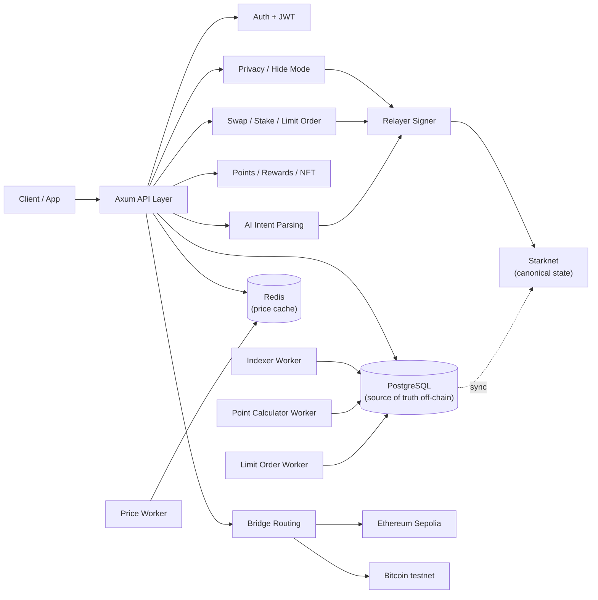

# CAREL Backend — Rust / Axum

The backend is the off-chain execution layer for CAREL Protocol. It handles trade routing, ZK proof orchestration, on-chain relaying, and the points/rewards pipeline. It is intentionally designed as a thin coordinator — business-critical state lives on-chain; the backend is the oracle bridge that feeds it.

This document covers architecture, the hybrid off-chain/on-chain design rationale, API surface, background workers, and deployment. Internal audit results are in [`AUDIT_BACKEND_RUST.md`](./AUDIT_BACKEND_RUST.md).

---

## Table of Contents

- [Why a backend exists](#why-a-backend-exists)
- [Architecture](#architecture)
- [Service Layer — What Stays Off-Chain and Why](#service-layer--what-stays-off-chain-and-why)
- [On-Chain Sync Points](#on-chain-sync-points)
- [API Domains](#api-domains)
- [Background Workers](#background-workers)
- [Build and Test](#build-and-test)
- [Run Local](#run-local)
- [Environment Variables](#environment-variables)
- [Signer Semantics](#signer-semantics)
- [Hide Mode (V4)](#hide-mode-v4)
- [AI Production Guardrails](#ai-production-guardrails)
- [Deployment Notes](#deployment-notes)
- [Current Constraints](#current-constraints)
- [Open Items (Pre-Mainnet)](#open-items-pre-mainnet)

---

## Why a backend exists

Certain protocol operations cannot or should not run entirely on-chain:

| Operation | Why off-chain |
|---|---|
| Point calculation | Needs price feeds, tx history, AI level, cross-epoch data from DB |
| Wash trading detection | Time-window query across tx history — no on-chain equivalent |
| Merkle tree generation | Must iterate all users; generate off-chain, post root on-chain |
| Limit order monitoring | Keeper pattern — backend polls price, triggers on-chain execution |
| Social verification | Requires external API calls (Twitter, Telegram, Discord) |
| ZK proof generation | Garaga Honk proof generation is a multi-second CPU job |
| Bridge routing | Aggregates quotes from LayerSwap, Garden Finance, Atomiq |

Everything that **does** have consensus requirements lives in Cairo smart contracts. The backend's job is to compute, then write the canonical result to chain.

---

## Architecture


```mermaid
flowchart LR
    CLIENT["Client / App"] --> API["Axum API Layer"]

    API --> AUTH["Auth + JWT"]
    API --> TRADE["Swap / Stake / Limit Order"]
    API --> PRIV["Privacy / Hide Mode"]
    API --> REWARD["Points / Rewards / NFT"]
    API --> BRIDGE["Bridge Routing"]
    API --> AI["AI Intent Parsing"]

    PRIV --> RELAYER["Relayer Signer"]
    TRADE --> RELAYER
    AI --> RELAYER

    API --> PG[("PostgreSQL\n(source of truth off-chain)")]
    API --> REDIS[("Redis\n(price cache)")]

    INDEXER["Indexer Worker"] --> PG
    PRICE["Price Worker"] --> REDIS
    POINTS["Point Calculator Worker"] --> PG
    LIMITEXEC["Limit Order Worker"] --> PG

    RELAYER --> STARKNET["Starknet\n(canonical state)"]
    BRIDGE --> ETH["Ethereum Sepolia"]
    BRIDGE --> BTC["Bitcoin testnet"]

    PG -.->|sync| STARKNET
```

**Data flow rule:** PostgreSQL is the mutable off-chain ledger. Smart contracts hold the immutable finalized state. The sync direction is always DB → chain, never chain → DB (except via the indexer, which is read-only from chain).

---

## Service Layer — What Stays Off-Chain and Why

```
backend-rust/src/services/
```

| Service | Responsibility | Why off-chain |
|---|---|---|
| `point_calculator` | Calculate trading / staking / battle / bridge points per tx | Needs USD prices, AI level, NFT state, cross-tx wash trading detection |
| `merkle_generator` | Build Poseidon Merkle tree of epoch rewards | Must read all users; tree construction is O(n) — not feasible on-chain |
| `snapshot_manager` | Finalize epochs, submit root + total to chain | Orchestration between DB and multiple contracts |
| `limit_order_executor` | Monitor active orders, trigger execution when price matches | Keeper pattern; price comparison needs off-chain price feed |
| `social_verifier` | Verify Twitter/Telegram/Discord tasks, award points | External OAuth / API calls |
| `nft_discount` | Read NFT discount rate on-chain, consume usage on-chain | On-chain reads + writes — backend acts as session coordinator |
| `privacy_verifier` | Route ZK verifier selection, validate proof format | Verifier routing config + pre-validation before on-chain submission |
| `gas_optimizer` | Estimate gas costs by tx type | Advisory — no consensus needed |
| `price_guard` | Sanitize price inputs, fallback prices | Defense against oracle manipulation in off-chain computation |
| `route_optimizer` | Select DEX route for swap / limit orders | Aggregation across Ekubo and other DEXes |

---

## On-Chain Sync Points

The backend calls these contracts to commit off-chain computation results:

| Trigger | Contract | Method | When |
|---|---|---|---|
| Points calculated | `PointStorage` | `submit_points(epoch, user, total)` | After each transaction is processed |
| Social task completed | `PointStorage` | `submit_points(epoch, user, total)` | After DB upsert |
| Epoch finalized | `PointStorage` | `finalize_epoch(epoch, total_points)` | End of epoch |
| Epoch finalized | `SnapshotDistributor` | `submit_merkle_root(epoch, root)` | After Merkle tree generated |
| Limit order expired | `LimitOrderBook` | `expire_limit_order(order_id)` | When keeper detects expiry |
| Limit order filled | `LimitOrderBook` | `execute_limit_order(order_id, amount)` | When price condition met |
| Privacy action | `PrivacyRouter` | `submit_action(...)` | For hide mode swaps/stakes |

**Design invariant:** `submit_points` always writes the **absolute total** (not a delta). This ensures that even if the backend retries or runs concurrently, on-chain state converges to the DB's authoritative value without double-counting.

---

## API Domains

All handlers live under `src/api/`:

| Group | Endpoints |
|---|---|
| Identity | `auth`, `wallet`, `profile`, `admin` |
| Trading | `swap`, `stake`, `limit_order`, `market` |
| Bridge | `bridge`, `garden` (Garden Finance) |
| Privacy | `privacy`, `onchain_privacy` |
| Rewards | `rewards`, `leaderboard`, `referral`, `nft`, `analytics` |
| Data | `transactions`, `charts`, `deposit`, `faucet` |
| AI | `ai`, `ai_plan` |
| Social / Game | `social`, `battleship`, `notifications` |
| Infra | `webhooks`, `health` |

---

## Background Workers

Workers spawn as `tokio` tasks at startup:

| Worker | File | Interval | Function |
|---|---|---|---|
| Block indexer | `services/event_indexer.rs` + `indexer/` | Continuous | Index Starknet events into DB |
| Price updater | `services/price_chart_service.rs` | 30s | Cache latest prices in Redis |
| Point calculator | `services/point_calculator.rs` | 10–60s | Process pending txs, sync points to chain |
| Snapshot manager | `services/snapshot_manager.rs` | Epoch boundary | Finalize epoch, submit Merkle root |
| Limit order executor | `services/limit_order_executor.rs` | 10s | Check prices, execute or expire orders |
| Header pusher | `services/header_pusher.rs` | Continuous | WebSocket price/order push |

---

## Build and Test

```bash
cd backend-rust
cargo build
cargo test
```

Latest recorded test snapshot (2026-03-05): **208 passed, 0 failed**

Detailed report: `../docs/test_reports.md`

---

## Run Local

```bash
cd backend-rust
cp .env.testnet.example .env
# edit .env — fill in RPC URLs, contract addresses, keys
cargo run
```

If shell-exported vars override `.env`:

```bash
env -i HOME="$HOME" PATH="$PATH" TERM="$TERM" bash -lc 'set -a; source .env; set +a; cargo run'
```

---

## Environment Variables

Reference file: `backend-rust/.env.testnet.example`

### Required at boot

```
DATABASE_URL
STARKNET_RPC_URL
ETHEREUM_RPC_URL
BACKEND_PRIVATE_KEY
BACKEND_PUBLIC_KEY
BACKEND_ACCOUNT_ADDRESS
JWT_SECRET
```

### Core contract bindings

```
CAREL_TOKEN_ADDRESS
POINT_STORAGE_ADDRESS
SNAPSHOT_DISTRIBUTOR_ADDRESS
PRICE_ORACLE_ADDRESS
LIMIT_ORDER_BOOK_ADDRESS
AI_EXECUTOR_ADDRESS
AI_SIGNATURE_VERIFIER_ADDRESS
BRIDGE_AGGREGATOR_ADDRESS
```

### Hide Mode bindings

```
ZK_PRIVACY_ROUTER_ADDRESS
PRIVATE_ACTION_EXECUTOR_ADDRESS
PRIVACY_INTERMEDIARY_ADDRESS
HIDE_BALANCE_EXECUTOR_KIND=shielded_pool_v4
HIDE_BALANCE_POOL_VERSION_DEFAULT=v4
HIDE_BALANCE_V2_REDEEM_ONLY=true
HIDE_BALANCE_MIN_NOTE_AGE_SECS=3600
HIDE_BALANCE_MAX_USES_PER_DAY=3
```

### Optional / prover

```
GARAGA_DYNAMIC_BINDING=true
GARAGA_PROVE_CMD
GARAGA_VK_PATH / GARAGA_PROOF_PATH / GARAGA_PUBLIC_INPUTS_PATH
PRIVACY_AUTO_GARAGA_PROVER_CMD
```

Full env audit: `docs/env_runtime_audit_mvp.md`

---

## Signer Semantics

| Key | Purpose |
|---|---|
| `BACKEND_PRIVATE_KEY` | Starknet relayer — signs all on-chain txs submitted by the backend |
| `BACKEND_ACCOUNT_ADDRESS` | The Starknet account contract for the relayer key |
| `BACKEND_PUBLIC_KEY` | Corresponding public key for verification |

These are Starknet keys, unrelated to LLM provider API keys.

---

## Hide Mode (V4)

The V4 hide mode baseline:

```
HIDE_BALANCE_EXECUTOR_KIND=shielded_pool_v4
HIDE_BALANCE_POOL_VERSION_DEFAULT=v4
HIDE_BALANCE_V2_REDEEM_ONLY=true   # legacy notes still redeemable, no new V2 deposits
```

Hide mode reduces linkability between the user's wallet and the on-chain transaction by routing execution through a backend relayer with Garaga ZK proof binding. It does **not** hide transaction amounts, timing, or token addresses — these remain visible on Starknet explorers.

See `docs-site/pages/hidemode.mdx` for the user-facing explanation.

---

## AI Production Guardrails

When `ENVIRONMENT=production|prod|mainnet`, the backend enforces fail-fast checks at startup:

- `AI_EXECUTOR_ADDRESS`, `AI_SIGNATURE_VERIFIER_ADDRESS`, `BACKEND_ACCOUNT_ADDRESS`, `TREASURY_ADDRESS` must be set and valid
- At least one provider key required (`LLM_API_KEY` or `OPENAI_API_KEY` or `CAIRO_CODER_API_KEY` or `GEMINI_API_KEY`)
- `AI_EXECUTOR_AUTO_DISABLE_SIGNATURE_VERIFICATION` must be `false`
- Signature verification mode defaults to `account`

---

## Deployment Notes

Run DB migrations before starting:

```bash
cd backend-rust
sqlx migrate run
cargo run
```

Optional smoke test:

```bash
bash scripts/smoke_test_api.sh
```

---

## Current Constraints

| Constraint | Notes |
|---|---|
| Hide mode metadata | Reduces wallet linkability; cannot hide amounts, timing, or token addresses |
| Bridge dependency | Depends on LayerSwap / Garden Finance uptime, API limits, and liquidity |
| RPC stability | Quote and indexer quality degrades under provider rate limits |
| Prover latency | Garaga Honk proof generation adds 3–10s to hide mode execution |
| Social verification | Twitter/Telegram/Discord integration is stub in testnet — requires real OAuth for mainnet |

Backend infrastructure roadmap: [`docs-site/pages/roadmap.mdx`](../docs-site/pages/roadmap.mdx) — Backend Infrastructure Roadmap section.

---

## Open Items (Pre-Mainnet)

From internal audit (`AUDIT_BACKEND_RUST.md`) — full file-by-file pass completed 2026-05-06:

**Fixed in this commit:**

| # | Item | Severity | Status |
|---|---|---|---|
| 1 | `expire_limit_order` on-chain + Rust fix | Critical | **Fixed** |
| 2 | Referral double-counting via `sync_referral_onchain` | Critical | **Fixed** |
| 3 | `add_points` vs `submit_points` race in social verifier | Medium | **Fixed** |

**Bug candidates — require fix before mainnet:**

| # | Item | Severity | File |
|---|---|---|---|
| 4 | `generate_proof` silently returns unverified proof — user cannot claim rewards | Medium | `services/merkle_generator.rs` |
| 5 | Unknown BTC senders credited to `DEFAULT_STARKNET_RECIPIENT` | Medium | `bridge_worker.rs` |
| 6 | Bridge worker uses `mint_points` on point token; conflicts with `PointStorage.submit_points` path | Medium | `bridge_worker.rs` |
| 7 | `POINTS_PER_USD = 25.0` hardcoded in bridge worker | Low | `bridge_worker.rs` |

**Technical debt — open:**

| # | Item | Severity |
|---|---|---|
| 8 | Local Honk proof pre-validation in `privacy_verifier.rs` | High |
| 9 | `GARAGA_ALLOW_STATEMENT_OVERRIDE` not blocked in production startup check | Medium |
| 10 | Epoch can be finalized without a Merkle root (`snapshot_manager`) | Medium |
| 11 | Chain-indexed transactions have no USD value → 0 points from calculator | Medium |
| 12 | `LimitOrderFilled` events do not extract user address (`event_parser`) | Medium |
| 13 | Gas price oracle in `gas_optimizer.rs` uses hardcoded values | Low |
| 14 | DEX clients (Ekubo, Haiko, Avnu) are mock stubs | Low (gated by mainnet flag) |
| 15 | Unify limit order status enum (DB uses 0/2/4; contract uses 1/2/3) | Low |
