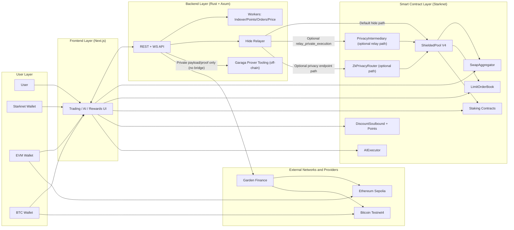

# Architecture

CAREL has three execution modes. Every user action goes through one of them.

## Execution Modes

### Normal Mode

The user connects their Starknet wallet and signs transactions directly. The backend handles quote aggregation, route optimization, and calldata preparation. The user's wallet submits the transaction on-chain.

```
User Wallet → Backend (quote + calldata) → User signs → Starknet
```

This is the default mode. All flows — swap, stake, limit order, bridge — are available in Normal Mode.

### Hide Mode

The user's wallet is not the transaction sender on-chain. Instead, the backend relayer submits the transaction after the user signs a private intent payload. A Garaga Honk ZK proof is generated to verify the user's intent was executed correctly.

```
User Wallet → signs intent payload
                    ↓
Backend generates Garaga Honk proof
                    ↓
Relayer submits tx on-chain (relayer wallet visible, not user wallet)
                    ↓
ShieldedPool V4 verifies proof on-chain
```

**What Hide Mode protects:** the link between your wallet address and the on-chain transaction.

**What Hide Mode does not hide:** transaction amounts, timing, and the relayer's wallet address. The relayer knows your identity off-chain.

This is a relayer-based privacy model with ZK execution integrity verification — not a trustless cryptographic anonymity system.

Supported flows: swap, stake, limit order.

### AI Mode (ERC-8004 Autonomous Agent)

The user sends a natural language command. The AI agent interprets the command, builds an execution plan, and submits it on-chain through the AIExecutor contract. Three tiers:

| Tier | Behavior |
|---|---|
| L1 | Backend-only AI, no on-chain execution |
| L2 | AI-assisted on-chain execution via AIExecutor |
| L3 | AI-assisted private execution via relayer + Garaga proof |

The AI agent is autonomous — it determines the execution path without requiring manual approval at each step.

## Stack

| Layer | Technology |
|---|---|
| Smart contracts | Cairo 2.x on Starknet |
| ZK proofs | Garaga Honk (UltraHonk via Barretenberg) |
| Backend | Rust + Axum |
| State | PostgreSQL + Redis |
| Frontend | Next.js 16 |
| Bridge | Aggregated (LayerSwap, Garden Finance) |

## System Diagram



## Full System Architecture

```
┌──────────────────────────────────────────────────────────┐
│  USER LAYER                                              │
│  Starknet Wallet · EVM Wallet · BTC Wallet               │
└────────────────────────┬─────────────────────────────────┘
                         │
┌────────────────────────▼─────────────────────────────────┐
│  FRONTEND  (Next.js · Vercel)                            │
│  Trading UI · AI panel · Rewards · Hide Mode UI          │
└──────┬─────────────────┬────────────────────┬────────────┘
       │ API / WebSocket │                    │ direct wallet tx
       │                 │                    │
┌──────▼─────────────────┴──────┐   ┌─────────▼──────────────────────────┐
│  BACKEND  (Rust + Axum · Railway)│  │  SMART CONTRACTS  (Starknet Sepolia)│
│                               │   │                                    │
│  REST + WebSocket API         │   │  SwapAggregator                    │
│  Hide Mode Relayer ───────────┼──▶│  LimitOrderBook                    │
│  Garaga Honk Prover           │   │  ShieldedPool V4 + Honk verifiers  │
│  AI Plan Router ──────────────┼──▶│  AIExecutor (ERC-8004)             │
│  Workers:                     │   │  AIPlanRouter                      │
│    Indexer / Points           │   │  Staking (CAREL · Stable · WBTC)   │
│    Order watcher              │   │  PointStorage · SnapshotDistributor│
│    Bridge orchestration ──────┼──▶│  ReferralSystem · DiscountSoulbound│
│    Price feeds                │   │  PriceOracle (TWAP)                │
└───────────────────────────────┘   │  ShadowBridgeReceiver              │
                                    │  CarelMultiFaucet                  │
┌──────────────────────────────┐    └────────────────────────────────────┘
│  EXTERNAL                    │
│  Ethereum Sepolia            │
│  Bitcoin Testnet4            │
│  Garden Finance (bridge)     │
└──────────────────────────────┘
```

## Action Path Flows

### Swap

```
Normal:
  Swap action → Backend quote → Wallet sign → SwapAggregator

Hide:
  Swap action → User deposit note
                      ↓
                Mixing window
                      ↓
                Backend prep payload
                      ↓
                Relayer submit → ShieldedPool V4 → SwapAggregator
```

### Limit Order

```
Normal:
  Limit action → Wallet sign → LimitOrderBook

Hide:
  Limit action → User deposit note
                       ↓
                 Mixing window
                       ↓
                 Backend prep payload
                       ↓
                 Relayer submit → ShieldedPool V4 → LimitOrderBook
```

### Staking

```
Normal:
  Stake action → Wallet sign → StakingCarel / StakingStablecoin / WBTCStaking

Hide:
  Stake action → User deposit note
                      ↓
                Mixing window
                      ↓
                Backend prep payload
                      ↓
                Relayer submit → ShieldedPool V4 → Staking contract
```

### AI Agent

```
L1 (advisory):
  AI command → Backend AI response only (no on-chain execution)

L2 (autonomous):
  AI command → AI builds execution plan
                     ↓
               User signs once (authorize plan)
                     ↓
               AIExecutor executes autonomously — no per-step approval
               → Swap / Limit / Stake / Bridge
                     ↓
               Execution report returned to user

L3 (autonomous + private):
  AI command → AI builds execution plan
                     ↓
               User signs once (authorize plan)
                     ↓
               AIExecutor → Garaga Honk proof generated (off-chain)
                     ↓
               Relayer submits proof → ShieldedPool V4 verifies on-chain
               → Swap / Limit / Stake (private, wallet unlinkable)
                     ↓
               Execution report returned to user
```

> No human approval at each step. The user authorizes the plan once — the agent handles all execution autonomously.

### Bridge

```
Bridge action → Backend quote + pre-check
                      ↓
                User signs source-chain tx
                      ↓
                Bridge provider settlement
                      ↓
                Destination receive
```

> AI bridge uses Level 2 by default (`AI_LEVEL3_BRIDGE_ENABLED=false`). Level 3 covers swap, stake, and limit order only.
