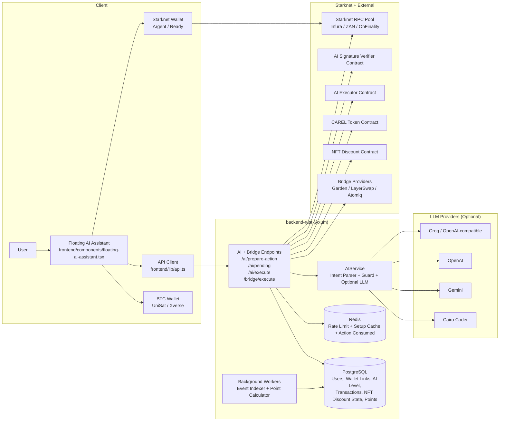
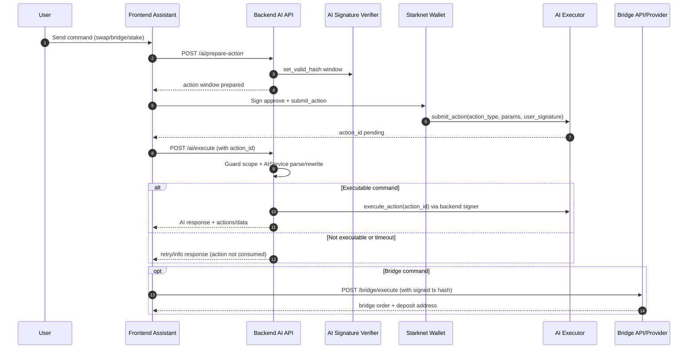

# AI Architecture Diagram

## 1) Component Architecture

## 2) AI Execution Flow (Setup + Execute)

## 3) Points + Discount Rules

- Point sources in calculator:
  - `swap` -> points enabled
  - `limit_order` -> points enabled
  - `stake` -> points enabled
  - `bridge` -> points enabled
- NFT discount is validated at submit-time and persisted in local state.
- Bridge points include NFT multiplier and AI level bonus:
  - Level 2: +2%
  - Level 3: +5%
- Final point settlement is handled by background workers after transaction indexing.
