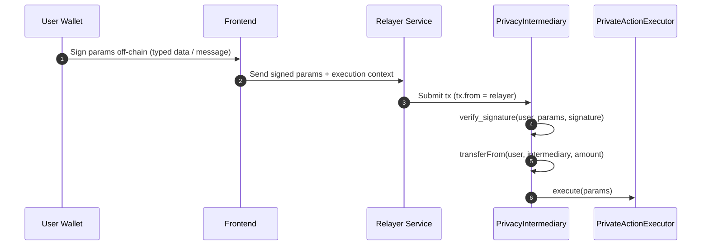

# AI Architecture — Garaga Critical Fixes (2026-02-26)

## Context

Semua transaksi privacy di sistem menggunakan kontrak Garaga yang sama, untuk dua flow:

- User Manual:
  - Swap + Hide mode
  - Limit Order + Hide mode
  - Stake + Hide mode
- Via AI:
  - L1
  - L2
  - L3 (`swap/stake/limit order` saja, tanpa bridge)

Karena semua flow memukul surface kontrak yang sama, dua bug berikut harus diperbaiki serentak.

## Bug #1 — Proof Static (Semua Transaksi Proof Identik)

### Root Cause

```env
GARAGA_ALLOW_PRECOMPUTED_PAYLOAD=true
GARAGA_PROVE_CMD=
```

Runtime membaca satu payload JSON precomputed, sehingga proof bisa identik lintas user/action/amount.

### Fix Wajib

1. Update `.env` backend:

```env
GARAGA_ALLOW_PRECOMPUTED_PAYLOAD=false
GARAGA_PROVE_CMD=python3 scripts/garaga_auto_prover.py --prove
GARAGA_PROOF_PATH=./garaga_proof.json
GARAGA_VK_PATH=./garaga_vk.json
GARAGA_PUBLIC_INPUTS_PATH=./garaga_public_inputs.json
```

2. Update `backend-rust/scripts/garaga_auto_prover.py` agar intent hash mengikat konteks transaksi:

```python
# Swap
intent_hash = hash(user_address, from_token, to_token, amount, nonce)

# Limit Order
intent_hash = hash(user_address, from_token, to_token, amount, price, nonce)

# Stake
intent_hash = hash(user_address, token, amount, pool, nonce)
```

3. Tambahkan queue proof generation berbasis Redis:
   - Max concurrency: `2`
   - Timeout per job: `30s`
   - Jika timeout/gagal: return error deterministik ke caller (jangan fallback ke payload statis)

4. Verifikasi:

```bash
python3 scripts/garaga_auto_prover.py --test
```

Jalankan dua kali dengan input berbeda. Proof harus berbeda.

## Bug #2 — User Address Bocor On-Chain

### Root Cause (2 Layer)

1. Layer tx sender:
   - `tx.from = user wallet` terlihat di explorer.
2. Layer calldata:
   - field yang langsung mengandung identitas/konteks user masih terbaca on-chain (contoh depositor/recipient/token/amount/target/min_payout).

Yang sudah aman dan tidak diubah:

- ZK proof validity
- Nullifier
- Commitment

## Fix Arsitektur — Relayer + PrivacyIntermediary (Kombinasi)

Gunakan relayer untuk submit tx on-chain, dan kontrak intermediary untuk atomic fund movement sebelum private execution.



### Invariant Penting (Saldo Pasti Berkurang)

- `transferFrom(user, intermediary, amount)` wajib dieksekusi sebelum action.
- User harus melakukan `approve(intermediary, amount)` lebih dulu.
- Atomicity: jika `transferFrom` gagal, seluruh tx revert.
- Tidak boleh ada jalur di mana action sukses tapi token user tidak berpindah.

## Detail Implementasi per Layer

1. Contract baru `PrivacyIntermediary` (Cairo):
   - Verifikasi signature user.
   - `transferFrom` user ke intermediary sebelum forwarding.
   - Forward call ke `private_action_executor`.

2. Update `private_action_executor.cairo`:
   - Hanya menerima caller dari whitelist intermediary.
   - `depositor` dan `recipient` diisi `get_caller_address()` (intermediary), bukan user wallet.

3. Backend relayer `backend-rust/src/services/relayer.rs`:
   - Menerima signed params dari frontend.
   - Submit tx dengan wallet relayer.
   - Monitor status tx, return result final.

4. Frontend `frontend/lib/onchain-trade.ts`:
   - Sign params off-chain (bukan broadcast langsung user wallet).
   - Submit signature + params ke endpoint relayer.
   - Tambah step approve ke intermediary sebelum eksekusi privacy.

5. Frontend `frontend/components/floating-ai-assistant.tsx`:
   - Semua hide mode (`swap/limit/stake`) lewat relayer path.
   - AI execution L1/L2/L3 privacy juga lewat relayer path.

6. Backend API `backend-rust/src/api/ai.rs`:
   - Build params dari AI intent.
   - Delegasi submit ke relayer service.

## Scope Coverage (Wajib 6 Mode)

| Mode | Flow | Bug #1 Static Proof | Bug #2 Address Leak |
|------|------|---------------------|---------------------|
| Swap + Hide | User Manual | Fix | Fix |
| Limit Order + Hide | User Manual | Fix | Fix |
| Stake + Hide | User Manual | Fix | Fix |
| L1 | AI | Fix | Fix |
| L2 | AI | Fix | Fix |
| L3 (swap/stake/limit) | AI | Fix | Fix |

## Prioritas Eksekusi

1. Bug #1: jadikan proof dynamic terlebih dulu.
2. Bug #2: lanjut relayer + intermediary setelah dynamic proof stabil.

## Yang Tidak Boleh Diubah

- Garaga proof verification semantics on-chain.
- Burn CAREL logic yang sudah berlaku per level.
- Verifier contract flow untuk setup signature AI.
- Typed data pada setup sign flow yang saat ini sudah benar.

## Definition of Done

- [ ] Dua transaksi berbeda menghasilkan proof berbeda.
- [ ] `tx.from` on-chain adalah relayer address, bukan user wallet.
- [ ] `depositor` dan `recipient` on-chain adalah intermediary address, bukan user wallet.
- [ ] Saldo user berkurang benar pada setiap transaksi sukses.
- [ ] Jika `transferFrom` gagal, seluruh transaksi revert (tanpa partial execution).
- [ ] Semua 6 mode ter-cover (`swap/limit/stake hide` + `AI L1/L2/L3`).
- [ ] Uji dua wallet berbeda: proof berbeda, address tidak bocor, saldo keduanya berkurang sesuai eksekusi.
