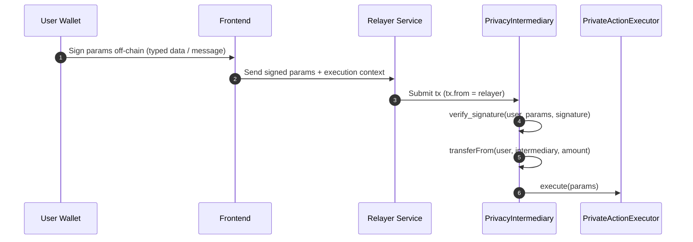

# AI Architecture — Garaga Critical Fixes (2026-02-26)

## 1. Context

All privacy transactions in this system use the same Garaga contract surface across two flow families:

- User manual flows:
  - Swap + Hide mode
  - Limit Order + Hide mode
  - Stake + Hide mode
- AI-driven flows:
  - L1
  - L2
  - L3 (`swap/stake/limit order` only, no bridge)

Because both families use the same contract surface, the two bugs below must be fixed together.

## 2. Bug #1 — Static Proof (Identical Proof Across Transactions)

### 2.1 Root Cause

```env
GARAGA_ALLOW_PRECOMPUTED_PAYLOAD=true
GARAGA_PROVE_CMD=
```

Runtime reads one precomputed JSON payload, so proof can become identical across users/actions/amounts.

### 2.2 Required Fix

1. Update backend `.env`:

```env
GARAGA_ALLOW_PRECOMPUTED_PAYLOAD=false
GARAGA_PROVE_CMD=python3 scripts/garaga_auto_prover.py --prove
GARAGA_PROOF_PATH=./garaga_proof.json
GARAGA_VK_PATH=./garaga_vk.json
GARAGA_PUBLIC_INPUTS_PATH=./garaga_public_inputs.json
```

2. Update `backend-rust/scripts/garaga_auto_prover.py` so intent hash binds transaction context:

```python
# Swap
intent_hash = hash(user_address, from_token, to_token, amount, nonce)

# Limit Order
intent_hash = hash(user_address, from_token, to_token, amount, price, nonce)

# Stake
intent_hash = hash(user_address, token, amount, pool, nonce)
```

3. Add Redis-based proof generation queue:
   - Max concurrency: `2`
   - Timeout per job: `30s`
   - On timeout/failure: return deterministic error to caller (do not fall back to static payload)

4. Verify:

```bash
python3 scripts/garaga_auto_prover.py --test
```

Run twice with different inputs. Proof must be different.

## 3. Bug #2 — User Address Leakage On-Chain

### 3.1 Root Cause (2 Layers)

1. Tx sender layer:
   - `tx.from = user wallet` is visible in explorer.
2. Calldata layer:
   - fields that directly encode user identity/context are still visible on-chain (for example depositor/recipient/token/amount/target/min_payout).

Already correct and not changed:

- ZK proof validity
- Nullifier
- Commitment

## 4. Architecture Fix — Relayer + PrivacyIntermediary (Combined)

Use relayer for on-chain tx submission and intermediary contract for atomic fund movement before private execution.


```mermaid
sequenceDiagram
    autonumber
    participant U as User Wallet
    participant FE as Frontend
    participant R as Relayer Service
    participant I as PrivacyIntermediary
    participant E as PrivateActionExecutor

    U->>FE: Sign params off-chain (typed data / message)
    FE->>R: Send signed params + execution context
    R->>I: Submit tx (tx.from = relayer)
    I->>I: verify_signature(user, params, signature)
    I->>I: transferFrom(user, intermediary, amount)
    I->>E: execute(params)
```

### 4.1 Critical Invariant (User Balance Must Decrease)

- `transferFrom(user, intermediary, amount)` must execute before action.
- User must call `approve(intermediary, amount)` first.
- Atomicity: if `transferFrom` fails, whole tx reverts.
- There must be no path where action succeeds but user token is not moved.

## 5. Implementation Detail by Layer

1. New Cairo contract `PrivacyIntermediary`:
   - Verify user signature.
   - `transferFrom` from user to intermediary before forwarding.
   - Forward call to `private_action_executor`.

2. Update `private_action_executor.cairo`:
   - Accept caller only from whitelisted intermediary.
   - Set `depositor` and `recipient` from `get_caller_address()` (intermediary), not user wallet.

3. Backend relayer `backend-rust/src/services/relayer.rs`:
   - Accept signed params from frontend.
   - Submit tx with relayer wallet.
   - Monitor tx status and return final result.

4. Frontend `frontend/lib/onchain-trade.ts`:
   - Sign params off-chain (not direct wallet broadcast).
   - Submit signature + params to relayer endpoint.
   - Add intermediary approve step before privacy execution.

5. Frontend `frontend/components/floating-ai-assistant.tsx`:
   - All hide mode actions (`swap/limit/stake`) use relayer path.
   - AI L1/L2/L3 privacy execution also uses relayer path.

6. Backend API `backend-rust/src/api/ai.rs`:
   - Build params from AI intent.
   - Delegate submission to relayer service.

## 6. Scope Coverage (Required 6 Modes)

| Mode | Flow | Bug #1 Static Proof | Bug #2 Address Leak |
|------|------|---------------------|---------------------|
| Swap + Hide | User Manual | Fix | Fix |
| Limit Order + Hide | User Manual | Fix | Fix |
| Stake + Hide | User Manual | Fix | Fix |
| L1 | AI | Fix | Fix |
| L2 | AI | Fix | Fix |
| L3 (swap/stake/limit) | AI | Fix | Fix |

## 7. Execution Priority

1. Bug #1: make proof dynamic first.
2. Bug #2: continue with relayer + intermediary after dynamic proof is stable.

## 8. Must Not Change

- Garaga on-chain verification semantics.
- CAREL burn logic already enforced by level.
- Verifier contract flow for AI setup signature.
- Typed-data setup sign flow that is already correct.

## 9. Definition of Done

- [ ] Two different transactions produce different proofs.
- [ ] On-chain `tx.from` is relayer address, not user wallet.
- [ ] On-chain `depositor` and `recipient` are intermediary address, not user wallet.
- [ ] User balance decreases correctly on every successful transaction.
- [ ] If `transferFrom` fails, full transaction reverts (no partial execution).
- [ ] All 6 modes are covered (`swap/limit/stake hide` + `AI L1/L2/L3`).
- [ ] Test two different wallets: proofs differ, no address leakage, both balances decrease correctly.
