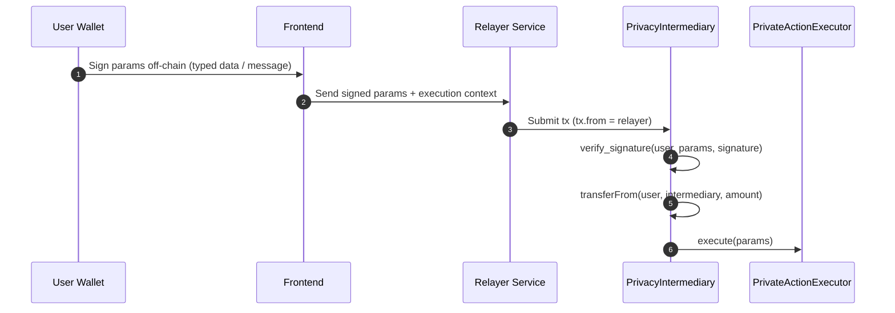

# AI Architecture — Garaga Critical Fixes (2026-02-26)

## 1. Context

All privacy transactions in this system use the same Garaga contract surface across two flow families:

- User manual flows:
  - Swap + Hide mode
  - Limit Order + Hide mode
  - Stake + Hide mode
- AI-driven flows:
  - L1
  - L2
  - L3 (`swap/stake/limit order` only, no bridge)

Because both families use the same contract surface, the two bugs below must be fixed together.

## 1.1 Agentic Autonomy (ERC‑8004 — Full)

Target behavior for the AI agent submission:
- Decision loop: `discover → plan → execute → verify → submit`
- Single user signature authorizes a **plan hash** that binds agent identity, operator wallet, chain id, expiry, and action list.
- One plan signature covers **many tasks** until it expires or runs out of action slots (not per-task by default).
- L2 executes normal flows via `AIExecutor` in batch.
- L3 executes hide flows via note deposit + relayer submit into `ShieldedPool V4`.
- Guardrails include preflight validation, bounded retries, and compute budget caps.

On‑chain components (full ERC‑8004 + plan):
- `ERC8004IdentityRegistry`: agent ownership/operator/wallet/metadata.
- `ERC8004ValidationRegistry`: validator attestations + proof URIs/hashes.
- `ERC8004ReputationRegistry`: positive/negative reputation signals.
- `AIPlanRouter`: single‑signature plan approval + operator‑only execution.
- `AIExecutor`: executes actions; plan router submits on behalf of user.
- `PrivacyRouterV4`: routes private actions into `ShieldedPoolV4`.

### Plan Hash (Single Signature)
The user signs once on a plan hash:
```
plan_hash = poseidon(
  chain_id,
  plan_router_address,
  user,
  agent_id,
  operator,
  plan_payload_hash,
  action_mask,
  max_actions,
  expires_at,
  nonce
)
```

### Plan Defaults (Reasonable)
- Default scope: L2 swap/bridge/stake/limit + L3 private swap/stake/limit.
- Default max actions: `50`
- Default expiry: `30 days` from approval time.
- Default rule: **no per-task signature** after plan approval.
- Optional safety: per-task confirmation only for high-value actions (UI toggle).

### Spending Caps (Recommended)
Plan controls **what** can be executed. Token allowances control **how much** can be spent.
- User sets ERC20 allowance to the relay once per token.
- Allowance size becomes the on-chain spend cap for auto mode.
- If user wants stricter safety, lower allowance or reduce max actions.

### Action Mask (Default)
- Swap = 1
- Bridge = 2
- Stake = 4
- Claim = 8
- Mint = 16
- MultiStep = 32
- Basic = 64

### Guardrails (On‑chain)
- Optional: `require_validation = true`
- Optional: `min_validation_count >= 1`
- Optional: `min_reputation` (positive‑negative)

## 1.2 ShieldedPool V4 Routing

Private action routing uses `PrivacyRouterV4`:
- `ACTION_SWAP`, `ACTION_SWAP_AGG`, `ACTION_PRIVATE_SWAP` → `submit_private_swap`
- `ACTION_STAKING` → `submit_private_stake`
- `ACTION_LIMIT` → `submit_private_limit`

This keeps V4 routing consistent while maintaining the same `IPrivacyRouter` interface.

## 1.3 Wiring Checklist (Prod)

1. Deploy registries:
   - `ERC8004IdentityRegistry`
   - `ERC8004ValidationRegistry`
   - `ERC8004ReputationRegistry`
2. Deploy `AIPlanRouter`
3. Deploy `PrivacyRouterV4`
4. Set addresses:
   - `AIExecutor.set_plan_router(plan_router)`
   - `AIExecutor.set_privacy_router(privacy_router_v4)`
   - `AISignatureVerifier.set_privacy_router(privacy_router_v4)`
   - `AIPlanRouter.set_executor(ai_executor)`
   - `AIPlanRouter.set_identity_registry(identity_registry)`
   - `AIPlanRouter.set_signature_verifier(ai_signature_verifier)`
   - `PrivacyRouterV4.set_shielded_pool(shielded_pool_v4)`

## 1.4 Agent Manifest (Template)

```json
{
  "agent_name": "Carel Autonomous Operator",
  "operator_wallet": "0x...",
  "erc8004_identity": "0x...",
  "supported_tools": [
    "starknet_rpc",
    "storage_ipfs",
    "price_oracle",
    "relayer_api"
  ],
  "supported_stacks": [
    "cairo",
    "rust",
    "typescript"
  ],
  "compute_constraints": {
    "max_cost_usd_per_day": 5,
    "max_tool_calls_per_run": 30,
    "max_retries_per_step": 2
  },
  "supported_task_categories": [
    "swap",
    "limit",
    "stake",
    "bridge",
    "ai_assistant"
  ],
  "guardrails": {
    "validate_tx_params": true,
    "confirm_chain_id": true,
    "reject_unknown_tokens": true,
    "abort_on_high_slippage": true
  }
}
```

## 1.5 Agent Execution Log (Template)

```json
{
  "run_id": "0x...",
  "agent_identity": "0x...",
  "operator_wallet": "0x...",
  "decision_loop": [
    { "phase": "discover", "summary": "User requested private swap", "ts": 0 },
    { "phase": "plan", "summary": "Compute plan hash + action mask", "ts": 0 },
    { "phase": "execute", "summary": "Submit plan + swap", "ts": 0 },
    { "phase": "verify", "summary": "Confirm tx success", "ts": 0 },
    { "phase": "submit", "summary": "Return result to user", "ts": 0 }
  ],
  "tool_calls": [
    { "tool": "starknet_rpc", "input": "get_nonce", "output": "ok" }
  ],
  "retries": [
    { "step": "submit_plan", "reason": "timeout", "count": 1 }
  ],
  "failures": [],
  "final_output": {
    "status": "success",
    "tx_hash": "0x..."
  }
}
```

## 2. Bug #1 — Static Proof (Identical Proof Across Transactions)

### 2.1 Root Cause

```env
GARAGA_ALLOW_PRECOMPUTED_PAYLOAD=true
GARAGA_PROVE_CMD=
```

Runtime reads one precomputed JSON payload, so proof can become identical across users/actions/amounts.

### 2.2 Required Fix

1. Update backend `.env`:

```env
GARAGA_ALLOW_PRECOMPUTED_PAYLOAD=false
GARAGA_PROVE_CMD=python3 scripts/garaga_auto_prover.py --prove
GARAGA_PROOF_PATH=./garaga_proof.json
GARAGA_VK_PATH=./garaga_vk.json
GARAGA_PUBLIC_INPUTS_PATH=./garaga_public_inputs.json
```

2. Update `backend-rust/scripts/garaga_auto_prover.py` so intent hash binds transaction context:

```python
# Swap
intent_hash = hash(user_address, from_token, to_token, amount, nonce)

# Limit Order
intent_hash = hash(user_address, from_token, to_token, amount, price, nonce)

# Stake
intent_hash = hash(user_address, token, amount, pool, nonce)
```

3. Add Redis-based proof generation queue:
   - Max concurrency: `2`
   - Timeout per job: `30s`
   - On timeout/failure: return deterministic error to caller (do not fall back to static payload)

4. Verify:

```bash
python3 scripts/garaga_auto_prover.py --test
```

Run twice with different inputs. Proof must be different.

## 3. Bug #2 — User Address Leakage On-Chain

### 3.1 Root Cause (2 Layers)

1. Tx sender layer:
   - `tx.from = user wallet` is visible in explorer.
2. Calldata layer:
   - fields that directly encode user identity/context are still visible on-chain (for example depositor/recipient/token/amount/target/min_payout).

Already correct and not changed:

- ZK proof validity
- Nullifier
- Commitment

## 4. Architecture Fix — Relayer + PrivacyIntermediary (Combined)

Use relayer for on-chain tx submission and intermediary contract for atomic fund movement before private execution.


```mermaid
sequenceDiagram
    autonumber
    participant U as User Wallet
    participant FE as Frontend
    participant R as Relayer Service
    participant I as PrivacyIntermediary
    participant E as PrivateActionExecutor

    U->>FE: Sign params off-chain (typed data / message)
    FE->>R: Send signed params + execution context
    R->>I: Submit tx (tx.from = relayer)
    I->>I: verify_signature(user, params, signature)
    I->>I: transferFrom(user, intermediary, amount)
    I->>E: execute(params)
```

### 4.1 Critical Invariant (User Balance Must Decrease)

- `transferFrom(user, intermediary, amount)` must execute before action.
- User must call `approve(intermediary, amount)` first.
- Atomicity: if `transferFrom` fails, whole tx reverts.
- There must be no path where action succeeds but user token is not moved.

## 5. Implementation Detail by Layer

1. New Cairo contract `PrivacyIntermediary`:
   - Verify user signature.
   - `transferFrom` from user to intermediary before forwarding.
   - Forward call to `private_action_executor`.

2. Update `private_action_executor.cairo`:
   - Accept caller only from whitelisted intermediary.
   - Set `depositor` and `recipient` from `get_caller_address()` (intermediary), not user wallet.

3. Backend relayer `backend-rust/src/services/relayer.rs`:
   - Accept signed params from frontend.
   - Submit tx with relayer wallet.
   - Monitor tx status and return final result.

4. Frontend `frontend/lib/onchain-trade.ts`:
   - Sign params off-chain (not direct wallet broadcast).
   - Submit signature + params to relayer endpoint.
   - Add intermediary approve step before privacy execution.

5. Frontend `frontend/components/floating-ai-assistant.tsx`:
   - All hide mode actions (`swap/limit/stake`) use relayer path.
   - AI L1/L2/L3 privacy execution also uses relayer path.

6. Backend API `backend-rust/src/api/ai.rs`:
   - Build params from AI intent.
   - Delegate submission to relayer service.

## 6. Scope Coverage (Required 6 Modes)

| Mode | Flow | Bug #1 Static Proof | Bug #2 Address Leak |
|------|------|---------------------|---------------------|
| Swap + Hide | User Manual | Fix | Fix |
| Limit Order + Hide | User Manual | Fix | Fix |
| Stake + Hide | User Manual | Fix | Fix |
| L1 | AI | Fix | Fix |
| L2 | AI | Fix | Fix |
| L3 (swap/stake/limit) | AI | Fix | Fix |

## 7. Execution Priority

1. Bug #1: make proof dynamic first.
2. Bug #2: continue with relayer + intermediary after dynamic proof is stable.

## 8. Must Not Change

- Garaga on-chain verification semantics.
- CAREL burn logic already enforced by level.
- Verifier contract flow for AI setup signature.
- Typed-data setup sign flow that is already correct.

## 9. Definition of Done

- [ ] Two different transactions produce different proofs.
- [ ] On-chain `tx.from` is relayer address, not user wallet.
- [ ] On-chain `depositor` and `recipient` are intermediary address, not user wallet.
- [ ] User balance decreases correctly on every successful transaction.
- [ ] If `transferFrom` fails, full transaction reverts (no partial execution).
- [ ] All 6 modes are covered (`swap/limit/stake hide` + `AI L1/L2/L3`).
- [ ] Test two different wallets: proofs differ, no address leakage, both balances decrease correctly.
