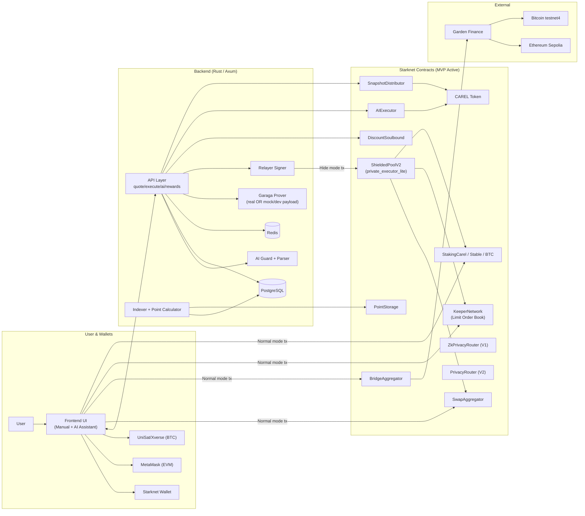
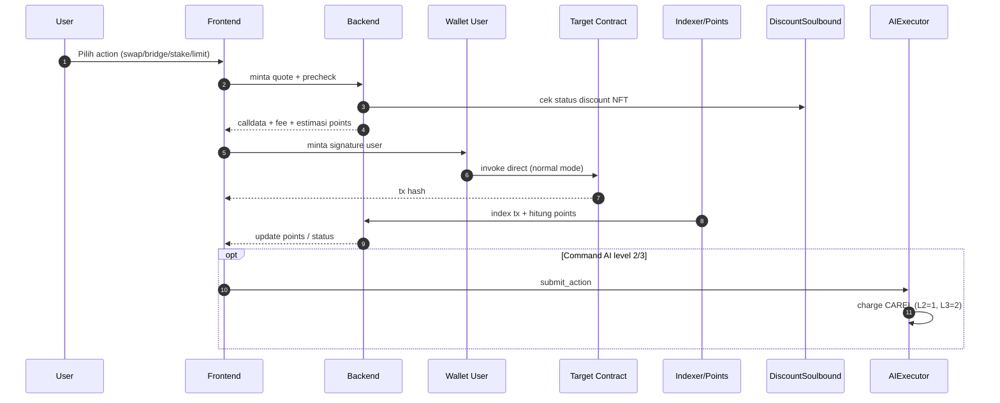
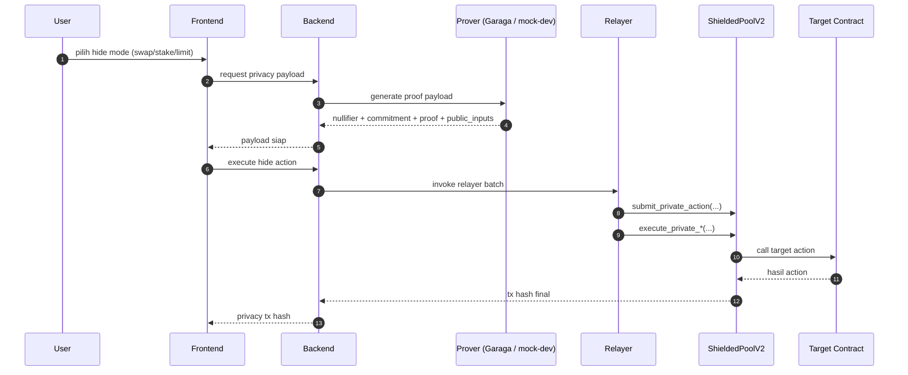

# CAREL Architecture (MVP) - Full, Normal, Hide

Dokumen ini menjawab 2 hal:
1. Kenapa tidak semua kontrak dipakai backend sekarang.
2. Gambar arsitektur yang mudah dibaca juri: full system, normal mode, hide mode.

## Source of Truth yang Dipakai
- Runtime backend: `backend-rust/.env`
- Runtime frontend: `frontend/.env.local`
- Smart contract workspace: `smartcontract/src` + `smartcontract/private_executor_lite`

Catatan penting implementasi saat ini:
- Hide mode aktif memakai `ShieldedPoolV2` (`HIDE_BALANCE_EXECUTOR_KIND=shielded_pool_v2`).
- Verifier/prover masih bisa berjalan dalam mode testnet mock/dev/precomputed saat pengembangan.
- Level 3 bridge default masih dibatasi di backend (`AI_LEVEL3_BRIDGE_ENABLED` default `false`).

## 1) Arsitektur Menyeluruh (MVP + Modular Roadmap)

## Kenapa Tidak Semua Kontrak Dipakai Bersamaan

| Status | Contoh Kontrak | Penjelasan |
| --- | --- | --- |
| Aktif runtime MVP | `SwapAggregator`, `BridgeAggregator`, `KeeperNetwork`, `Staking*`, `ShieldedPoolV2`, `AIExecutor`, `DiscountSoulbound`, `PointStorage`, `SnapshotDistributor` | Dipakai langsung di flow user harian (manual + AI). |
| Aktif tapi scope terbatas | `ZkPrivacyRouter`, `PrivacyRouter`, `DarkPool`, `PrivatePayments`, `AnonymousCredentials`, `PrivateBTCSwap` | Dipakai per fitur tertentu, bukan semua user flow setiap saat. |
| Disiapkan untuk tahap lanjut | `Governance`, `Timelock`, `AccessControlContract`, `EmergencyPause`, `VestingManager`, `FeeCollector` | Arsitektur modular. Tidak semua modul harus aktif di MVP demo. |

## 2) Arsitektur Normal Mode (Direct Wallet Execution)

Normal mode ringkas:
- Sender transaksi action utama adalah wallet user.
- Tidak ada `submit_private_action`.
- Cocok untuk flow paling sederhana dan cepat.

## 3) Arsitektur Hide Mode (Relayer + ZK Binding)

Hide mode ringkas:
- Sender transaksi private execute adalah relayer.
- Nullifier + commitment mencegah replay/double-spend.
- Wallet user bisa tetap muncul di tx setup/approval terpisah jika flow memerlukannya.
- Bridge hide level 3 masih terbatas by default pada env backend saat ini.

## AI, NFT, Points, Tokenomics (Current Code State)

### AI Level
| Level | Fungsi utama | Biaya CAREL |
| --- | --- | --- |
| 1 | Read-only assistant | 0 |
| 2 | Eksekusi on-chain standar | 1 CAREL/action |
| 3 | Multi-step/private scope lebih lanjut | 2 CAREL/action |

Catatan:
- Bonus points AI di calculator backend: level 2 `+20%`, level 3 `+40%`.
- Bridge level 3 default dibatasi kecuali `AI_LEVEL3_BRIDGE_ENABLED=true`.

### NFT Discount
| Tier | Discount |
| --- | --- |
| Bronze | 5% |
| Silver | 10% |
| Gold | 25% |
| Platinum | 35% |
| Onyx | 50% |

### CAREL Stake Multiplier (points)
| CAREL staked | Multiplier |
| --- | --- |
| `<100` | 1x |
| `100 - 999` | 2x |
| `1,000 - 9,999` | 3x |
| `>=10,000` | 5x |

### Tokenomics Ringkas
- Total supply: `1,000,000,000 CAREL`.
- Distribusi: Ecosystem 40%, Team 15%, Investor 15%, Treasury 10%, Listing 10%, Marketing 7%, Early Access 3%.
- Burn/fee terkait operasi:
  - AIExecutor burn saat submit action (level 2/3 pricing).
  - Claim rewards memakai fee split 5% (2.5% management + 2.5% dev) sebelum net claim user.

## Contoh Link Verifikasi Transaksi (Data Demo Saat Ini)
- Normal Swap: https://sepolia.voyager.online/tx/0x22a53b1af0f7d62e19569a99b38d67e9165faad2804ca50a1b0a53f289bab98
- Hide Swap: https://sepolia.voyager.online/tx/0x71b6c99287c78b082d105dc7169faa56b419a3e2568b3ea9a70ef1ff653a2d2
- Normal Stake: https://sepolia.voyager.online/tx/0x3ffda88b060ad41b752e8410b13b567c2cca3aa1e32b29f60cf75d9f8b42d60
- Hide Stake: https://sepolia.voyager.online/tx/0x5fcac3b4578ebe8cf32dde9b0c6ab2390f1f1aa6bea731c3f779575abbdd4cf
- Normal Limit: https://sepolia.voyager.online/tx/0x737c40659dc5c7872ab1a89222d879bca68163b890a61f09b1875d52e4747a6
- Hide Limit: https://sepolia.voyager.online/tx/0x523c9721e57f69fddff4ed3be3935cce3b5782ca2c3b454df565c0be6b22ba3
- BTC bridge tx: https://mempool.space/testnet4/tx/d26a8f5d0213b4448722cde81e1f47e68b8efbd00c56ce4802e39c9b0898db4c
- Garden order: https://testnet-explorer.garden.finance/order/237be68816b9144b9d3533ca3ec8c4eb1e7c00b1649e9ec216d89469fd014e70
- ETH bridge tx: https://sepolia.etherscan.io/tx/0xab25b9261dc9f703e44cb89a34831ff03024b8fe89e32cce4a7e58b5d6dcdef3

## Referensi Internal Repo
- `backend-rust/src/api/swap.rs`
- `backend-rust/src/api/stake.rs`
- `backend-rust/src/api/limit_order.rs`
- `backend-rust/src/api/bridge.rs`
- `backend-rust/src/api/ai.rs`
- `backend-rust/src/services/point_calculator.rs`
- `backend-rust/src/constants.rs`
- `backend-rust/src/tokenomics.rs`
- `smartcontract/src/ai/ai_executor.cairo`
- `smartcontract/private_executor_lite/src/shielded_pool_v2.cairo`
