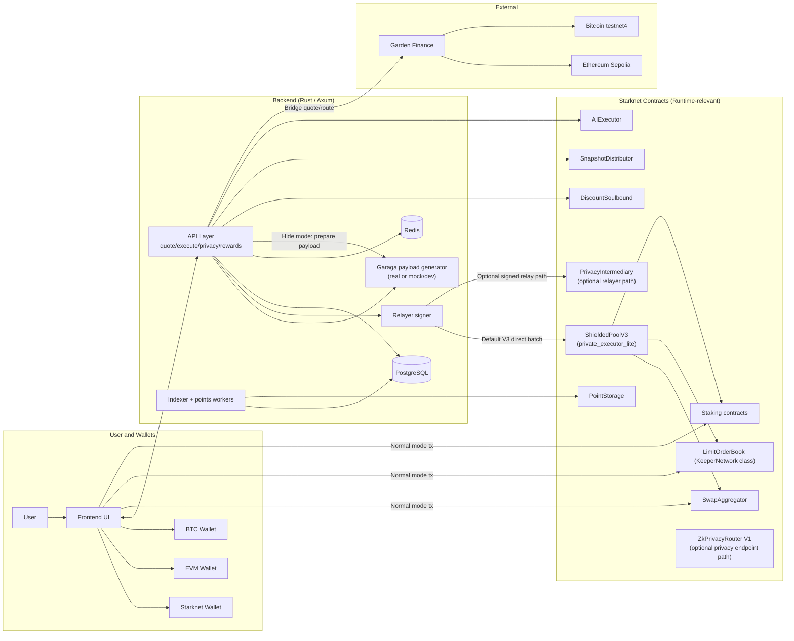
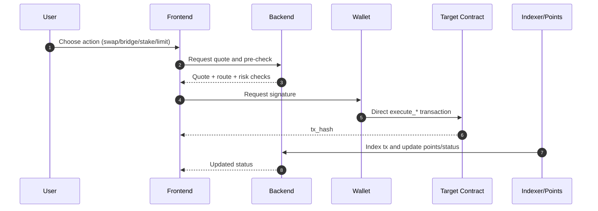
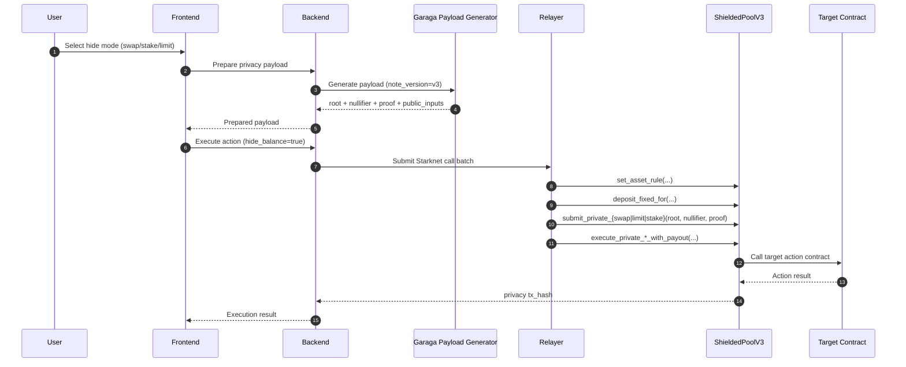
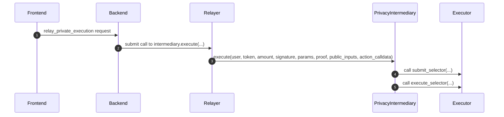

# CAREL Architecture (MVP) - Runtime-Accurate View

This document describes the current runtime architecture and execution behavior for:
- normal mode,
- hide mode V3,
- bridge path,
- optional/legacy privacy paths.

## 1. Source of Truth and Profile Split
Runtime source of truth:
- Backend runtime: `backend-rust/.env`
- Frontend runtime: `frontend/.env.local` (fallback: `frontend/.env`)

Contract catalog source of truth:
- `smartcontract/.env`

Profile note:
- Runtime profile and catalog profile can differ by address. This is expected when migration and historical deployments coexist.

## 2. Runtime Baseline (Current)
Hide-mode baseline currently used by runtime:
- `HIDE_BALANCE_EXECUTOR_KIND=shielded_pool_v3`
- `HIDE_BALANCE_POOL_VERSION_DEFAULT=v3`
- `HIDE_BALANCE_V2_REDEEM_ONLY=true`
- Runtime executor: `PRIVATE_ACTION_EXECUTOR_ADDRESS=0x0112a5f60db409d74c4e67b5c29c85c7fbeefffccf9762a37460a42854cc74c2`
- AI bridge baseline: bridge commands use the public Level 2 path; `AI_LEVEL3_BRIDGE_ENABLED=false` by default.

## 3. System Architecture (Runtime)

```mermaid
flowchart LR
    subgraph USER["User and Wallets"]
        U["User"]
        FE["Frontend UI"]
        SW["Starknet Wallet"]
        EW["EVM Wallet"]
        BW["BTC Wallet"]
        U --> FE
        FE --> SW
        FE --> EW
        FE --> BW
    end

    subgraph BE["Backend (Rust / Axum)"]
        API["API Layer\nquote/execute/privacy/rewards"]
        PROVER["Garaga payload generator\n(real or mock/dev)"]
        RELAYER["Relayer signer"]
        IDX["Indexer + points workers"]
        DB[("PostgreSQL")]
        REDIS[("Redis")]
        API --> PROVER
        API --> RELAYER
        API --> DB
        API --> REDIS
        IDX --> DB
    end

    subgraph SC["Starknet Contracts (Runtime-relevant)"]
        SWAP["SwapAggregator"]
        LOB["LimitOrderBook (KeeperNetwork class)"]
        STAKE["Staking contracts"]
        EXECV3["ShieldedPoolV3\n(private_executor_lite)"]
        INTERM["PrivacyIntermediary\n(optional relayer path)"]
        ZKV1["ZkPrivacyRouter V1\n(optional privacy endpoint path)"]
        AIEXEC["AIExecutor"]
        NFT["DiscountSoulbound"]
        POINTS["PointStorage"]
        SNAP["SnapshotDistributor"]
    end

    subgraph EXT["External"]
        GARDEN["Garden Finance"]
        ETH["Ethereum Sepolia"]
        BTC["Bitcoin testnet4"]
    end

    FE <--> API

    FE -->|"Normal mode tx"| SWAP
    FE -->|"Normal mode tx"| LOB
    FE -->|"Normal mode tx"| STAKE

    API -->|"Hide mode: prepare payload"| PROVER
    RELAYER -->|"Default V3 direct batch"| EXECV3
    RELAYER -->|"Optional signed relay path"| INTERM

    EXECV3 --> SWAP
    EXECV3 --> LOB
    EXECV3 --> STAKE

    API --> NFT
    IDX --> POINTS
    API --> SNAP
    API --> AIEXEC

    API -->|"Bridge quote/route"| GARDEN
    GARDEN --> ETH
    GARDEN --> BTC
```

## 4. Normal Mode Flow (Direct Wallet Execution)

```mermaid
sequenceDiagram
    autonumber
    participant User
    participant FE as Frontend
    participant BE as Backend
    participant W as Wallet
    participant T as Target Contract
    participant IDX as Indexer/Points

    User->>FE: Choose action (swap/bridge/stake/limit)
    FE->>BE: Request quote and pre-check
    BE-->>FE: Quote + route + risk checks
    FE->>W: Request signature
    W->>T: Direct execute_* transaction
    T-->>FE: tx_hash
    IDX->>BE: Index tx and update points/status
    BE-->>FE: Updated status
```

Normal mode properties:
- Final sender is user wallet.
- No private note submit/execute path.

## 5. Hide Mode V3 Flow (Default Runtime Path)

```mermaid
sequenceDiagram
    autonumber
    participant User
    participant FE as Frontend
    participant BE as Backend
    participant P as Garaga Payload Generator
    participant R as Relayer
    participant E as ShieldedPoolV3
    participant T as Target Contract

    User->>FE: Select hide mode (swap/stake/limit)
    FE->>BE: Prepare privacy payload
    BE->>P: Generate payload (note_version=v3)
    P-->>BE: root + nullifier + proof + public_inputs
    BE-->>FE: Prepared payload

    FE->>BE: Execute action (hide_balance=true)
    BE->>R: Submit Starknet call batch
    R->>E: set_asset_rule(...)
    R->>E: deposit_fixed_for(...)
    R->>E: submit_private_{swap|limit|stake}(root, nullifier, proof)
    R->>E: execute_private_*_with_payout(...)
    E->>T: Call target action contract
    T-->>E: Action result
    E-->>BE: privacy tx_hash
    BE-->>FE: Execution result
```

Hide mode V3 properties:
- Final sender is relayer account.
- V3 path binds action to nullifier/root/proof context.
- Starknet calldata and ERC20 transfers remain public; hide mode reduces linkability (commitment vs nullifier), not trade-parameter confidentiality.
- `v2` contract remains for redemption-only migration window.

## 6. Optional Intermediary Relay Flow
Used when `relay_private_execution` endpoint is invoked with signed user payload.

```mermaid
sequenceDiagram
    autonumber
    participant FE as Frontend
    participant BE as Backend
    participant R as Relayer
    participant I as PrivacyIntermediary
    participant E as Executor

    FE->>BE: relay_private_execution request
    BE->>R: submit call to intermediary.execute(...)
    R->>I: execute(user, token, amount, signature, params, proof, public_inputs, action_calldata)
    I->>E: call submit_selector(...)
    I->>E: call execute_selector(...)
```

Notes:
- This is an optional relay path, not the only hide-mode path.
- Runtime verification logic supports both intermediary and direct invoke patterns.

## 7. Active vs Optional Contract Scope
| Status | Contracts | Notes |
| --- | --- | --- |
| Active runtime core | `SwapAggregator`, `BridgeAggregator`, `LimitOrderBook`, `Staking*`, `ShieldedPoolV3`, `AIExecutor`, `DiscountSoulbound`, `PointStorage`, `SnapshotDistributor` | Used by default runtime flows. |
| Active but path-specific | `PrivacyIntermediary`, `ZkPrivacyRouter`, `PrivacyRouter` | Used by specific privacy flows/endpoints, not every action path. |
| Deployed optional | `DarkPool`, `PrivatePayments`, `AnonymousCredentials`, `PrivateBTCSwap` | Not default frontend path in current MVP runtime. |
| Legacy compatibility | `ShieldedPoolV2`, `PrivateActionExecutor` | Retained for migration/backward compatibility. |

## 8. Historical Proof Links (Context)
These hide tx links are historical MVP proof links from the earlier phase before V3 baseline finalization:
- Hide Swap: https://sepolia.voyager.online/tx/0x71b6c99287c78b082d105dc7169faa56b419a3e2568b3ea9a70ef1ff653a2d2
- Hide Stake: https://sepolia.voyager.online/tx/0x5fcac3b4578ebe8cf32dde9b0c6ab2390f1f1aa6bea731c3f779575abbdd4cf
- Hide Limit: https://sepolia.voyager.online/tx/0x523c9721e57f69fddff4ed3be3935cce3b5782ca2c3b454df565c0be6b22ba3

Keep these links as historical evidence, not as a claim that runtime baseline is still V2.

## 9. Code References
- `backend-rust/src/api/swap.rs`
- `backend-rust/src/api/stake.rs`
- `backend-rust/src/api/limit_order.rs`
- `backend-rust/src/api/privacy.rs`
- `backend-rust/src/api/onchain_privacy.rs`
- `backend-rust/src/api/bridge.rs`
- `backend-rust/src/services/point_calculator.rs`
- `smartcontract/private_executor_lite/src/shielded_pool_v3.cairo`
- `smartcontract/private_executor_lite/src/shielded_pool_v2.cairo` (legacy)
- `smartcontract/src/privacy_intermediary.cairo`
