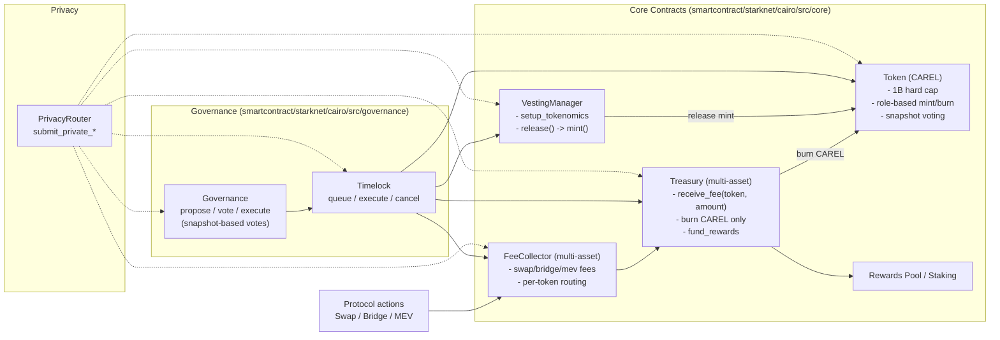
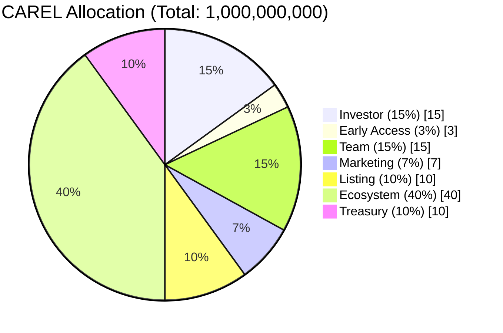
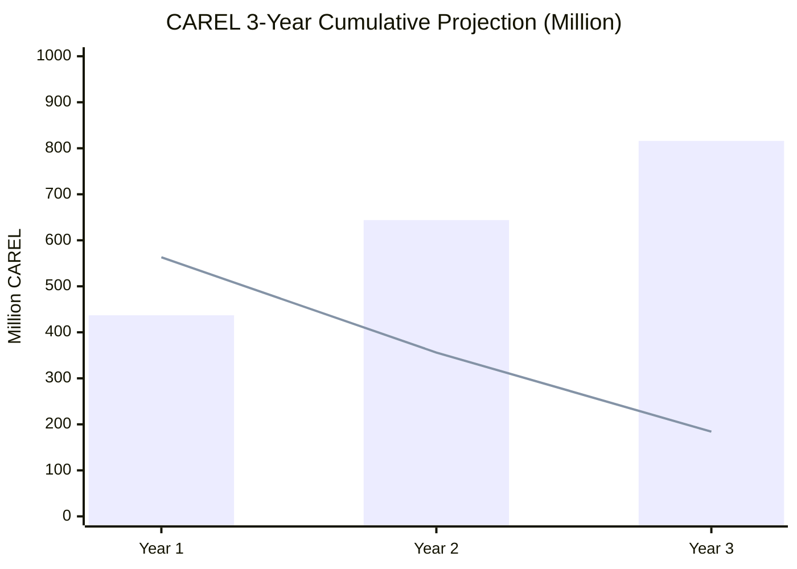

# CAREL Tokenomics (Root Guide, Mermaid)

Primary tokenomics guide at repo root, using Mermaid-only diagrams.

## 1. Architecture (Mermaid)

## 2. Token Allocation (Mermaid)

## 3. 3-Year Unlock Projection (Mermaid)

Interpretation:
- `bar` = unlocked cumulative supply
- `line` = remaining locked supply

## 4. Key Numbers

- Year 1 unlocked: `437M`, locked: `563M`
- Year 2 unlocked: `644M`, locked: `356M`
- Year 3 unlocked: `816M`, locked: `184M`

## 4.1. Claim Fee (Current On‑Chain)

- Airdrop claim fee: `5%` of claimed amount
- Allocation (current): `1.25%` treasury + `1.25%` dev + `2.5%` burn

## 4.2. AI Access Tiers + Burn (Current On‑Chain)

- Default tier prices (current): `L2 = 5 CAREL`, `L3 = 10 CAREL`
- Per‑action AI fee: **split** burn + fee recipient  
  - L2: burn `2`, fee recipient `3`  
  - L3: burn `3`, fee recipient `7`
- Tier upgrade fee: paid to `fee_recipient` (dev wallet)
- Config is adjustable via governance (`set_ai_fee_config`)
- Runtime points bonus: L2 `+20%`, L3 `+40%` (runtime-only, not on-chain)

## 4.3. Post‑Mainnet Adjustments (Governance‑Tunable)

- Claim fee + AI fee splits are **already live** on-chain and adjustable by governance.
- Post‑mainnet tuning may change tier prices or burn split based on usage data.

## 4.4. Points Multipliers (Runtime)

- Buckets: `swap_points`, `bridge_points`, `stake_points`, `referral_points`, `social_points`
- Base rates (runtime): swap `10` pts/USD, limit `12` pts/USD, ETH bridge `15`, BTC/WBTC bridge `25`, stake `3` (before multipliers)
- Stake action multipliers: CAREL `2x / 3x / 5x` at `>=100 / >=1,000 / >=10,000`
- Token multipliers: WBTC `1.5x`, USDT/USDC/STRK `1x`, LP `5x`
- AI level bonus (runtime‑only): L2 `+20%`, L3 `+40%`
- Hide‑only tier bonus (USDT‑equivalent): `+5% / +10% / +20% / +30% / +50%` at `>=5 / >=10 / >=50 / >=100 / >=250`
- Formula: `total_points = (swap + bridge + stake + referral + social) * staking_multiplier * nft_factor`
- On‑chain sync: backend submits exact epoch totals via `PointStorage.submit_points`

## 4.5. Governance Adjustability

- Parameters above are **adjustable via governance** after mainnet usage data is available.

## 5. Assumptions

- `setup_tokenomics(..., release_immediate=true)`
- periodic `release()` is executed by admin (governance/timelock)

## 6. Function-Level Spec (Precise)

**Token (CarelToken)** — `smartcontract/starknet/cairo/src/core/token.cairo`
- `mint(recipient, amount)` requires `MINTER_ROLE`, checks hard cap, increments `total_minted`, mints to `recipient`.
- `burn(amount)` requires `BURNER_ROLE`, burns from caller, decrements `total_minted`.
- `set_minter(address)` and `set_burner(address)` require `DEFAULT_ADMIN_ROLE`.
- `get_votes(account)` returns current voting power (balance).
- `get_past_votes(account, block_number)` returns checkpointed balance at `block_number` (flash-loan resistant).
- Snapshot checkpoints are written after every mint/burn/transfer; same-block updates overwrite the last checkpoint.

**VestingManager** — `smartcontract/starknet/cairo/src/core/vesting_manager.cairo`
- `create_vesting(beneficiary, amount, category, cliff_duration, vesting_duration)` only owner.
- `vesting_duration == 0` allowed only for `Listing`, `EarlyAccess`, `Treasury`; if `duration == 0` then `cliff_duration` must be `0`.
- `calculate_releasable(beneficiary)` returns `total - released` for immediate categories; otherwise linear vesting.
- `release(beneficiary)` updates `released_amount` before mint to prevent reentrancy.
- `setup_tokenomics(...)` mints schedules using category defaults; can auto-release immediate categories.

**Treasury (Multi-Asset)** — `smartcontract/starknet/cairo/src/core/treasury.cairo`
- `receive_fee(token, amount)` only authorized fee collectors. If `token == CAREL` and burn enabled, burns `burn_rate_bps` and records net. For non-CAREL, no burn is applied.
- `burn_excess(token, amount)` only governance. Requires `token == CAREL` and enforces epoch burn cap.
- `fund_rewards(token, recipient, amount)` only governance. Accounting-only for rewards distribution per token.
- `batch_fund_rewards(token, recipients, amounts)` only governance. Accounting-only per token.
- `withdraw_emergency(token, amount)` only governance. Transfers `token` to owner (timelock) for incident recovery.
- `get_treasury_balance(token)` returns token balance held by treasury.
- `set_governance_executor(address)` required before any governance-only outflow.

**FeeCollector (Multi-Asset)** — `smartcontract/starknet/cairo/src/core/fee_collector.cairo`
- `collect_swap_fee(token, amount, lp_address)` computes fee using `swap_fee_rate`; forwards treasury share via `treasury.receive_fee(token, ...)`, records LP fees per token.
- `collect_bridge_fee(token, amount, provider)` computes provider/dev split using bridge rates; records per token and emits events.
- `collect_mev_fee(token, amount, user_enabled)` forwards MEV fees to treasury when enabled.
- `update_fee_rates(...)` requires owner; `lp_share + treasury_share == swap_rate`.
- `set_bridge_fee_split(provider_share_bps, dev_share_bps, dev_fund)` requires owner; shares must sum to `bridge_fee_rate`.
- `get_lp_fees(lp, token)` returns LP fees for a specific token.

**Governance + Timelock (Snapshot Voting)**
- `Governance.propose(...)` stores `snapshot_block` at proposal creation.
- `Governance.vote(...)` uses `token.get_past_votes(caller, snapshot_block)` to prevent flash-loan voting.
- `Timelock` enforces minimum delay (>= 48h in constructor guard) for queued executions.

## 7. DEX Fees: Non-CAREL Handling

- The fee asset (USDC, STRK, ETH, WBTC, etc.) is passed explicitly into `FeeCollector.collect_*`.
- Treasury stores each asset separately via `receive_fee(token, amount)`.
- Burn policy applies only when `token == CAREL`.
- Governance may later decide to swap non-CAREL fees into CAREL or redistribute them directly.

## 7.1. Discount Policy (Protocol Fee Only)

- Discount applies only to **protocol fee (treasury share)**.
- LP fees and relayer fees are **not** reduced by discount.
- Simple formula:
- `protocol_fee_after_discount = protocol_fee * (1 - discount_bps / 10_000)`

## 8. Limit Orders (Public)

**LimitOrderBook** — `smartcontract/starknet/cairo/src/trading/dca_orders.cairo`
- `create_limit_order(order_id, from_token, to_token, amount, target_price, expiry)` validates caller, amount, and expiry; stores active order (status `1`) and emits `LimitOrderCreated`.
- `cancel_limit_order(order_id)` only owner can cancel; requires active order; sets status `3` and emits `LimitOrderCancelled`.
- `execute_limit_order(order_id, order_value)` can be called by any executor; requires active, non-expired order; sets status `2` and emits `LimitOrderExecuted`.
- `set_fee_config(protocol_fee_bps, executor_fee_bps, fee_recipient)` owner-only; caps combined fee at `<= 10_000` bps and emits `FeeConfigUpdated`.
- `get_fee_config()` returns `(protocol_fee_bps, executor_fee_bps, fee_recipient)`.
- Fee policy: fees are **calculated** and emitted as `LimitOrderFeesCalculated` during execution; actual token settlement is still handled by the swap executor/relayer.

**Production Defaults (current `.env`)**
- `protocol_fee_bps = 20` (0.2%)
- `executor_fee_bps = 0`
- `fee_recipient = FEE_COLLECTOR_ADDRESS`

## 9. Staking Modules (Public + Hide Mode)

**StakingCarel** — `smartcontract/starknet/cairo/src/trading/staking/staking_carel.cairo`
- `stake(amount)` transfers CAREL from user to contract, compounds pending rewards, updates tier, resets timestamps, and increases total staked.
- `unstake(amount)` applies 10% penalty if withdrawn before `MIN_LOCK_PERIOD` (7 days); penalty is transferred to `reward_pool_address`.
- `claim_rewards()` pulls rewards from `reward_pool_address` via `transfer_from` and pays the user; reward pool must approve the staking contract.
- `batch_claim_rewards(users)` batches claims with `MAX_BATCH_CLAIM = 20`.
- `calculate_rewards(user)` uses tiered APY (bps: 800/1200/1500) and linear accrual.
- `set_reward_fee(fee_bps, fee_recipient)` owner-only; applies a fee on **rewards** (not principal). Defaults to `0`.
- `get_reward_fee()` returns `(fee_bps, fee_recipient)`.
- Hide Mode: `set_privacy_router` + `submit_private_staking_action` forward ZK payload to `privacy_router`.
- Fee policy: no staking fee on deposit/withdraw; only early-unstake penalty.

**Production Defaults (current `.env`)**
- `reward_fee_bps = 200` (2%)
- `fee_recipient = TREASURY_CONTRACT_ADDRESS`

**LPStaking** — `smartcontract/starknet/cairo/src/trading/staking/staking_lp.cairo`
- `add_pool(...)` owner-only; registers APY and point multiplier per pool.
- `stake(pool, amount)` and `unstake(pool, amount)` move LP tokens to/from contract.
- `claim_rewards(pool)` pays rewards in `reward_token`.
- `calculate_rewards(user, pool)` uses pool APY.
- `set_reward_fee(fee_bps, fee_recipient)` owner-only; fee is taken from rewards.
- `get_reward_fee()` returns `(fee_bps, fee_recipient)`.
- Hide Mode: `set_privacy_router` + `submit_private_staking_action`.
- Fee policy: no protocol fee on staking actions.

**Production Defaults (current `.env`)**
- `reward_fee_bps = 200` (2%)
- `fee_recipient = TREASURY_CONTRACT_ADDRESS`

**StakingStablecoin** — `smartcontract/starknet/cairo/src/trading/staking/staking_stablecoin.cairo`
- Fixed APY 7% (`APY_BPS = 700`).
- `add_stablecoin(token)` owner-only allowlist.
- `stake/unstake/claim_rewards/calculate_rewards` per token.
- `set_reward_fee(fee_bps, fee_recipient)` owner-only; fee is taken from rewards.
- `get_reward_fee()` returns `(fee_bps, fee_recipient)`.
- Hide Mode: `set_privacy_router` + `submit_private_staking_action`.
- Fee policy: no protocol fee on staking actions.

**Production Defaults (current `.env`)**
- `reward_fee_bps = 200` (2%)
- `fee_recipient = TREASURY_CONTRACT_ADDRESS`

**WBTCStaking** — `smartcontract/starknet/cairo/src/trading/staking/staking_wbtc.cairo`
- 14-day lock period (`LOCK_PERIOD = 1209600`).
- Allowlisted BTC wrapper tokens (default allowlist set in constructor).
- Tier thresholds (100/1000/10000 units) with APY 6% (`apy_bps = 600` for tiers).
- `stake/unstake/claim_rewards/calculate_rewards` per BTC token.
- `set_reward_fee(fee_bps, fee_recipient)` owner-only; fee is taken from rewards.
- `get_reward_fee()` returns `(fee_bps, fee_recipient)`.
- Hide Mode: `set_privacy_router` + `submit_private_staking_action`.
- Fee policy: no protocol fee on staking actions.

**Production Defaults (current `.env`)**
- `reward_fee_bps = 200` (2%)
- `fee_recipient = TREASURY_CONTRACT_ADDRESS`

## 10. Rewards Funding Notes

- Treasury can fund rewards using `fund_rewards(token, recipient, amount)` and `batch_fund_rewards(...)`.
- For CAREL staking, rewards are pulled from `reward_pool_address` via allowance; this pool can be the Treasury or a dedicated rewards vault.
- For LP/Stablecoin/WBTC staking, `reward_token` is paid directly by the staking contract; ensure funding and allowance are configured in deployment.

## 11. Points & Monthly Airdrop (3-Year Plan)

This section documents the **point system**, **Merkle distribution**, and the **3-year monthly airdrop cadence** to keep the community active.

### 11.1 Points System (On-chain + Off-chain)

**On-chain (source of truth)**
- **PointStorage** — `smartcontract/starknet/cairo/src/rewards/point_storage.cairo`
- `submit_points(epoch, user, points)` writes the absolute value for that epoch (backend signer only).
- `add_points(epoch, user, points)` adds a delta (backend signer or authorized producer).
- `consume_points(epoch, user, amount)` deducts points (backend signer or authorized consumer).
- `finalize_epoch(epoch, total_points)` locks the epoch and stores global points.
- `convert_points_to_carel(epoch, user_points, total_distribution)` returns proportional CAREL for finalized epochs.

**Off-chain (calculation pipeline)**
- Backend aggregates points by activity (swap/bridge/stake/referral/social) and stores them in Postgres.
- `SnapshotManager.finalize_epoch` marks points finalized, stores snapshot totals, and submits `snapshot_distributor.submit_merkle_root(epoch, root)` when the Merkle root exists.
- `SnapshotManager.finalize_epoch` also calls `point_storage.finalize_epoch(epoch, total_points)` to lock conversions.

### 11.2 Monthly Airdrop Distribution Flow (Precise)

**Reward math (per month)**  
`reward_i = monthly_pool * user_points_i / total_points_epoch`

**On-chain claim**  
- Merkle leaf = `Poseidon(user, amount_wei, epoch)`  
- `snapshot_distributor.claim_reward(epoch, amount, proof)`  
- Contract verifies proof, marks claimed, applies 5% tax split (2.5% treasury, 2.5% dev wallet).  

### 11.3 Testnet Pool (Fixed 3% Cap)

Testnet uses a **hard-capped pool** to prevent accidental over-mint:
- Mint **exactly 3%** of total supply into `SnapshotDistributor` once.
- Claims **transfer** from this balance (no mint inside claim).
- If pool is empty, claims revert (safe by design).

### 11.4 Mainnet 3-Year Airdrop Cadence (Community Sustain)

To keep engagement alive for 3 years, allocate the **Ecosystem pool (40%)** into 36 monthly distributions:

**Example calculation (if full 40% is used):**
- Total Ecosystem pool: `400,000,000 CAREL`
- Duration: `36 months`
- Monthly pool: `~11,111,111 CAREL`

**Funding strategy**
- Treasury/Timelock tops up `SnapshotDistributor` monthly (or quarterly) with the planned pool.
- This avoids infinite minting and keeps governance in full control.

### 11.5 Risks, Solutions, and Innovations

**Risk: Bad Merkle root or backend bug**  
Solution: Distribution is capped by a pre-funded pool; cannot mint beyond allocation.

**Risk: Double-claim or replay**  
Solution: `claimed(epoch, user)` mapping + proof validation.

**Risk: Testnet never “finishes”**  
Solution: Pool remains fixed at 3% so distribution is bounded regardless of duration.

**Innovation**  
Hybrid architecture: off-chain computation + on-chain verification (Merkle).  
Privacy-ready: snapshot actions can be routed via `submit_private_snapshot_action`.  
Governance-controlled supply: all distributions are budgeted and time-locked.

## 12. Contract Sources

- Supply cap: `smartcontract/starknet/cairo/src/core/token.cairo`
- Allocation constants: `smartcontract/starknet/cairo/src/core/vesting_manager.cairo`
- Ecosystem monthly release: `smartcontract/starknet/cairo/src/core/vesting_manager.cairo`
- Timelock min delay guard: `smartcontract/starknet/cairo/src/governance/timelock.cairo`
