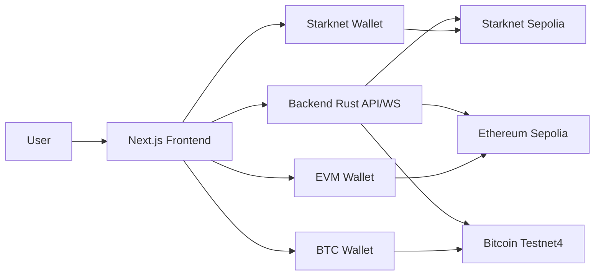
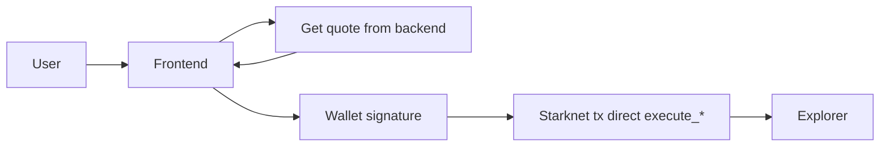
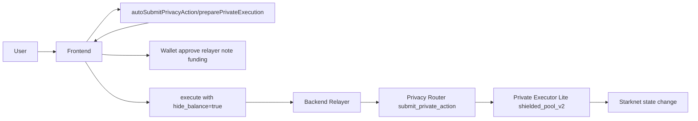

# CAREL Frontend (Starknet Testnet MVP)

Frontend CAREL Protocol berbasis Next.js 16 untuk eksekusi DeFi Starknet (swap, stake, limit order, bridge), mode normal dan hide (Garaga), AI assistant, loyalty NFT, points, dan leaderboard.

Dokumen ini khusus untuk folder `frontend/` saja.

## Table of Contents
- [Scope](#scope)
- [Repository Structure](#repository-structure)
- [Contract Catalog](#contract-catalog)
- [Core Protocol](#core-protocol)
- [Trading](#trading)
- [Privacy Layer](#privacy-layer)
- [Gamification](#gamification)
- [Architecture](#architecture)
- [Environment Profiles](#environment-profiles)
- [Build and Test](#build-and-test)
- [Deployment Docs](#deployment-docs)
- [Deployed Addresses (Starknet Sepolia)](#deployed-addresses-starknet-sepolia)
- [MVP Proof Transactions](#mvp-proof-transactions)
- [Current Constraints](#current-constraints)
- [Development Plan](#development-plan)

## Scope
- In scope: aplikasi web di `frontend/`, integrasi wallet, koneksi backend API/WS, alur on-chain signing, hide-mode integration, AI panel, rewards UI.
- Out of scope: implementasi backend (`backend-rust`) dan smart contract internals (`smartcontract`).

Profil runtime frontend untuk bukti MVP memakai `frontend/.env.local` dan terhubung ke backend profile di `backend-rust/.env`.

## Repository Structure
| Path | Purpose |
| --- | --- |
| `app/` | Routing/layout Next.js |
| `components/` | Modul UI utama (trading, stake, limit, rewards, AI, navbar) |
| `hooks/` | Hook wallet, websocket, price stream, notifications |
| `lib/api.ts` | Client API ke backend (`/api/v1/*`) |
| `lib/onchain-trade.ts` | Util signing Starknet/EVM/BTC wallet |
| `lib/network-config.ts` | Konfigurasi network, explorer, faucet URL |
| `public/` | Asset brand, NFT media, manifest |

## Contract Catalog
Kontrak yang dipakai frontend saat ini (berdasarkan env + source code):

| Module | Main Env | Status | Notes |
| --- | --- | --- | --- |
| Swap Router | `NEXT_PUBLIC_STARKNET_SWAP_CONTRACT_ADDRESS` | Active | Eksekusi swap normal |
| Bridge Aggregator | `NEXT_PUBLIC_STARKNET_BRIDGE_AGGREGATOR_ADDRESS` | Active | Bridge quote/execution |
| Limit Order Book | `NEXT_PUBLIC_STARKNET_LIMIT_ORDER_BOOK_ADDRESS` | Active | Buat/cancel limit order |
| Staking CAREL | `NEXT_PUBLIC_STARKNET_STAKING_CAREL_ADDRESS` | Active | Stake CAREL/STRK pool |
| Staking Stablecoin | `NEXT_PUBLIC_STARKNET_STAKING_STABLECOIN_ADDRESS` | Active | Stake USDC/USDT |
| Staking BTC | `NEXT_PUBLIC_STARKNET_STAKING_BTC_ADDRESS` | Active | Stake WBTC |
| Discount Soulbound NFT | `NEXT_PUBLIC_STARKNET_DISCOUNT_SOULBOUND_ADDRESS` | Active | Loyalty NFT + fee discount |
| ZK Privacy Router | `NEXT_PUBLIC_ZK_PRIVACY_ROUTER_ADDRESS` | Active | `submit_private_action` |
| PrivacyIntermediary | `NEXT_PUBLIC_PRIVACY_INTERMEDIARY_ADDRESS` | Active | Relayer entrypoint `execute(...)` untuk hide submit+execute atomik |
| Private Action Executor Lite | `NEXT_PUBLIC_PRIVATE_ACTION_EXECUTOR_ADDRESS` + `NEXT_PUBLIC_HIDE_BALANCE_EXECUTOR_KIND=shielded_pool_v2` | Active | Jalur hide-mode utama |
| AI Executor | `NEXT_PUBLIC_STARKNET_AI_EXECUTOR_ADDRESS` | Active | Setup/execution AI on-chain |
| `garaga_real_bls` (legacy) | N/A | Not active in frontend | Frontend saat ini tidak direct-call modul ini |

Catatan penting: teks lama seperti "BLS on-chain" di konteks frontend berarti payload proof Garaga (`proof[]`, `public_inputs[]`) diverifikasi melalui jalur privacy router/executor on-chain, bukan endpoint legacy terpisah.

## Core Protocol
- Wallet layer:
  - Starknet: Argent X, Braavos (`@starknet-io/get-starknet`)
  - EVM Sepolia: MetaMask
  - Bitcoin Testnet: UniSat / Xverse
- Data/API layer:
  - REST: `NEXT_PUBLIC_BACKEND_URL`
  - WebSocket: `NEXT_PUBLIC_BACKEND_WS_URL`
- Pricing layer:
  - Prioritas data: WebSocket backend -> CoinGecko (opsional) -> fallback statis.

## Trading
- Swap:
  - Normal: wallet sign langsung ke swap path.
  - Hide: via Garaga payload + relayer/private executor path.
- Bridge:
  - Pair testnet yang diizinkan saat ini: `ETH<->BTC`, `BTC<->WBTC`, `ETH<->WBTC`.
- Stake:
  - CAREL/STRK, USDC/USDT, WBTC.
- Limit Order:
  - Create/cancel dengan dukungan hide mode.

## Privacy Layer
Perbedaan mode di frontend:

| Item | Normal Mode | Hide Mode |
| --- | --- | --- |
| Sender on-chain | Wallet user | Relayer (default shielded pool path) |
| Privacy proof | Tidak ada | Garaga payload (`nullifier`, `commitment`, `proof`, `public_inputs`) |
| Flow entrypoint | Direct execution (`execute_*`) | `submit_private_action` + private executor calls |
| Fallback | N/A | Bisa fallback terbatas; pada `shielded_pool_v2` wallet fallback dibatasi agar detail tidak bocor |

Catatan signer:
- Relayer hide mode ditandatangani akun backend (konfigurasi `BACKEND_PRIVATE_KEY` di backend), bukan API key LLM.

## Gamification
- Loyalty NFT:
  - Bronze / Silver / Gold / Platinum / Onyx.
  - Discount dipakai otomatis saat execution (sesuai response backend + status NFT).
- Points:
  - Ditampilkan dari backend dan dipakai untuk progres reward.
- AI:
  - Tier upgrade UI: L1 free, upgrade ke L2/L3 berbasis transfer CAREL.
  - Eksekusi on-chain AI butuh setup signature (bisa strict fresh setup via env).
- Battleship:
  - Saat ini statusnya `Coming Soon` di halaman utama (sementara dinonaktifkan).

## Architecture
### 1) End-to-End (Frontend-Centric)


### 2) Normal Mode Flow


### 3) Hide Mode Flow (Active MVP Path)


## Environment Profiles
Env precedence Next.js:
- `frontend/.env.local` override `frontend/.env`.
- Jika ada nilai berbeda di dua file, yang dipakai runtime adalah `.env.local`.

Template terpusat ada di [`frontend/.env.example`](./.env.example).

### Mandatory for full MVP (disarankan dianggap wajib)
| Variable | Why |
| --- | --- |
| `NEXT_PUBLIC_BACKEND_URL` | REST API utama |
| `NEXT_PUBLIC_BACKEND_WS_URL` | Price/live updates |
| `NEXT_PUBLIC_STARKNET_SWAP_CONTRACT_ADDRESS` | Swap execution |
| `NEXT_PUBLIC_STARKNET_BRIDGE_AGGREGATOR_ADDRESS` | Bridge execution |
| `NEXT_PUBLIC_STARKNET_LIMIT_ORDER_BOOK_ADDRESS` | Limit order execution |
| `NEXT_PUBLIC_STARKNET_STAKING_CAREL_ADDRESS` | Stake CAREL/STRK |
| `NEXT_PUBLIC_STARKNET_STAKING_STABLECOIN_ADDRESS` | Stake USDC/USDT |
| `NEXT_PUBLIC_STARKNET_STAKING_BTC_ADDRESS` | Stake WBTC |
| `NEXT_PUBLIC_STARKNET_DISCOUNT_SOULBOUND_ADDRESS` | Loyalty NFT |
| `NEXT_PUBLIC_ZK_PRIVACY_ROUTER_ADDRESS` | Hide-mode proof call |
| `NEXT_PUBLIC_PRIVACY_INTERMEDIARY_ADDRESS` | Relayer target untuk hide execution via intermediary |
| `NEXT_PUBLIC_PRIVATE_ACTION_EXECUTOR_ADDRESS` | Hide-mode executor |
| `NEXT_PUBLIC_HIDE_BALANCE_RELAYER_POOL_ENABLED=true` | Aktifkan relayer hide path |
| `NEXT_PUBLIC_HIDE_BALANCE_RELAYER_POOL_LIMIT_ENABLED=true` | Hide limit order path |
| `NEXT_PUBLIC_HIDE_BALANCE_PRIVATE_EXECUTOR_ENABLED=false` | Sesuai mode relayer aktif saat ini |
| `NEXT_PUBLIC_HIDE_BALANCE_EXECUTOR_KIND=shielded_pool_v2` | Pastikan pakai executor baru |
| `NEXT_PUBLIC_ENABLE_DEV_GARAGA_AUTOFILL=false` | Wajib off untuk demo proof real |
| `NEXT_PUBLIC_TOKEN_CAREL_ADDRESS` | CAREL transfer/fee |
| `NEXT_PUBLIC_TOKEN_STRK_ADDRESS` | STRK map |
| `NEXT_PUBLIC_TOKEN_USDT_ADDRESS` | USDT map |
| `NEXT_PUBLIC_TOKEN_USDC_ADDRESS` | USDC map |
| `NEXT_PUBLIC_TOKEN_BTC_ADDRESS` | BTC/WBTC bridge map |
| `NEXT_PUBLIC_TOKEN_WBTC_ADDRESS` | WBTC map |
| `NEXT_PUBLIC_BTC_VAULT_ADDRESS` | Deposit address untuk flow BTC bridge |

### Optional / fallback vars
- Explorer dan faucet URL (`NEXT_PUBLIC_STARKNET_EXPLORER_URL`, `NEXT_PUBLIC_ETHERSCAN_SEPOLIA_URL`, dll) memiliki default.
- CoinGecko settings (`NEXT_PUBLIC_COINGECKO_*`) opsional.
- AI setup tuning (`NEXT_PUBLIC_AI_SETUP_*`, `NEXT_PUBLIC_AI_REQUIRE_FRESH_SETUP_PER_EXECUTION`) opsional.
- Alias legacy (contoh `NEXT_PUBLIC_LIMIT_ORDER_BOOK_ADDRESS`, `NEXT_PUBLIC_STAKING_*_ADDRESS`) hanya fallback kompatibilitas.

### Environment Audit Split (Current Runtime)
Hasil audit dari env aktif saat ini (`frontend/.env.local`):

- `ACTIVE_MVP`
  - Swap/bridge/limit/hide/AI/token maps semuanya tersedia dan dipakai runtime.
- `FALLBACK_FROM_FRONTEND_DOT_ENV`
  - `NEXT_PUBLIC_STARKNET_STAKING_CAREL_ADDRESS`
  - `NEXT_PUBLIC_STARKNET_STAKING_STABLECOIN_ADDRESS`
  - Dua key ini tidak ada di `.env.local` saat ini, sehingga runtime mengambil dari `frontend/.env`.
- `LEGACY_ALIAS_OPTIONAL`
  - `NEXT_PUBLIC_LIMIT_ORDER_BOOK_ADDRESS`
  - `NEXT_PUBLIC_STAKING_BTC_ADDRESS`
  - `NEXT_PUBLIC_AI_EXECUTOR_ADDRESS`
  - `NEXT_PUBLIC_DISCOUNT_SOULBOUND_ADDRESS`
  - Alias ini bernilai sama dengan key `NEXT_PUBLIC_STARKNET_*` dan hanya fallback kompatibilitas.

Audit detail lintas FE/BE ada di `docs/ENV_RUNTIME_AUDIT_MVP.md`.

## Build and Test
Prerequisite:
- Node `>=20.9.0` (project `.nvmrc` saat ini: `20.11.1`)
- npm

Run local:
```bash
cd frontend
nvm use
npm install
npm run dev
```

Production build:
```bash
npm run build
npm run start
```

Hasil verifikasi lokal terakhir (2026-02-25):
- `npm run lint`: gagal karena belum ada ESLint config di repo frontend.
- `npm run build`: gagal di Node `v18.19.1` (Next.js 16 butuh `>=20.9.0`).

Detail: [`frontend/FE_TEST_REPORT.md`](./FE_TEST_REPORT.md)

## Deployment Docs
- Dokumen deployment testnet: [`frontend/DEPLOY_TESTNET.md`](./DEPLOY_TESTNET.md)

## Deployed Addresses (Starknet Sepolia)
Alamat aktif yang dipakai konfigurasi frontend saat ini:

Catatan:
- Ini adalah **runtime profile frontend/backend** untuk demo bukti tx.
- Bisa berbeda dari katalog deployment smartcontract di `smartcontract/.env`.

### Contracts
| Contract | Address |
| --- | --- |
| Swap Router | `0x06f3e03be8a82746394c4ad20c6888dd260a69452a50eb3121252fdecacc6d28` |
| Bridge Aggregator | `0x047ed770a6945fc51ce3ed32645ed71260fae278421826ee4edabeae32b755d5` |
| Limit Order Book | `0x06b189eef1358559681712ff6e9387c2f6d43309e27705d26daff4e3ba1fdf8a` |
| AI Executor | `0x00d8ada9eb26d133f9f2656ac1618d8cdf9fcefe6c8e292cf9b7ee580b72a690` |
| Staking CAREL | `0x06ed000cdf98b371dbb0b8f6a5aa5b114fb218e3c75a261d7692ceb55825accb` |
| Staking Stablecoin | `0x014f58753338f2f470c397a1c7ad1cfdc381a951b314ec2d7c9aec06a73a0aff` |
| Staking BTC | `0x01fa14e91abade76d753d718640a14540032c307832a435f8781d446b288cdf8` |
| Discount Soulbound | `0x05b4c1e3578fd605b44b1950c749f01b2f652b8fd7a77135801d8d31af6fe809` |
| ZK Privacy Router | `0x0682719dbe8364fc5c772f49ecb63ea2f2cf5aa919b7d5baffb4448bb4438d1f` |
| Privacy Intermediary | `0x0246cd17157819eb614e318d468270981d10e6b6e99bcaa7ca4b43d53de810ab` |
| Private Action Executor Lite | `0x060549e87e71903ffe1e6449aaa1e77d941de1a5117be3beabd0026d847c61fb` |

### Tokens
| Token | Address |
| --- | --- |
| CAREL | `0x0517f60f4ec4e1b2b748f0f642dfdcb32c0ddc893f777f2b595a4e4f6df51545` |
| STRK | `0x04718f5a0Fc34cC1AF16A1cdee98fFB20C31f5cD61D6Ab07201858f4287c938D` |
| USDT | `0x030fcbfd1f83fb2d697ad8bdd52e1d55a700b876bed1f4507875539581ed53e5` |
| USDC | `0x0179cc8cb5ea0b143e17d649e8ad60d80c45c8132c4cf162d57eaf8297f529d8` |
| BTC / WBTC | `0x496bef3ed20371382fbe0ca6a5a64252c5c848f9f1f0cccf8110fc4def912d5` |

## MVP Proof Transactions
- Normal Swap: https://sepolia.voyager.online/tx/0x22a53b1af0f7d62e19569a99b38d67e9165faad2804ca50a1b0a53f289bab98
- Hide Swap: https://sepolia.voyager.online/tx/0x71b6c99287c78b082d105dc7169faa56b419a3e2568b3ea9a70ef1ff653a2d2
- Normal Stake: https://sepolia.voyager.online/tx/0x3ffda88b060ad41b752e8410b13b567c2cca3aa1e32b29f60cf75d9f8b42d60
- Hide Stake: https://sepolia.voyager.online/tx/0x5fcac3b4578ebe8cf32dde9b0c6ab2390f1f1aa6bea731c3f779575abbdd4cf
- Normal Limit: https://sepolia.voyager.online/tx/0x737c40659dc5c7872ab1a89222d879bca68163b890a61f09b1875d52e4747a6
- Hide Limit: https://sepolia.voyager.online/tx/0x523c9721e57f69fddff4ed3be3935cce3b5782ca2c3b454df565c0be6b22ba3
- BTC bridge tx: https://mempool.space/testnet4/tx/d26a8f5d0213b4448722cde81e1f47e68b8efbd00c56ce4802e39c9b0898db4c
- Garden order: https://testnet-explorer.garden.finance/order/237be68816b9144b9d3533ca3ec8c4eb1e7c00b1649e9ec216d89469fd014e70
- ETH bridge tx: https://sepolia.etherscan.io/tx/0xab25b9261dc9f703e44cb89a34831ff03024b8fe89e32cce4a7e58b5d6dcdef3

## Current Constraints
- Frontend lint belum siap dipakai CI karena tidak ada konfigurasi ESLint.
- Build gagal jika Node < 20.9.0.
- Battleship UI masih disable (coming soon).
- Hide mode sangat tergantung backend relayer readiness + payload Garaga valid.
- Bila `shielded_pool_v2` aktif dan relayer gagal, fallback wallet direct hide dibatasi agar detail tidak bocor.

## Development Plan
1. Tooling hardening: tambah ESLint config + CI check (`lint`, `build`) untuk frontend.
2. Env hardening: validasi env saat startup (schema-based) supaya missing var langsung terlihat.
3. Privacy observability: dashboard status relayer + proof payload health check.
4. UX hardening: wizard mode setup wallet/network/env untuk demo juri.
5. Product extension: aktifkan kembali Battleship setelah stabilitas API/game finalized.
