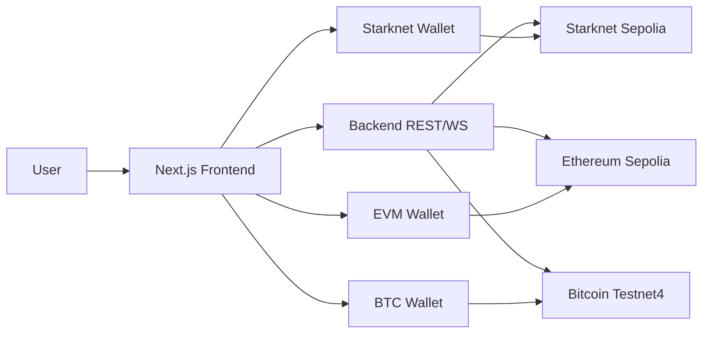
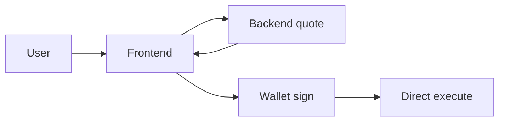
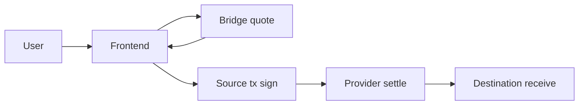
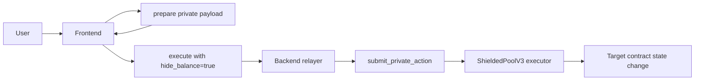

# CAREL Frontend 

Frontend module for CAREL Protocol, built with Next.js 16.
This README is frontend-only: UI modules, wallet integration, FE/BE API contract, and runtime env profile.

## Table of Contents
- [Scope](#scope)
- [Repository Structure](#repository-structure)
- [Frontend Architecture](#frontend-architecture)
- [Execution Flows](#execution-flows)
- [Contract Bindings Used by Frontend](#contract-bindings-used-by-frontend)
- [Hide Mode V3 Requirements](#hide-mode-v3-requirements)
- [Environment Profiles](#environment-profiles)
- [Build and Test](#build-and-test)
- [Deployment Docs](#deployment-docs)
- [Runtime Addresses (Frontend Profile)](#runtime-addresses-frontend-profile)
- [Known Constraints](#known-constraints)
- [Development Plan](#development-plan)

## Scope
In scope:
- web app under `frontend/`
- wallet UX (Starknet/EVM/BTC)
- API calls to backend (`/api/v1/*`)
- hide-mode UI and payload handoff
- rewards/NFT/AI frontend surfaces

Out of scope:
- backend internals (`backend-rust/`)
- contract internals (`smartcontract/`)

## Repository Structure
| Path | Purpose |
| --- | --- |
| `app/` | Next.js routing and layouts |
| `components/` | UI modules (trade, stake, bridge, AI, rewards) |
| `hooks/` | Wallet, websocket, price stream, notifications |
| `lib/api.ts` | Backend REST client |
| `lib/onchain-trade.ts` | Wallet signing and tx helpers |
| `lib/network-config.ts` | Network and explorer config |
| `public/` | Static assets |

## Frontend Architecture

```mermaid
flowchart LR
  U[User] --> FE[Next.js Frontend]
  FE --> API[Backend REST/WS]
  FE --> SW[Starknet Wallet]
  FE --> EW[EVM Wallet]
  FE --> BW[BTC Wallet]
  API --> SN[Starknet Sepolia]
  API --> ETH[Ethereum Sepolia]
  API --> BTC[Bitcoin Testnet4]
  SW --> SN
  EW --> ETH
  BW --> BTC
```

## Execution Flows
### 1) Normal Mode (Swap/Stake/Limit)

```mermaid
flowchart LR
  U[User] --> FE[Frontend]
  FE --> Q[Backend quote]
  Q --> FE
  FE --> W[Wallet sign]
  W --> CHAIN[Direct execute]
```

### 1b) Bridge (Public Route)

```mermaid
flowchart LR
  U[User] --> FE[Frontend]
  FE --> Q[Bridge quote]
  Q --> FE
  FE --> W[Source tx sign]
  W --> P[Provider settle]
  P --> DST[Destination receive]
```

### 2) Hide Mode (V3 Baseline)

```mermaid
flowchart LR
  U[User] --> FE[Frontend]
  FE --> API1[prepare private payload]
  API1 --> FE
  FE --> API2[execute with hide_balance=true]
  API2 --> RELAYER[Backend relayer]
  RELAYER --> ZK[submit_private_action]
  ZK --> EXEC[ShieldedPoolV3 executor]
  EXEC --> CHAIN[Target contract state change]
```

Key behavior:
- User wallet is not the sender of final private execution tx.
- Relayer account submits the private execution tx.
- FE must send V3-compatible payload fields through backend APIs.
- AI bridge commands (`bridge btc ...`, `bridge eth ...`) must use AI Level 2 in current runtime.
- AI Level 3 remains for Garaga/private execution intents and not for default public bridge flow.

## Contract Bindings Used by Frontend
| Module | Main Variable | Status |
| --- | --- | --- |
| Swap | `NEXT_PUBLIC_STARKNET_SWAP_CONTRACT_ADDRESS` | Active |
| Bridge | `NEXT_PUBLIC_STARKNET_BRIDGE_AGGREGATOR_ADDRESS` | Active |
| Limit order | `NEXT_PUBLIC_STARKNET_LIMIT_ORDER_BOOK_ADDRESS` | Active |
| Staking CAREL | `NEXT_PUBLIC_STARKNET_STAKING_CAREL_ADDRESS` | Active |
| Staking Stablecoin | `NEXT_PUBLIC_STARKNET_STAKING_STABLECOIN_ADDRESS` | Active |
| Staking WBTC (contract: `StakingBTC`) | `NEXT_PUBLIC_STARKNET_STAKING_BTC_ADDRESS` | Active |
| Loyalty NFT | `NEXT_PUBLIC_STARKNET_DISCOUNT_SOULBOUND_ADDRESS` | Active |
| ZK router | `NEXT_PUBLIC_ZK_PRIVACY_ROUTER_ADDRESS` | Active |
| Privacy intermediary | `NEXT_PUBLIC_PRIVACY_INTERMEDIARY_ADDRESS` | Active |
| Private executor | `NEXT_PUBLIC_PRIVATE_ACTION_EXECUTOR_ADDRESS` | Active |
| AI executor | `NEXT_PUBLIC_STARKNET_AI_EXECUTOR_ADDRESS` | Active |

## Hide Mode V3 Requirements
Required alignment for V3 runtime:
- `NEXT_PUBLIC_HIDE_BALANCE_EXECUTOR_KIND=shielded_pool_v3`
- `NEXT_PUBLIC_PRIVATE_ACTION_EXECUTOR_ADDRESS` must match backend `PRIVATE_ACTION_EXECUTOR_ADDRESS`
- `NEXT_PUBLIC_ZK_PRIVACY_ROUTER_ADDRESS` must match backend `ZK_PRIVACY_ROUTER_ADDRESS`
- `NEXT_PUBLIC_PRIVACY_INTERMEDIARY_ADDRESS` must match backend `PRIVACY_INTERMEDIARY_ADDRESS`
- `NEXT_PUBLIC_HIDE_BALANCE_RELAYER_POOL_ENABLED=true`
- `NEXT_PUBLIC_HIDE_BALANCE_RELAYER_POOL_LIMIT_ENABLED=true`

Migration note:
- If local/frontend env still contains `shielded_pool_v2`, update it before V3 demo or production-like testing.

## Environment Profiles
Next.js precedence:
- `.env.local` overrides `.env`

In this repository:
- `frontend/.env.local` currently contains backend URLs.
- Most contract/token values are resolved from `frontend/.env` unless overridden.

Recommended workflow:
1. Keep backend profile (`backend-rust/.env`) as canonical for relayer-driven hide mode.
2. Mirror the V3-critical vars in frontend env.
3. Re-run an end-to-end hide-mode smoke test after env updates.

### Minimum variables for full MVP runtime
| Variable | Purpose |
| --- | --- |
| `NEXT_PUBLIC_BACKEND_URL` | REST API endpoint |
| `NEXT_PUBLIC_BACKEND_WS_URL` | websocket endpoint |
| `NEXT_PUBLIC_STARKNET_SWAP_CONTRACT_ADDRESS` | swap execution |
| `NEXT_PUBLIC_STARKNET_BRIDGE_AGGREGATOR_ADDRESS` | bridge execution |
| `NEXT_PUBLIC_STARKNET_LIMIT_ORDER_BOOK_ADDRESS` | limit-order execution |
| `NEXT_PUBLIC_STARKNET_STAKING_CAREL_ADDRESS` | staking (CAREL) |
| `NEXT_PUBLIC_STARKNET_STAKING_STABLECOIN_ADDRESS` | staking (stablecoin) |
| `NEXT_PUBLIC_STARKNET_STAKING_BTC_ADDRESS` | staking (WBTC via `StakingBTC` contract) |
| `NEXT_PUBLIC_STARKNET_DISCOUNT_SOULBOUND_ADDRESS` | NFT discount module |
| `NEXT_PUBLIC_STARKNET_AI_EXECUTOR_ADDRESS` | AI on-chain module |
| `NEXT_PUBLIC_ZK_PRIVACY_ROUTER_ADDRESS` | private action routing |
| `NEXT_PUBLIC_PRIVACY_INTERMEDIARY_ADDRESS` | relayer intermediary |
| `NEXT_PUBLIC_PRIVATE_ACTION_EXECUTOR_ADDRESS` | private executor contract |
| `NEXT_PUBLIC_HIDE_BALANCE_EXECUTOR_KIND` | hide mode executor selector |
| `NEXT_PUBLIC_HIDE_BALANCE_RELAYER_POOL_ENABLED` | enable hide relayer path |
| `NEXT_PUBLIC_HIDE_BALANCE_RELAYER_POOL_LIMIT_ENABLED` | enable hide limit path |
| `NEXT_PUBLIC_TOKEN_CAREL_ADDRESS` | CAREL token map |
| `NEXT_PUBLIC_TOKEN_STRK_ADDRESS` | STRK token map |
| `NEXT_PUBLIC_TOKEN_USDT_ADDRESS` | USDT token map |
| `NEXT_PUBLIC_TOKEN_USDC_ADDRESS` | USDC token map |
| `NEXT_PUBLIC_TOKEN_BTC_ADDRESS` | BTC token map |
| `NEXT_PUBLIC_TOKEN_WBTC_ADDRESS` | WBTC token map |

## Build and Test
Prerequisites:
- Node `>=20.9.0` (`.nvmrc` currently `20.11.1`)
- npm

Run locally:
```bash
cd frontend
nvm use
npm install
npm run dev
```

Build:
```bash
npm run build
npm run start
```

Latest recorded local checks (2026-03-05):
- `npm run lint`: pass (`0` warnings, `0` errors).
- `npm run build`: pass on Node `20.11.1`.

Detailed report: `../docs/test_reports.md`.

## Deployment Docs
- `../docs/deploy_testnet.md`

## Runtime Addresses (Frontend Profile)
Expected V3 runtime addresses (must match backend profile for hide mode):

| Contract | Address |
| --- | --- |
| Swap Router | `0x06f3e03be8a82746394c4ad20c6888dd260a69452a50eb3121252fdecacc6d28` |
| Bridge Aggregator | `0x047ed770a6945fc51ce3ed32645ed71260fae278421826ee4edabeae32b755d5` |
| Limit Order Book | `0x06b189eef1358559681712ff6e9387c2f6d43309e27705d26daff4e3ba1fdf8a` |
| AI Executor | `0x00d8ada9eb26d133f9f2656ac1618d8cdf9fcefe6c8e292cf9b7ee580b72a690` |
| Staking CAREL | `0x06ed000cdf98b371dbb0b8f6a5aa5b114fb218e3c75a261d7692ceb55825accb` |
| Staking Stablecoin | `0x014f58753338f2f470c397a1c7ad1cfdc381a951b314ec2d7c9aec06a73a0aff` |
| Staking WBTC (contract: `StakingBTC`) | `0x01fa14e91abade76d753d718640a14540032c307832a435f8781d446b288cdf8` |
| Discount Soulbound | `0x05b4c1e3578fd605b44b1950c749f01b2f652b8fd7a77135801d8d31af6fe809` |
| ZK Privacy Router | `0x0682719dbe8364fc5c772f49ecb63ea2f2cf5aa919b7d5baffb4448bb4438d1f` |
| Privacy Intermediary | `0x0246cd17157819eb614e318d468270981d10e6b6e99bcaa7ca4b43d53de810ab` |
| Private Action Executor (V3) | `0x0112a5f60db409d74c4e67b5c29c85c7fbeefffccf9762a37460a42854cc74c2` |

## Known Constraints
- Hide-mode reliability depends on backend relayer readiness and valid proof payload.
- Public-chain metadata remains visible even in hide mode.
- Frontend lint/build gates should be re-validated after env/profile updates.

## Development Plan
1. Finalize V3 env parity checks between FE and BE.
2. Add a startup env validator for critical hide-mode keys.
3. Improve UI observability for relayer/proof status.
4. Prepare dedicated UX flow for planned Shadow Bridge hide-mode roadmap.
