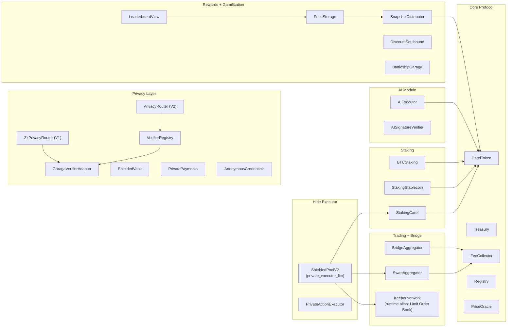

# CAREL Smart Contracts (MVP)

Dokumen ini adalah README utama untuk semua smart contract CAREL. Fokusnya profesional, mudah dicek juri, dan konsisten dengan profile env (catalog + runtime).

## Table of Contents
- Scope
- Repository Structure
- Address Profiles
- Architecture (MVP)
- Runtime Scope (Code-Verified)
- Contract Catalog
- Build and Test
- Deployment Docs
- Deployed Addresses (Starknet Sepolia)
- Current Constraints
- Development Plan
- Related Docs

## Scope
- Jaringan target: Starknet Sepolia (MVP testnet).
- Dua jalur eksekusi: Normal mode (direct wallet execution).
- Dua jalur eksekusi: Hide mode (relayer + proof binding).
- Source of truth katalog deploy smartcontract adalah env: `smartcontract/.env`.
- Runtime profile demo yang dipakai frontend/backend bisa memakai env berbeda (`frontend/.env.local` + `backend-rust/.env`).

## Repository Structure
```text
smartcontract/
  src/                      # Kontrak utama (normal mode + privacy core + staking + trading + AI)
  private_executor_lite/    # Executor hide mode aktif (ShieldedPoolV2 + PrivateActionExecutor)
  tests/                    # Test untuk package utama smartcontract
  scripts/                  # Script test/deploy/wiring/register
  .env                      # Source of truth alamat/konfigurasi deploy lokal aktif
```

## Address Profiles
Untuk mencegah konflik data antar dokumen:

- **Catalog profile (smartcontract)**:
  - Sumber: `smartcontract/.env`
  - Dipakai untuk inventory kontrak, deploy script, dan wiring SC level.
- **Runtime profile (frontend/backend MVP proof)**:
  - Sumber: `frontend/.env.local` + `backend-rust/.env`
  - Dipakai oleh flow demo normal/hide yang menghasilkan bukti tx MVP.

Contoh perbedaan yang perlu diketahui:
- `ZK_PRIVACY_ROUTER_ADDRESS` di `smartcontract/.env`: `0x00694e...`
- `ZK_PRIVACY_ROUTER_ADDRESS` di runtime FE/BE profile: `0x068271...`

Artinya, tabel alamat di README ini tetap valid untuk katalog smartcontract, tetapi bukti tx MVP mengikuti runtime profile aktif.

## Architecture (MVP)
Diagram ini fokus pada on-chain smart contract layer di folder `smartcontract`.



Catatan:
- `DarkPool` dan `PrivateBTCSwap` tetap deployed, tetapi tidak dimasukkan ke diagram MVP aktif karena tidak dipakai flow frontend saat ini (backend-only optional routes).

## Runtime Scope (Code-Verified)
Status ini berdasarkan scan kode repo (FE/BE/SC), bukan asumsi dokumen saja.

| Module | Status | Evidence |
| --- | --- | --- |
| `ShieldedPoolV2` + `ZkPrivacyRouter` | Active MVP | Dipakai jalur hide mode FE/BE (`NEXT_PUBLIC_HIDE_BALANCE_EXECUTOR_KIND=shielded_pool_v2`, endpoint hide swap/stake/limit). |
| `KeeperNetwork` (`src/trading/dca_orders.cairo`) | Active MVP (alias `Limit Order Book`) | FE/BE pakai `LIMIT_ORDER_BOOK_ADDRESS` dengan selector `create_limit_order` / `cancel_limit_order`. |
| `DarkPool` | Deployed, backend-only optional | Ada kontrak + route backend `/api/v1/dark-pool/*`, tetapi tidak ada referensi frontend saat ini. |
| `PrivateBTCSwap` | Deployed, backend-only optional | Ada kontrak + route backend `/api/v1/private-btc-swap/*`, tetapi tidak ada referensi frontend saat ini. |
| `KEEPER_NETWORK_ADDRESS` | Catalog/legacy alias | Runtime FE/BE tidak membaca key ini; runtime memakai `LIMIT_ORDER_BOOK_ADDRESS`. |

Catatan verifikasi on-chain:
- `KEEPER_NETWORK_ADDRESS` dan `LIMIT_ORDER_BOOK_ADDRESS` saat ini punya class hash sama (`0x1cccfb03db2090988c86d0cbcb8fc793dcffe1b3b19700b5cab871577a3e9b7`) dan ABI `IKeeperNetwork`.

## Contract Catalog
### Core Protocol
- `CarelToken` (`src/core/token.cairo`)
- `Treasury` (`src/core/treasury.cairo`)
- `FeeCollector` (`src/core/fee_collector.cairo`)
- `Registry` (`src/core/registry.cairo`)
- `VestingManager` (`src/core/vesting_manager.cairo`)
- `PriceOracle` (`src/utils/price_oracle.cairo`)
- `PointStorage` (`src/rewards/point_storage.cairo`)
- `SnapshotDistributor` (`src/rewards/snapshot_distributor.cairo`)
- `ReferralSystem` (`src/rewards/referral_system.cairo`)
- `LeaderboardView` (`src/utils/leaderboard_view.cairo`)

### Trading
- `SwapAggregator` (`src/bridge/swap_aggregator.cairo`)
- `BridgeAggregator` (`src/bridge/bridge_aggregator.cairo`)
- `KeeperNetwork` (limit order / DCA, runtime alias: `Limit Order Book`, `src/trading/dca_orders.cairo`)
- `DarkPool` (`src/trading/dark_pool.cairo`, deployed optional, backend-only route saat ini)
- `PrivateBTCSwap` (`src/bridge/private_btc_swap.cairo`, deployed optional, backend-only route saat ini)

### Privacy Layer
- `ZkPrivacyRouter` (V1, `src/privacy/zk_privacy_router.cairo`)
- `PrivacyRouter` (V2, `src/privacy/privacy_router.cairo`)
- `PrivacyIntermediary` (`src/privacy_intermediary.cairo`)
- `GaragaVerifierAdapter` (`src/privacy/garaga_verifier_adapter.cairo`)
- `VerifierRegistry` (`src/privacy/verifier_registry.cairo`)
- `ShieldedVault` (`src/privacy/shielded_vault.cairo`)
- `PrivatePayments` (`src/privacy/private_payments.cairo`)
- `AnonymousCredentials` (`src/privacy/anonymous_credentials.cairo`)

### Gamification
- `DiscountSoulbound` (`src/nft/discount_soulbound.cairo`)
- `PointStorage` + `SnapshotDistributor` (loyalty + rewards)
- `BattleshipGaraga` (`src/trading/battleship_garaga.cairo`)

### Hide Mode Executor (MVP)
- `ShieldedPoolV2` (`private_executor_lite/src/shielded_pool_v2.cairo`)
- `PrivateActionExecutor` (`private_executor_lite/src/private_action_executor.cairo`)

## Build and Test
Build:
```bash
cd smartcontract
scarb build
```

Test (recommended):
```bash
# Paket utama (normal mode + privacy core + staking/trading)
bash scripts/test_core_fast.sh

# Hide mode aktif (ShieldedPoolV2 / private_executor_lite)
bash scripts/test_private_executor_lite.sh

# Opsional: verifier BLS real (compile lebih berat)
bash scripts/test_garaga_fast.sh
```

Status lokal terakhir (26 Feb 2026):
- `smartcontract`: `172/172` passed
- `private_executor_lite`: `12/12` passed

Test report lengkap: `smartcontract/SC_TEST_REPORT.md`.

## Deployment Docs
- Urutan deploy & wiring: `smartcontract/DEPLOY_TESTNET.md`
- Scripts detail: `smartcontract/scripts/README.md`
- Deploy PrivacyIntermediary: `bash smartcontract/scripts/11_deploy_privacy_intermediary.sh`

## Deployed Addresses (Starknet Sepolia)
Sumber: `smartcontract/.env` (catalog profile).

### Core + Rewards
| Contract | Env Key | Address |
| --- | --- | --- |
| CAREL Token | `CAREL_TOKEN_ADDRESS` | `0x0517f60f4ec4e1b2b748f0f642dfdcb32c0ddc893f777f2b595a4e4f6df51545` |
| Treasury | `TREASURY_CONTRACT_ADDRESS` | `0x0351e9882d322ab41239eb925f22d3a598290bda6a3a2e7ce560dcff8a119c7d` |
| VestingManager | `VESTING_MANAGER_ADDRESS` | `0x00ad575e602452b0146f93dfb525e2679d4ab9d2686b83019e0384c2009b206b` |
| FeeCollector | `FEE_COLLECTOR_ADDRESS` | `0x0192ddb217569ce0700ea537f809b7b83823d5b9f4629447094dcec3fd2d045e` |
| Registry | `REGISTRY_ADDRESS` | `0x06a6196d2077e40bcf86576234926478aaed865268fbd41777f3c8334e0bcb1a` |
| PriceOracle | `PRICE_ORACLE_ADDRESS` | `0x06d3bed050b11afad71022e9ea4d5401366b9c01ef8387df22de6155e6c6977a` |
| PointStorage | `POINT_STORAGE_ADDRESS` | `0x0501e74ab48e605ef81348a087d21c95ea5d43694ee1a60d6ca1e9186be54029` |
| SnapshotDistributor | `SNAPSHOT_DISTRIBUTOR_ADDRESS` | `0x04fcc58ba819766fe19b8f7a96ed5bd7b7558e8ad62f495815e825d8e8f822dd` |
| ReferralSystem | `REFERRAL_SYSTEM_ADDRESS` | `0x040bfc6214d3204c53898c730285d79d6e7cd2cd987e3ecde048b330ed3a2d06` |
| LeaderboardView | `LEADERBOARD_VIEW_ADDRESS` | `0x068f3da6a7641948e02486c75f8a1d367fa6e43dc789f8f853892e40b14cae62` |
| DiscountSoulbound | `DISCOUNT_SOULBOUND_ADDRESS` | `0x05b4c1e3578fd605b44b1950c749f01b2f652b8fd7a77135801d8d31af6fe809` |

### Trading + Bridge
| Contract | Env Key | Address |
| --- | --- | --- |
| SwapAggregator | `SWAP_AGGREGATOR_ADDRESS` | `0x06f3e03be8a82746394c4ad20c6888dd260a69452a50eb3121252fdecacc6d28` |
| BridgeAggregator | `BRIDGE_AGGREGATOR_ADDRESS` | `0x047ed770a6945fc51ce3ed32645ed71260fae278421826ee4edabeae32b755d5` |
| Limit Order Book (KeeperNetwork class) | `LIMIT_ORDER_BOOK_ADDRESS` | `0x06b189eef1358559681712ff6e9387c2f6d43309e27705d26daff4e3ba1fdf8a` |
| KeeperNetwork (alias/legacy catalog key) | `KEEPER_NETWORK_ADDRESS` | `0x072e4038cd806f2bcc3e0e111c19517f6c14081e658d7d9af6e88e314bf35132` |
| PrivateBTCSwap (deployed optional) | `PRIVATE_BTC_SWAP_ADDRESS` | `0x006faaf4bbd1f3139b4b409e1bdea0eada42901674e1f6abe2699ece84a181a3` |
| DarkPool (deployed optional) | `DARK_POOL_ADDRESS` | `0x03bec062a2789e399999e088a662e8d8d11e168e9c734e57dd333615baeb1385` |

### Staking
| Contract | Env Key | Address |
| --- | --- | --- |
| StakingCarel | `STAKING_CAREL_ADDRESS` | `0x06ed000cdf98b371dbb0b8f6a5aa5b114fb218e3c75a261d7692ceb55825accb` |
| StakingStablecoin | `STAKING_STABLECOIN_ADDRESS` | `0x014f58753338f2f470c397a1c7ad1cfdc381a951b314ec2d7c9aec06a73a0aff` |
| BTCStaking | `STAKING_BTC_ADDRESS` | `0x01fa14e91abade76d753d718640a14540032c307832a435f8781d446b288cdf8` |

### Privacy + Hide Mode
| Contract | Env Key | Address |
| --- | --- | --- |
| ZkPrivacyRouter (V1) | `ZK_PRIVACY_ROUTER_ADDRESS` | `0x00694e35433fe3ce49431e1816f4d4df9ab6d550a3f73f8f07f9c2cc69b6891b` |
| PrivacyRouter (V2) | `PRIVACY_ROUTER_ADDRESS` | `0x0133e0c11f4df0a77d6a3b46e301f402c6fa6817e9a8d79c2dc0cd45f244c364` |
| VerifierRegistry | `VERIFIER_REGISTRY_ADDRESS` | `0x02e3aa26983b1c9cca8f8092b59eb18ba4877ed27eb6a80b36ef09175f352046` |
| Garaga Adapter | `GARAGA_ADAPTER_ADDRESS` | `0x07dc2000785cd8a8a1f8435b386d2fdf1a9f2b23c66670ea87bdd59e3c3c2d03` |
| Garaga Verifier | `GARAGA_VERIFIER_ADDRESS` | `0x0590a20b1dd4780104ddecd64abc7e20e135cc92ac61e449342ead831aadb261` |
| PrivacyIntermediary | `PRIVACY_INTERMEDIARY_ADDRESS` | `0x0246cd17157819eb614e318d468270981d10e6b6e99bcaa7ca4b43d53de810ab` |
| ShieldedPoolV2 (Hide Executor) | `PRIVATE_ACTION_EXECUTOR_ADDRESS` | `0x060549e87e71903ffe1e6449aaa1e77d941de1a5117be3beabd0026d847c61fb` |
| ShieldedVault | `SHIELDED_VAULT_ADDRESS` | `0x07e09754f159ee7bce0b1d297315eea6bb22bc912e92741a7e8c793ef24a6abb` |
| PrivatePayments | `PRIVATE_PAYMENTS_ADDRESS` | `0x00e9efd7e5cb33f1d8eb4779c8fe68d1836141feb826b18d132c8ca1da391b94` |
| AnonymousCredentials | `ANONYMOUS_CREDENTIALS_ADDRESS` | `0x040a454139f2df866b3ea34247d67126f8a6a8e61e5e9ac3b3ed27ad12e1d57d` |

Catatan runtime:
- Untuk jalur bukti MVP aktif (frontend/backend), router yang dipakai saat ini adalah `0x0682719dbe8364fc5c772f49ecb63ea2f2cf5aa919b7d5baffb4448bb4438d1f`.

### AI
| Contract | Env Key | Address |
| --- | --- | --- |
| AIExecutor | `AI_EXECUTOR_ADDRESS` | `0x00d8ada9eb26d133f9f2656ac1618d8cdf9fcefe6c8e292cf9b7ee580b72a690` |
| AISignatureVerifier | `AI_SIGNATURE_VERIFIER_ADDRESS` | `0x01afd98662c262b8b8634bdb434f32b4c72c6a0313b0f0dc352372825d0894cd` |

Hardening terbaru AIExecutor:
- Admin bisa rotasi signer backend via `set_backend_signer`.
- Admin bisa transfer kontrol admin via `set_admin`.
- Redeploy terakhir (26 Feb 2026): `0x033a6e6f261fef47f714a657c8a9e42374b75f742ef615e59ff77679e6258754`.

### Tokens (Testnet)
| Token | Env Key | Address |
| --- | --- | --- |
| STRK | `TOKEN_STRK_ADDRESS` | `0x04718f5a0Fc34cC1AF16A1cdee98fFB20C31f5cD61D6Ab07201858f4287c938D` |
| USDC | `TOKEN_USDC_ADDRESS` | `0x0179cc8cb5ea0b143e17d649e8ad60d80c45c8132c4cf162d57eaf8297f529d8` |
| USDT | `TOKEN_USDT_ADDRESS` | `0x030fcbfd1f83fb2d697ad8bdd52e1d55a700b876bed1f4507875539581ed53e5` |
| WBTC/BTC | `TOKEN_WBTC_ADDRESS` | `0x496bef3ed20371382fbe0ca6a5a64252c5c848f9f1f0cccf8110fc4def912d5` |

## Current Constraints
- `MockGaragaVerifier` hanya untuk testnet (tidak boleh mainnet).
- Hide mode mengurangi linkability, tetapi metadata chain publik tetap ada.
- Belum ada proxy upgrade; perubahan kontrak berarti redeploy + migrasi state.
- Gas AI dan TWAP masih di atas target.
- Bridge bergantung pada provider eksternal (Garden, dll).

## Development Plan
- Short-term: Optimasi gas AI executor dan TWAP; stabilkan hide mode batch + payout edge-cases; rapikan wiring privacy router V2 dan verifier registry.
- Mid-term: Audit eksternal formal (post-funding); deploy Garaga verifier real (opsional) untuk mainnet; strengthen monitoring dan replay/nullifier analytics.
- Long-term: Mainnet readiness (upgrade strategy + migration tooling); ekspansi bridge providers (LayerSwap, Atomiq) dan UX aggregator; gamification on-chain lebih lengkap (Battleship state persistence).

## Related Docs
- `smartcontract/garaga_real_bls/README.md`
- `smartcontract/private_executor_lite/README.md`
- `smartcontract/DEPLOY_TESTNET.md`
- `smartcontract/SC_TEST_REPORT.md`
- `smartcontract/security_audit_checklist.md`
- `smartcontract/scripts/README.md`
- `docs/ENV_RUNTIME_AUDIT_MVP.md`
