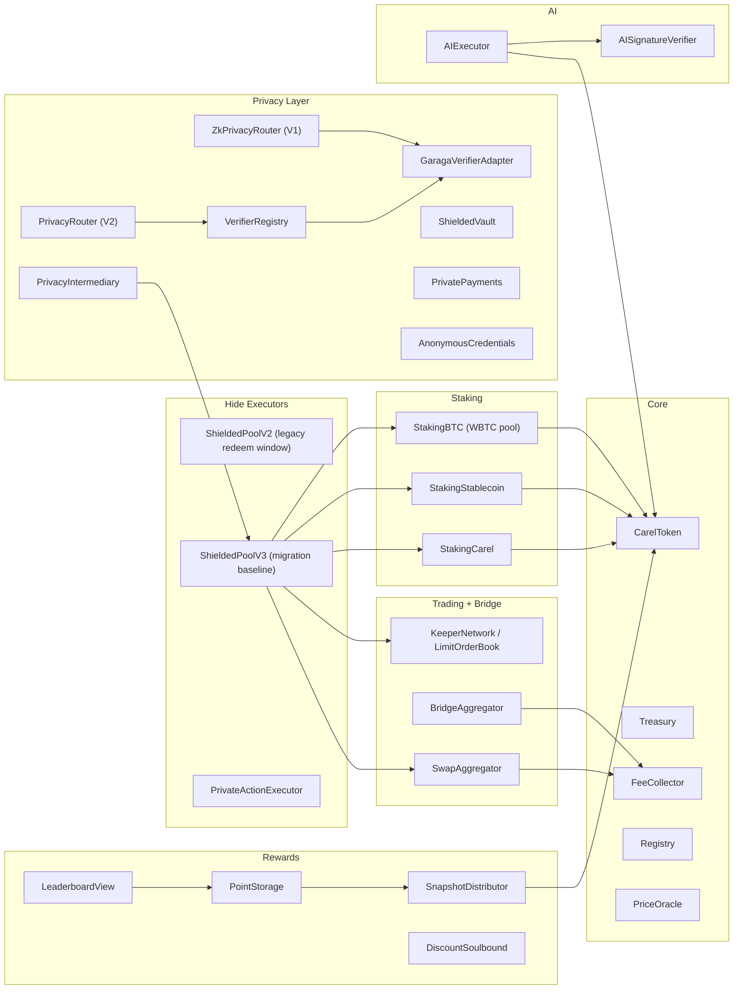

# CAREL Smart Contracts (MVP)

Technical README for the `smartcontract/` module.

This document is contract-focused and separates:
- catalog deployment inventory (`smartcontract/.env`)
- runtime profile used by frontend/backend execution flow

## Table of Contents
- [Scope](#scope)
- [Repository Structure](#repository-structure)
- [Address Profiles](#address-profiles)
- [On-Chain Architecture](#on-chain-architecture)
- [Runtime Scope (Code-Verified)](#runtime-scope-code-verified)
- [Contract Catalog](#contract-catalog)
- [Build and Test](#build-and-test)
- [Deployment Docs](#deployment-docs)
- [Catalog Addresses (Starknet Sepolia)](#catalog-addresses-starknet-sepolia)
- [Runtime Address Overrides (FE/BE Profile)](#runtime-address-overrides-febe-profile)
- [Current Constraints](#current-constraints)
- [Development Plan](#development-plan)
- [Related Docs](#related-docs)

## Scope
- Target network: Starknet Sepolia (MVP testnet).
- Two execution classes:
  - normal mode (direct wallet execution)
  - hide mode (relayer + private executor path)
- Contract catalog source of truth: `smartcontract/.env`.
- Runtime execution profile used by app layers may differ (`backend-rust/.env`, `frontend/.env*`).

## Repository Structure
```text
smartcontract/
  src/                      # Core protocol, trading, staking, privacy, AI
  private_executor_lite/    # Hide-mode executors (ShieldedPoolV2 + ShieldedPoolV3)
  tests/                    # Main package tests
  scripts/                  # Deploy/test/wiring scripts
  .env                      # Catalog deployment inventory
```

## Address Profiles
To avoid data conflicts:
- Catalog profile:
  - Source: `smartcontract/.env`
  - Usage: deployment inventory, script wiring, contract references
- Runtime profile:
  - Source: `backend-rust/.env` + `frontend/.env*`
  - Usage: active application execution path and live demos

If a value differs between these profiles, treat it as environment/profile separation, not an automatic deployment error.

## On-Chain Architecture

```mermaid
flowchart LR
    subgraph CORE["Core"]
        CAREL["CarelToken"]
        TREASURY["Treasury"]
        FEE["FeeCollector"]
        REG["Registry"]
        ORACLE["PriceOracle"]
    end

    subgraph TRADING["Trading + Bridge"]
        SWAP["SwapAggregator"]
        BRIDGE["BridgeAggregator"]
        LOB["KeeperNetwork / LimitOrderBook"]
    end

    subgraph STAKING["Staking"]
        SCAREL["StakingCarel"]
        SSTABLE["StakingStablecoin"]
        SBTC["StakingBTC (WBTC pool)"]
    end

    subgraph PRIVACY["Privacy Layer"]
        ZKV1["ZkPrivacyRouter (V1)"]
        ZKV2["PrivacyRouter (V2)"]
        PINTERM["PrivacyIntermediary"]
        GADAPT["GaragaVerifierAdapter"]
        VREG["VerifierRegistry"]
        VAULT["ShieldedVault"]
        PPAY["PrivatePayments"]
        ACRED["AnonymousCredentials"]
    end

    subgraph HIDE["Hide Executors"]
        EXECV2["ShieldedPoolV2 (legacy redeem window)"]
        EXECV3["ShieldedPoolV3 (migration baseline)"]
        EXECLEG["PrivateActionExecutor"]
    end

    subgraph REWARDS["Rewards"]
        POINTS["PointStorage"]
        SNAP["SnapshotDistributor"]
        NFT["DiscountSoulbound"]
        BOARD["LeaderboardView"]
    end

    subgraph AI["AI"]
        AIEXEC["AIExecutor"]
        AIVER["AISignatureVerifier"]
    end

    SWAP --> FEE
    BRIDGE --> FEE
    SCAREL --> CAREL
    SSTABLE --> CAREL
    SBTC --> CAREL

    EXECV3 --> SWAP
    EXECV3 --> LOB
    EXECV3 --> SCAREL
    EXECV3 --> SSTABLE
    EXECV3 --> SBTC

    ZKV1 --> GADAPT
    ZKV2 --> VREG
    VREG --> GADAPT
    PINTERM --> EXECV3

    AIEXEC --> CAREL
    AIEXEC --> AIVER
    POINTS --> SNAP
    SNAP --> CAREL
    BOARD --> POINTS
```

## Runtime Scope (Code-Verified)
| Module | Status | Evidence |
| --- | --- | --- |
| `ShieldedPoolV3` | Migration baseline | `private_executor_lite/src/shielded_pool_v3.cairo`, V3 checklist docs |
| `ShieldedPoolV2` | Legacy compatibility | kept for redeem-only migration window |
| `KeeperNetwork` (limit order) | Active | `src/trading/dca_orders.cairo`, runtime uses `LIMIT_ORDER_BOOK_ADDRESS` |
| `DarkPool` | Deployed optional | backend-only optional routes; not a default frontend path |
| `PrivateBTCSwap` | Deployed optional | backend-only optional routes; not a default frontend path |

## Contract Catalog
### Core
- `CarelToken` (`src/core/token.cairo`)
- `Treasury` (`src/core/treasury.cairo`)
- `FeeCollector` (`src/core/fee_collector.cairo`)
- `Registry` (`src/core/registry.cairo`)
- `VestingManager` (`src/core/vesting_manager.cairo`)
- `PriceOracle` (`src/utils/price_oracle.cairo`)
- `PointStorage` (`src/rewards/point_storage.cairo`)
- `SnapshotDistributor` (`src/rewards/snapshot_distributor.cairo`)
- `ReferralSystem` (`src/rewards/referral_system.cairo`)
- `LeaderboardView` (`src/utils/leaderboard_view.cairo`)

### Trading/Bridge
- `SwapAggregator` (`src/bridge/swap_aggregator.cairo`)
- `BridgeAggregator` (`src/bridge/bridge_aggregator.cairo`)
- `KeeperNetwork` (runtime alias: Limit Order Book, `src/trading/dca_orders.cairo`)
- `DarkPool` (`src/trading/dark_pool.cairo`)
- `PrivateBTCSwap` (`src/bridge/private_btc_swap.cairo`)

### Privacy
- `ZkPrivacyRouter` (V1, `src/privacy/zk_privacy_router.cairo`)
- `PrivacyRouter` (V2, `src/privacy/privacy_router.cairo`)
- `PrivacyIntermediary` (`src/privacy_intermediary.cairo`)
- `GaragaVerifierAdapter` (`src/privacy/garaga_verifier_adapter.cairo`)
- `VerifierRegistry` (`src/privacy/verifier_registry.cairo`)
- `ShieldedVault` (`src/privacy/shielded_vault.cairo`)
- `PrivatePayments` (`src/privacy/private_payments.cairo`)
- `AnonymousCredentials` (`src/privacy/anonymous_credentials.cairo`)

### Hide executors
- `ShieldedPoolV2` (`private_executor_lite/src/shielded_pool_v2.cairo`)
- `ShieldedPoolV3` (`private_executor_lite/src/shielded_pool_v3.cairo`)
- `PrivateActionExecutor` (`private_executor_lite/src/private_action_executor.cairo`)

## Build and Test
Build:
```bash
cd smartcontract
scarb build
```

Recommended test sequence:
```bash
# Core package
bash scripts/test_core_fast.sh

# Hide executor package (V2 + V3)
bash scripts/test_private_executor_lite.sh

# Optional heavier verifier tests
bash scripts/test_garaga_fast.sh
```

Latest recorded local snapshot (2026-02-26):
- `smartcontract`: `172/172` passed
- `private_executor_lite`: `12/12` passed

Full report: `smartcontract/SC_TEST_REPORT.md`.

## Deployment Docs
- `smartcontract/DEPLOY_TESTNET.md`
- `smartcontract/scripts/README.md`
- Example command: `bash smartcontract/scripts/11_deploy_privacy_intermediary.sh`

## Catalog Addresses (Starknet Sepolia)
Source: `smartcontract/.env`.

### Core + rewards
| Contract | Env Key | Address |
| --- | --- | --- |
| CAREL Token | `CAREL_TOKEN_ADDRESS` | `0x0517f60f4ec4e1b2b748f0f642dfdcb32c0ddc893f777f2b595a4e4f6df51545` |
| Treasury | `TREASURY_CONTRACT_ADDRESS` | `0x0351e9882d322ab41239eb925f22d3a598290bda6a3a2e7ce560dcff8a119c7d` |
| VestingManager | `VESTING_MANAGER_ADDRESS` | `0x00ad575e602452b0146f93dfb525e2679d4ab9d2686b83019e0384c2009b206b` |
| FeeCollector | `FEE_COLLECTOR_ADDRESS` | `0x0192ddb217569ce0700ea537f809b7b83823d5b9f4629447094dcec3fd2d045e` |
| Registry | `REGISTRY_ADDRESS` | `0x06a6196d2077e40bcf86576234926478aaed865268fbd41777f3c8334e0bcb1a` |
| PriceOracle | `PRICE_ORACLE_ADDRESS` | `0x06d3bed050b11afad71022e9ea4d5401366b9c01ef8387df22de6155e6c6977a` |
| PointStorage | `POINT_STORAGE_ADDRESS` | `0x0501e74ab48e605ef81348a087d21c95ea5d43694ee1a60d6ca1e9186be54029` |
| SnapshotDistributor | `SNAPSHOT_DISTRIBUTOR_ADDRESS` | `0x04fcc58ba819766fe19b8f7a96ed5bd7b7558e8ad62f495815e825d8e8f822dd` |
| ReferralSystem | `REFERRAL_SYSTEM_ADDRESS` | `0x040bfc6214d3204c53898c730285d79d6e7cd2cd987e3ecde048b330ed3a2d06` |
| LeaderboardView | `LEADERBOARD_VIEW_ADDRESS` | `0x068f3da6a7641948e02486c75f8a1d367fa6e43dc789f8f853892e40b14cae62` |
| DiscountSoulbound | `DISCOUNT_SOULBOUND_ADDRESS` | `0x05b4c1e3578fd605b44b1950c749f01b2f652b8fd7a77135801d8d31af6fe809` |

### Trading + bridge
| Contract | Env Key | Address |
| --- | --- | --- |
| SwapAggregator | `SWAP_AGGREGATOR_ADDRESS` | `0x06f3e03be8a82746394c4ad20c6888dd260a69452a50eb3121252fdecacc6d28` |
| BridgeAggregator | `BRIDGE_AGGREGATOR_ADDRESS` | `0x047ed770a6945fc51ce3ed32645ed71260fae278421826ee4edabeae32b755d5` |
| Limit Order Book | `LIMIT_ORDER_BOOK_ADDRESS` | `0x06b189eef1358559681712ff6e9387c2f6d43309e27705d26daff4e3ba1fdf8a` |
| KeeperNetwork (legacy key) | `KEEPER_NETWORK_ADDRESS` | `0x072e4038cd806f2bcc3e0e111c19517f6c14081e658d7d9af6e88e314bf35132` |
| PrivateBTCSwap | `PRIVATE_BTC_SWAP_ADDRESS` | `0x006faaf4bbd1f3139b4b409e1bdea0eada42901674e1f6abe2699ece84a181a3` |
| DarkPool | `DARK_POOL_ADDRESS` | `0x03bec062a2789e399999e088a662e8d8d11e168e9c734e57dd333615baeb1385` |

### Staking
| Contract | Env Key | Address |
| --- | --- | --- |
| StakingCarel | `STAKING_CAREL_ADDRESS` | `0x06ed000cdf98b371dbb0b8f6a5aa5b114fb218e3c75a261d7692ceb55825accb` |
| StakingStablecoin | `STAKING_STABLECOIN_ADDRESS` | `0x014f58753338f2f470c397a1c7ad1cfdc381a951b314ec2d7c9aec06a73a0aff` |
| StakingBTC (WBTC pool) | `STAKING_BTC_ADDRESS` | `0x01fa14e91abade76d753d718640a14540032c307832a435f8781d446b288cdf8` |

### Privacy + hide
| Contract | Env Key | Address |
| --- | --- | --- |
| ZkPrivacyRouter (V1) | `ZK_PRIVACY_ROUTER_ADDRESS` | `0x00694e35433fe3ce49431e1816f4d4df9ab6d550a3f73f8f07f9c2cc69b6891b` |
| PrivacyRouter (V2) | `PRIVACY_ROUTER_ADDRESS` | `0x0133e0c11f4df0a77d6a3b46e301f402c6fa6817e9a8d79c2dc0cd45f244c364` |
| VerifierRegistry | `VERIFIER_REGISTRY_ADDRESS` | `0x02e3aa26983b1c9cca8f8092b59eb18ba4877ed27eb6a80b36ef09175f352046` |
| Garaga Adapter | `GARAGA_ADAPTER_ADDRESS` | `0x07dc2000785cd8a8a1f8435b386d2fdf1a9f2b23c66670ea87bdd59e3c3c2d03` |
| Garaga Verifier | `GARAGA_VERIFIER_ADDRESS` | `0x04bc6f22779e528785ee27b844b93e92cf92d8ff0b6bed2f9b5cf41ee467ff45` |
| PrivacyIntermediary | `PRIVACY_INTERMEDIARY_ADDRESS` | `0x0246cd17157819eb614e318d468270981d10e6b6e99bcaa7ca4b43d53de810ab` |
| Private Action Executor (catalog) | `PRIVATE_ACTION_EXECUTOR_ADDRESS` | `0x03b7aa4252fbbe12b94aa145a1372f519ad75d6774e2d4cb969e6ed3f0d9a143` |
| ShieldedVault | `SHIELDED_VAULT_ADDRESS` | `0x07e09754f159ee7bce0b1d297315eea6bb22bc912e92741a7e8c793ef24a6abb` |
| PrivatePayments | `PRIVATE_PAYMENTS_ADDRESS` | `0x00e9efd7e5cb33f1d8eb4779c8fe68d1836141feb826b18d132c8ca1da391b94` |
| AnonymousCredentials | `ANONYMOUS_CREDENTIALS_ADDRESS` | `0x040a454139f2df866b3ea34247d67126f8a6a8e61e5e9ac3b3ed27ad12e1d57d` |

### AI + tokens
| Contract/Token | Env Key | Address |
| --- | --- | --- |
| AIExecutor | `AI_EXECUTOR_ADDRESS` | `0x00d8ada9eb26d133f9f2656ac1618d8cdf9fcefe6c8e292cf9b7ee580b72a690` |
| AISignatureVerifier | `AI_SIGNATURE_VERIFIER_ADDRESS` | `0x033d199bd31a34d890b85e10c606dda54962dd1d906960afd22b050313a0f86d` |
| STRK | `TOKEN_STRK_ADDRESS` | `0x04718f5a0Fc34cC1AF16A1cdee98fFB20C31f5cD61D6Ab07201858f4287c938D` |
| USDC | `TOKEN_USDC_ADDRESS` | `0x0179cc8cb5ea0b143e17d649e8ad60d80c45c8132c4cf162d57eaf8297f529d8` |
| USDT | `TOKEN_USDT_ADDRESS` | `0x030fcbfd1f83fb2d697ad8bdd52e1d55a700b876bed1f4507875539581ed53e5` |
| WBTC (`TOKEN_BTC_ADDRESS` legacy alias) | `TOKEN_WBTC_ADDRESS` | `0x496bef3ed20371382fbe0ca6a5a64252c5c848f9f1f0cccf8110fc4def912d5` |

## Runtime Address Overrides (FE/BE Profile)
Active app runtime profile currently uses (from `backend-rust/.env`):
- `ZK_PRIVACY_ROUTER_ADDRESS`: `0x0682719dbe8364fc5c772f49ecb63ea2f2cf5aa919b7d5baffb4448bb4438d1f`
- `PRIVATE_ACTION_EXECUTOR_ADDRESS`: `0x0112a5f60db409d74c4e67b5c29c85c7fbeefffccf9762a37460a42854cc74c2`
- `HIDE_BALANCE_EXECUTOR_KIND=shielded_pool_v3`
- `HIDE_BALANCE_POOL_VERSION_DEFAULT=v3`
- `HIDE_BALANCE_V2_REDEEM_ONLY=true`

Use this override set for FE/BE runtime demos; keep catalog inventory unchanged unless redeploy/wiring is confirmed.

## Current Constraints
- Hide mode reduces linkability, but chain-level metadata remains public.
- `MockGaragaVerifier` usage is testnet-only.
- Contract upgrades currently require redeploy/migration (no proxy strategy in current baseline).
- Bridge behavior depends on external providers.

## Development Plan
- Short term:
  - Stabilize V3 executor migration paths and payout edge cases.
  - Complete verifier/router wiring hardening.
- Mid term:
  - External security audit for V3 and relayer-facing surfaces.
  - Improve nullifier/replay analytics and observability.
- Long term:
  - Mainnet readiness strategy (upgrade and migration tooling).
  - Bridge provider expansion and deeper privacy feature coverage.

## Related Docs
- `smartcontract/private_executor_lite/README.md`
- `smartcontract/DEPLOY_TESTNET.md`
- `smartcontract/SC_TEST_REPORT.md`
- `smartcontract/security_audit_checklist.md`
- `smartcontract/scripts/README.md`
- `docs/ENV_RUNTIME_AUDIT_MVP.md`
- `docs/PRODUCTION_GO_LIVE_CHECKLIST_V3_2026-02-27.md`
