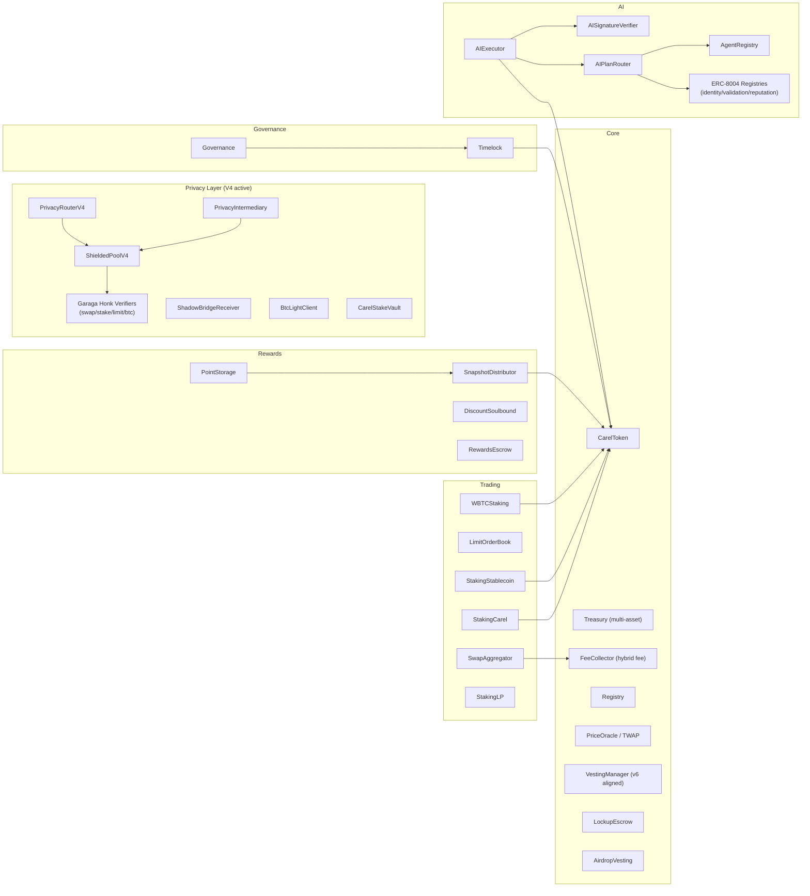
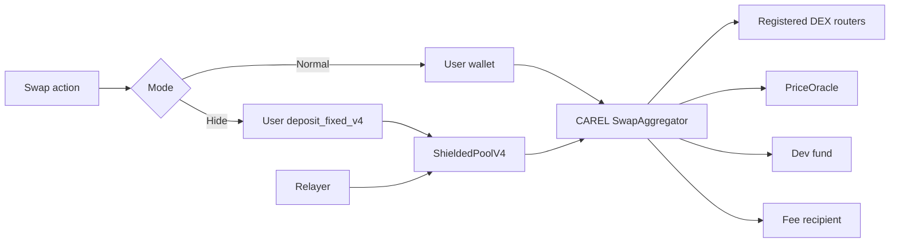
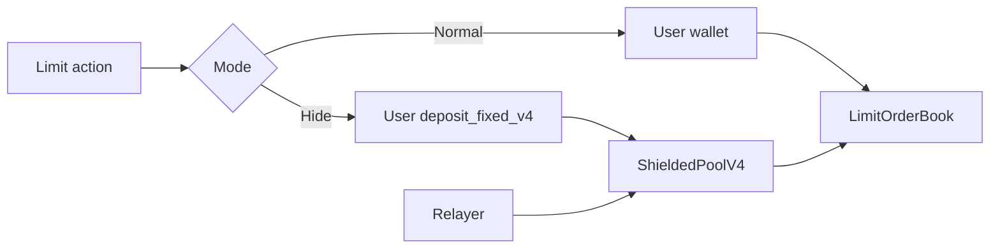
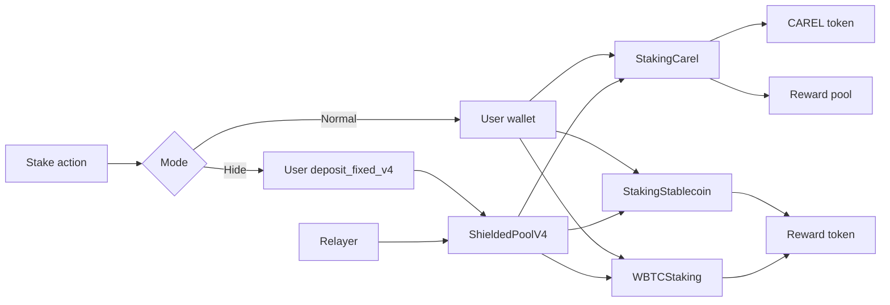

# CAREL Smart Contracts

Technical README for the `smartcontract/starknet/cairo/` module.
This file separates contract catalog inventory (`smartcontract/.env`) from FE/BE runtime profile values.

## Table of Contents
- [Scope](#scope)
- [Repository Structure](#repository-structure)
- [Address Profiles](#address-profiles)
- [On-Chain Architecture](#on-chain-architecture)
- [Core Contract Flows](#core-contract-flows)
- [Rewards, Points, and Discount NFT](#rewards-points-and-discount-nft)
- [OpenZeppelin Usage](#openzeppelin-usage)
- [Runtime Scope (Code-Verified)](#runtime-scope-code-verified)
- [Contract Catalog](#contract-catalog)
- [Build and Test](#build-and-test)
- [Deployment Docs](#deployment-docs)
- [Catalog Addresses (Starknet Sepolia)](#catalog-addresses-starknet-sepolia)
- [Runtime Address Overrides (FE/BE Profile)](#runtime-address-overrides-febe-profile)
- [Current Constraints](#current-constraints)
- [Internal Audit Status](#internal-audit-status)
- [Development Plan](#development-plan)
- [Related Docs](#related-docs)

## Scope
- Target network: Starknet Sepolia (MVP testnet).
- Two execution classes:
  - normal mode (direct wallet execution)
  - hide mode (relayer + private executor path)
- Contract catalog source of truth: `smartcontract/.env`.
- Runtime execution profile used by app layers may differ (`backend-rust/.env`, `frontend/.env*`).

## Repository Structure
```text
smartcontract/starknet/cairo/
  src/                      # Core protocol, trading, staking, privacy, AI, governance
    core/                   # Token, Treasury, FeeCollector, Registry, VestingManager, CarelProtocol, LockupEscrow, AirdropVesting
    trading/                # SwapAggregator, LimitOrderBook, Staking (CAREL/Stable/WBTC/LP), Battleship
    rewards/                # PointStorage, SnapshotDistributor, ReferralSystem, PointToken, RewardsEscrow
    nft/                    # DiscountSoulbound
    ai/                     # AIExecutor, AISignatureVerifier, AIPlanRouter, AgentRegistry, ERC-8004 registries
    governance/             # Governance, Timelock
    utils/                  # PriceOracle, TwapOracle, EmergencyPause, Multisig
    faucet/                 # MultiFaucet
    garaga_verifiers/       # Honk verifier suites: swap, stake, limit, btc
    privacy_router.cairo    # IPrivacyRouter interface (shared)
    privacy_router_v4.cairo # Active privacy router — routes actions to ShieldedPoolV4
    privacy_action_types.cairo
    shielded_pool_v4.cairo  # Active hide-mode pool with Merkle tree + Poseidon + ZK proof binding
    shadow_bridge_receiver.cairo
    btc_light_client.cairo
    carel_stake_vault.cairo
    honk_wrapper_adapter.cairo  # Wraps raw Garaga verifier into IProofVerifier for ShieldedPoolV4
    interfaces/             # i_ekubo, i_nostra, i_zklend, i_external_stake
    mocks/                  # mock_erc20, mock_signature_account (tests only)
  tests/                    # Main package tests
```

> **Note:** Legacy hide-mode contracts (ShieldedPoolV2, ShieldedPoolV3, PrivateActionExecutor) and legacy privacy routers (V1/V2, GaragaVerifierAdapter, VerifierRegistry, ShieldedVault) are not present in this source tree. They remain deployed at on-chain addresses listed below for migration/backward-compatibility windows only.

## Address Profiles
Use these profiles to avoid address conflicts:
- Catalog profile:
  - Source: `smartcontract/.env`
  - Usage: deployment inventory, script wiring, contract references
- Runtime profile:
  - Source: `backend-rust/.env` + `frontend/.env*`
  - Usage: active application execution path and live demos

If values differ, treat that as profile separation, not an automatic deployment error.

## On-Chain Architecture


## Core Contract Flows
- `SwapAggregator` is the CAREL routing contract. It can call registered DEX routers and use oracle-based quoting/fallback logic.
- `LimitOrderBook` is the contract in `src/trading/dca_orders.cairo`.
- `WBTCStaking` is the contract used for WBTC staking.
- `ShieldedPoolV4` is the active hide-mode pool. It maintains a depth-20 Merkle tree, enforces Poseidon-hashed nullifiers, binds actions to ZK proofs (Garaga Honk verifiers), and routes payout to recipient after proof verification.
- `PrivacyRouterV4` is the active router that receives `submit_action` calls and dispatches to `ShieldedPoolV4.submit_private_{swap,limit,stake}`.
- `ShieldedPoolV4` deposit uses `deposit_fixed_v4` (fixed-denomination note with Merkle leaf insertion). Execute paths are `execute_private_swap_v4`, `execute_private_limit_v4`, `execute_private_stake_internal_v4`, `execute_private_stake_external_v4`, `execute_private_unstake_v4`, `execute_private_claim_v4`.
- Hide mode uses pre-funded notes on `ShieldedPoolV4` via `deposit_fixed_v4` before relayer execution.

Privacy note (important):
- Starknet calldata and ERC20 transfers are public. Hide mode does **not** hide trade parameters (token pair, amount, route).
- Deposits/exits/payouts still create public token transfers (depositor/recipient and denomination tier remain observable).
- Hide mode focuses on note unlinkability (commitment vs nullifier) and proof-bound execution (relayer cannot mutate bound action/exit params).

### Swap


### Limit Order


### Staking


### AI
```mermaid
flowchart TD
  A[AI command] --> B[Planner + tool runner]
  B --> C[Plan + batch actions]
  C --> D[AgentRegistry: ERC-8004 identity + operator wallet]
  D --> E[User signs once (plan hash + agent id)]
  E --> F{Path}

  F --> L1[L1: backend response only]

  F --> L2[L2 normal]
  L2 --> L2A[AIExecutor submit_action or submit_action_from_plan]
  L2A --> L2B[Backend execute_action / batch_execute_actions]
  L2B --> L2C[Swap / Limit / Stake]

  F --> L3[L3 hide]
  L3 --> H1[Auto setup on-chain]
  H1 --> H2[User deposit note — deposit_fixed_v4]
  H2 --> H3[Mixing window]
  H3 --> H4[Relayer submit]
  H4 --> H5[ShieldedPoolV4]
  H5 --> H6[Swap / Limit / Stake]
```

AI notes:
- Single user signature authorizes the plan (batch actions) and is reused for L2/L3 execution after backend preflight.
- The plan hash must bind agent identity, operator wallet, chain id, expiry, and action list.
- `AIExecutor` stores L2/L3 tiers per user. Users call `upgrade_to_l2` or `upgrade_to_l3` paying CAREL to set their tier.
- Per-action fee on `submit_action` (v6 hybrid): L2 — `2` CAREL flat burn + `$0.30` USD-target in CAREL (TWAP oracle, 75% treasury + 25% buyback fund); L3 — `3` CAREL flat burn + `$0.50` USD-target. Weekly buyback epoch burns the accumulated 25% fund via market buy. Seed phase (pre-oracle): flat set to `5` CAREL until TWAP live.
- `submit_action_from_plan` is callable only from the `AIPlanRouter` contract (plan-bound submission path).
- L2 runs normal swap/limit/stake via `AIExecutor` + backend execution.
- L3 hide runs private swap/limit/stake via note deposit + mixing window + relayer submit into `ShieldedPoolV4`.
- AI points bonus is runtime-only: `L2 +20%`, `L3 +40%`.
- `AgentRegistry` stores agent identity (ERC-8004), operator wallet, manifest URI/hash, and structured run logs per run_id.
- Agent manifest + structured execution log templates: `docs/agent_manifest.json` and `docs/agent_log_template.json`.

`LimitOrderBook` stores user orders for normal (public) execution. Hide-mode limit orders run through `ShieldedPoolV4`, not the legacy privacy router. For AI, `L1` stays off-chain, `L2` covers normal swap/limit/stake execution through `AIExecutor`, and `L3` is reserved for private swap/limit/stake execution through the shielded pool. Bridge does not run on `L3` yet; users should stay on `L2` for bridge until the private bridge path exists.

## Rewards, Points, and Discount NFT
`PointStorage`, `SnapshotDistributor`, `ReferralSystem`, and `DiscountSoulbound` are the core rewards stack. The important split is that point formulas mostly live in runtime/backend code, while the Starknet contracts store epoch state, consume points, and settle claims.

### PointStorage
- `PointStorage` is the on-chain epoch ledger. `submit_points` writes the exact balance for `(epoch, user)`, `add_points` and `consume_points` mutate an existing balance, `finalize_epoch` locks the epoch, and `convert_points_to_carel` converts finalized points into a proportional CAREL allocation.
- Write permissions are explicit: `backend_signer` can write/finalize directly, `authorized_producers` can add points, and `authorized_consumers` can consume points.
- The privacy hook `submit_private_points_action` does not compute points; it forwards a proof-bound payload to the privacy router.

### Runtime points vs on-chain points
- The backend runtime keeps separate buckets for `swap_points`, `bridge_points`, `stake_points`, `referral_points`, and `social_points`.
- Product base rates in runtime are `10` points/USD for swap, `12` for limit order, `15` for ETH bridge, `25` for BTC/WBTC bridge, and `3` for stake before pool multiplier.
- Stake action multipliers in runtime are `CAREL 2x / 3x / 5x` at `>=100 / >=1,000 / >=10,000`, `WBTC 1.5x`, `USDT` / `USDC` / `STRK 1x`, and LP `5x`.
- AI level bonus is runtime-only: `L2 +20%`, `L3 +40%`.
- Swap, limit order, and stake preview paths also apply a hide-only USDT-equivalent tier bonus of `+5% / +10% / +20% / +30% / +50%` at `>=5 / >=10 / >=50 / >=100 / >=250`.
- After bucket updates, backend recomputes `total_points = (swap + bridge + stake + referral + social) * staking_multiplier * nft_factor`, then syncs the exact epoch total on-chain through `PointStorage.submit_points`.

### DiscountSoulbound
- `DiscountSoulbound` is a soulbound NFT paid with points from `PointStorage`, not with CAREL.
- Default constructor tiers are:

| Tier | Name | Cost | Discount | Max usage |
| --- | --- | --- | --- | --- |
| `1` | Bronze | Free (min 1 tx) | `5%` | `5` |
| `2` | Silver | `15,000` | `10%` | `7` |
| `3` | Gold | `50,000` | `25%` | `10` |
| `4` | Platinum | `150,000` | `35%` | `15` |
| `5` | Onyx | `500,000` | `50%` | `20` |

- `mint_nft` consumes points from the current epoch, `use_discount` / `use_discount_batch` spend usage quota, and `recharge_nft` resets usage. Current default recharge cost is `0` for all tiers.
- `user_nft` points to the latest NFT for the user. Runtime treats the discount as active only while `used_in_period < max_usage`.
- The privacy hook `submit_private_nft_action` forwards proof-bound NFT actions to the privacy router.

### SnapshotDistributor and ReferralSystem
- `SnapshotDistributor` stores one Merkle root per epoch, requires a minimum stake in the configured staking contract before claim, and mints CAREL on successful claims.
- Claim flow marks the claim first, then mints net reward after a `5%` tax split (`2.5%` treasury, `2.5%` dev).
- `ReferralSystem` keeps the referrer/referee graph on-chain, accrues referral bonus by epoch, and credits claimed bonus into `PointStorage`.
- Contract default referral settings are `100` minimum referee points and `10%` bonus rate (`1000` bps). Backend runtime adds another gate before referral sync: referee cumulative transaction volume must already be at least `$20`.
- `submit_private_snapshot_action` and `submit_private_referral_action` are privacy-router forwarding hooks, not independent reward calculators.

## OpenZeppelin Usage
This repo uses OpenZeppelin Cairo 0.20.0 components for token standards, ownership, access control, reentrancy protection, pausability, and nonce management. Business logic (swap routing, staking, limit orders, ZK proving) is custom Cairo. All owner-gated contracts use `OwnableTwoStepImpl` (two-step ownership transfer — requires `accept_ownership()` to complete a handover). Full component details per module are in the tables below; see [AUDIT.md](AUDIT.md) for security findings and breaking change notes.

**AI module** (`src/ai/`) — all 7 contracts were security-audited and upgraded to OZ components (see [AUDIT.md](AUDIT.md)):

| Contract | OZ Components |
|----------|--------------|
| `ai_executor.cairo` | `OwnableComponent` (two-step), `PausableComponent`, `ReentrancyGuardComponent`, `NoncesComponent` |
| `ai_plan_router.cairo` | `OwnableComponent` (two-step) |
| `ai_signature_verifier.cairo` | `OwnableComponent` (two-step) |
| `erc8004_identity_registry.cairo` | `OwnableComponent` (two-step), `NoncesComponent` |
| `erc8004_validation_registry.cairo` | `OwnableComponent` (two-step), `AccessControlComponent`, `SRC5Component` |
| `erc8004_reputation_registry.cairo` | `OwnableComponent` (two-step), `AccessControlComponent`, `SRC5Component` |
| `agent_registry.cairo` | `OwnableComponent` (two-step) |

All AI contracts use `OwnableTwoStepImpl` (two-step ownership transfer). `AccessControlComponent` requires `SRC5Component` as a dependency in OZ 0.20.0.

**Core module** (`src/core/`) — all 8 contracts audited and upgraded (see [AUDIT.md](AUDIT.md)):

| Contract | OZ Components |
|----------|--------------|
| `token.cairo` | `ERC20Component`, `AccessControlComponent`, `SRC5Component` (existing); nullifier replay protection added |
| `treasury.cairo` | `OwnableComponent` (two-step), `ReentrancyGuardComponent`; v6: multi-asset auto-convert, USD circuit breakers |
| `fee_collector.cairo` | `OwnableComponent` (two-step); v6: hybrid AI fee (flat burn + TWAP USD-target + buyback epoch) |
| `registry.cairo` | `OwnableComponent` (two-step) |
| `vesting_manager.cairo` | `OwnableComponent` (two-step); v6: vesting alignment fix (team ends after investor) |
| `carel_protocol.cairo` | `OwnableComponent` (two-step) — replaced raw `owner` storage field |
| `lockup_escrow.cairo` | `OwnableComponent` (two-step), `ReentrancyGuardComponent`; v6 new — 6/12-month escrow, 8/12% APR from buyback fund, 5% early penalty |
| `airdrop_vesting.cairo` | `OwnableComponent` (two-step), `ReentrancyGuardComponent`; v6 new — tiered recipient vesting (7/30/90d), Merkle proof, staker bypass |

**Governance module** (`src/governance/`) — audited and upgraded (see [AUDIT.md](AUDIT.md)):

| Contract | OZ Components |
|----------|--------------|
| `governance.cairo` | `OwnableComponent` (two-step) — replaced raw `owner` storage field |
| `timelock.cairo` | `OwnableComponent` (two-step) — replaced raw `admin` storage field; added `ITimelockAdmin` for proposer management |

**NFT module** (`src/nft/`) — audited and upgraded (see [AUDIT.md](AUDIT.md)):

| Contract | OZ Components |
|----------|--------------|
| `discount_soulbound.cairo` | `OwnableComponent` (two-step) — replaced raw `admin` storage field |

**Rewards module** (`src/rewards/`) — audited and upgraded (see [AUDIT.md](AUDIT.md)):

| Contract | OZ Components |
|----------|--------------|
| `point_storage.cairo` | `OwnableComponent` (two-step) added — constructor now requires `admin` param |
| `snapshot_distributor.cairo` | `OwnableComponent` (two-step) added, `ReentrancyGuardComponent` — constructor now requires `admin` as first param |
| `rewards_escrow.cairo` | `OwnableComponent` (two-step, upgraded from one-step), `ReentrancyGuardComponent` |
| `referral_system.cairo` | `OwnableComponent` (two-step, already present) — nullifier replay protection added |
| `point_token.cairo` | `OwnableComponent` (two-step) — replaced raw `admin_address` storage field |
| `merkle_verifier.cairo` | Pure computation — no admin components; NatSpec only |

**Utils module** (`src/utils/`) — audited and upgraded (see [AUDIT.md](AUDIT.md)):

| Contract | OZ Components |
|----------|--------------|
| `emergency_pause.cairo` | `AccessControlComponent`, `SRC5Component` (existing) — fixed Storage struct syntax error; nullifier replay protection added |
| `multisig.cairo` | No OZ ownership (multisig is its own auth mechanism) — nullifier replay protection and full event suite added |
| `price_oracle.cairo` | `OwnableComponent` (two-step) — replaced raw `owner` storage field; constructor now requires `admin` as first param |
| `twap_oracle.cairo` | `OwnableComponent` (two-step, upgraded from one-step) — nullifier replay protection added |

**Trading module** (`src/trading/`) — audited and upgraded (see [AUDIT.md](AUDIT.md)):

| Contract | OZ Components |
|----------|--------------|
| `staking_carel.cairo` | `OwnableComponent` (two-step) — replaced raw `owner`; `ReentrancyGuardComponent`; nullifier replay protection; constructor now requires `admin` as first param |
| `staking_stablecoin.cairo` | `OwnableComponent` (two-step) — replaced raw `owner`; `ReentrancyGuardComponent`; nullifier replay protection; constructor now requires `owner` as first param |
| `staking_wbtc.cairo` | `OwnableComponent` (two-step) — replaced raw `owner`; `ReentrancyGuardComponent`; nullifier replay protection; constructor now requires `owner` as first param |
| `staking_lp.cairo` | `OwnableComponent` (two-step) — replaced raw `owner`; `ReentrancyGuardComponent`; nullifier replay protection; constructor now requires `owner` as first param |
| `swap_aggregator.cairo` | `OwnableComponent` (two-step) — replaced raw `owner`; nullifier replay protection; `DexRegistered`, `FeeConfigUpdated`, `PrivacyRouterUpdated` events added |
| `dca_orders.cairo` | `OwnableComponent` (two-step) — replaced raw `owner`; `ReentrancyGuardComponent`; `KeeperUpdated` event added |
| `privacy_intermediary.cairo` | `OwnableComponent` (two-step, upgraded from one-step); NatSpec added |
| `battleship_garaga.cairo` | No admin components (ZK game); NatSpec only |

**src/ Root module** (privacy, bridge, stake vault) — audited and upgraded (see [AUDIT.md](AUDIT.md)):

| Contract | OZ Components |
|----------|--------------|
| `shielded_pool_v4.cairo` | `OwnableComponent` (two-step) — replaced raw `owner`; `ReentrancyGuardComponent` — replaced manual `reentrancy_lock` bool |
| `shadow_bridge_receiver.cairo` | `OwnableComponent` (two-step) — replaced raw `owner` |
| `carel_stake_vault.cairo` | `OwnableComponent` (two-step) — replaced raw `owner` |
| `privacy_router_v4.cairo` | `OwnableComponent` (two-step, upgraded from one-step) |
| `btc_light_client.cairo` | No admin components (stub — PoW/proof TODO); NatSpec only |
| `privacy_router.cairo` | Interface file — NatSpec only |
| `privacy_action_types.cairo` | Constants module — NatSpec only |
| `garaga_verifiers.cairo` | Module re-exports — NatSpec only |
| `honk_wrapper_adapter.cairo` | No admin components (stateless adapter); NatSpec added; moved from standalone package |

## Runtime Scope (Code-Verified)
| Module | Status | Evidence |
| --- | --- | --- |
| `ShieldedPoolV4` | Active hide-mode pool | `src/shielded_pool_v4.cairo` — Merkle tree depth-20, Honk verifier dispatch, Poseidon nullifiers |
| `PrivacyRouterV4` | Active privacy router | `src/privacy_router_v4.cairo` — routes submit_action to ShieldedPoolV4 |
| `ShieldedPoolV3` | Legacy (migration baseline, not in this source tree) | deployed at catalog address; kept for redeem-only migration window |
| `ShieldedPoolV2` | Legacy compatibility | deployed at catalog address; kept for migration |
| `LimitOrderBook` (limit order) | Active | `src/trading/dca_orders.cairo`, runtime uses `LIMIT_ORDER_BOOK_ADDRESS` |
| `DarkPool` | Deployed optional (not in source tree) | backend-only optional routes; not a default frontend path |

## Contract Catalog

### Core
- `CarelToken` (`src/core/token.cairo`) — ERC20 + AccessControl, supply cap 1B CAREL, balance checkpoints for governance voting
- `CarelProtocol` (`src/core/carel_protocol.cairo`) — high-level event-emitting facade for swap and BTC stake actions
- `Treasury` (`src/core/treasury.cairo`) — v6: multi-asset (35% USDC / 35% CAREL / 20% ETH+BTC / 10% LP), auto-convert 35% inflow → USDC, USD-denominated circuit breakers ($4M→25% / $2M→15% / $800K→5% / <$800K→paused)
- `FeeCollector` (`src/core/fee_collector.cairo`) — v6: hybrid AI fee — flat burn (2/3 CAREL) + USD-target ($0.30/$0.50 via TWAP) + weekly buyback-burn epoch (25% of USD component)
- `Registry` (`src/core/registry.cairo`)
- `VestingManager` (`src/core/vesting_manager.cairo`) — v6: alignment fix — Investor 12m cliff + 24m linear (end month 36), Team 12m cliff + 36m linear (end month 48), Ecosystem 36m linear
- `LockupEscrow` (`src/core/lockup_escrow.cairo`) — **v6 new** — on-chain escrow for lock-up bonus program; 6m=8% APR, 12m=12% APR; bonus from treasury buyback fund (no minting); 5% principal penalty + full bonus forfeit on early unlock
- `AirdropVesting` (`src/core/airdrop_vesting.cairo`) — **v6 new** — recipient vesting at claim time; tiered by amount (<1K instant, 1K–10K 7d, 10K–50K 30d, >50K 90d); staker bypass (≥30d stake = instant); Merkle proof verification per epoch; 5% claim fee (2.5% burn + 1.25% treasury + 1.25% dev)
- `PriceOracle` (`src/utils/price_oracle.cairo`)
- `TwapOracle` (`src/utils/twap_oracle.cairo`)
- `Multisig` (`src/utils/multisig.cairo`)
- `EmergencyPause` (`src/utils/emergency_pause.cairo`)

### Trading
- `SwapAggregator` (`src/trading/swap/swap_aggregator.cairo`) — multi-DEX router with oracle quoting, fee splitting (dev fund + fee recipient), MEV protection flag
- `ZkCarelRouter` (`src/trading/swap/router.cairo`) — full-featured swap + bridge router with private mode, MEV protection, and per-action fee BPS config (swap 0.3%, bridge 0.4%, MEV 0.15%, private 0.1%); integrates NFT discount and PointStorage
- `LimitOrderBook` (`src/trading/dca_orders.cairo`) — limit orders with keeper authorization; keepers call `execute_limit_order`, price checked against oracle
- `PrivacyIntermediary` (`src/trading/privacy_intermediary.cairo`) — signature + ZK proof bound proxy; routes arbitrary action calldata through the active shielded pool with nonce replay protection
- `PrivateSwap` (`src/trading/swap/private_swap.cairo`) — private swap action type handler
- `BattleshipGaraga` (`src/trading/battleship_garaga.cairo`) — ZK-based Battleship game using Garaga proofs

### Staking
- `StakingCarel` (`src/trading/staking/staking_carel.cairo`) — tiered APY CAREL staking, minimum lock period
- `StakingStablecoin` (`src/trading/staking/staking_stablecoin.cairo`)
- `StakingWBTC` (`src/trading/staking/staking_wbtc.cairo`)
- `StakingLP` (`src/trading/staking/staking_lp.cairo`) — multi-pool LP staking with per-pool APY and point multiplier

### Rewards
- `PointStorage` (`src/rewards/point_storage.cairo`)
- `SnapshotDistributor` (`src/rewards/snapshot_distributor.cairo`)
- `ReferralSystem` (`src/rewards/referral_system.cairo`)
- `MerkleVerifier` (`src/rewards/merkle_verifier.cairo`)
- `PointToken` (`src/rewards/point_token.cairo`) — ERC20 point token
- `RewardsEscrow` (`src/rewards/rewards_escrow.cairo`) — linear vesting escrow for reward payouts; supports `emergency_release` with penalty and a privacy hook `submit_private_rewards_action`
- `DiscountSoulbound` (`src/nft/discount_soulbound.cairo`)

### Privacy (V4 — active)
- `PrivacyRouterV4` (`src/privacy_router_v4.cairo`) — active router; dispatches `submit_action` calls to `ShieldedPoolV4.submit_private_{swap,limit,stake}`
- `ShieldedPoolV4` (`src/shielded_pool_v4.cairo`) — active hide-mode pool; depth-20 Merkle tree, Poseidon hashing, per-action Honk verifiers, exact-approval payout pattern, reentrancy guard
- `ShadowBridgeReceiver` (`src/shadow_bridge_receiver.cairo`) — operator-controlled bridge-receive path that deposits into `ShieldedPoolV4`
- `BtcLightClient` (`src/btc_light_client.cairo`) — stores BTC block headers and verifies BTC transaction inclusion proofs (stub — PoW/proof TODO)
- `RawHonkProofVerifierAdapter` (`src/honk_wrapper_adapter.cairo`) — wraps a standalone Garaga `verify_ultra_keccak_zk_honk_proof` verifier into the `IProofVerifier` interface consumed by `ShieldedPoolV4`; used by the headless build pipeline for standalone verifier deployments

### Privacy (legacy — deployed but NOT in this source tree)
The V1/V2 privacy router and associated legacy contracts are not present in this Cairo package source. They remain at on-chain addresses for backward-compatibility/migration windows only.
- `ZkPrivacyRouter` (V1) — on-chain at `ZK_PRIVACY_ROUTER_ADDRESS`
- `PrivacyRouter` (V2) — on-chain at `PRIVACY_ROUTER_ADDRESS`
- `VerifierRegistry` — on-chain at `VERIFIER_REGISTRY_ADDRESS`
- `GaragaVerifierAdapter` — on-chain at `GARAGA_ADAPTER_ADDRESS`
- `ShieldedVault` — on-chain at `SHIELDED_VAULT_ADDRESS`
- `PrivatePayments` — on-chain at `PRIVATE_PAYMENTS_ADDRESS`
- `AnonymousCredentials` — on-chain at `ANONYMOUS_CREDENTIALS_ADDRESS`

### Hide executors (legacy — deployed but NOT in this source tree)
- `ShieldedPoolV2` — on-chain at `HIDE_BALANCE_V2` (redeem-only window)
- `ShieldedPoolV3` — on-chain at migration baseline address
- `PrivateActionExecutor` — on-chain at `PRIVATE_ACTION_EXECUTOR_ADDRESS`

### Garaga Honk Verifiers
Four action-specific Honk verifier suites generated by Garaga. Each suite has `honk_verifier.cairo`, `honk_verifier_circuits.cairo`, and `honk_verifier_constants.cairo`.
- `SwapHonkVerifier` (`src/garaga_verifiers/swap_verifier/`)
- `StakeHonkVerifier` (`src/garaga_verifiers/stake_verifier/`)
- `LimitHonkVerifier` (`src/garaga_verifiers/limit_verifier/`)
- `BtcHonkVerifier` (`src/garaga_verifiers/btc_verifier/`)

### AI
- `AIExecutor` (`src/ai/ai_executor.cairo`) — manages AI action queue; user tiers (L1/L2/L3), rate limits, per-action fee burn/split; `submit_action`, `submit_action_from_plan`, `execute_action`, `batch_execute_actions`
- `AISignatureVerifier` (`src/ai/ai_signature_verifier.cairo`)
- `AIPlanRouter` (`src/ai/ai_plan_router.cairo`) — plan-based submission router; calls `AIExecutor.submit_action_from_plan`
- `AgentRegistry` (`src/ai/agent_registry.cairo`) — stores ERC-8004 agent identity, operator wallet, manifest URI/hash, and run logs per run_id
- `ERC8004IdentityRegistry` (`src/ai/erc8004_identity_registry.cairo`)
- `ERC8004ValidationRegistry` (`src/ai/erc8004_validation_registry.cairo`)
- `ERC8004ReputationRegistry` (`src/ai/erc8004_reputation_registry.cairo`)

### Governance
- `Governance` (`src/governance/governance.cairo`) — on-chain proposals with block-based voting windows; uses `CarelToken.get_past_votes` for snapshot voting power
- `Timelock` (`src/governance/timelock.cairo`) — enforces minimum 48-hour delay before executing sensitive governance actions; Poseidon-hashed transaction IDs

### Staking Vault
- `CarelStakeVault` (`src/carel_stake_vault.cairo`) — unified vault that delegates to internal staking or an external adapter (Ekubo/Nostra/zkLend via `IExternalStakeAdapter`)

### Faucet
- `MultiFaucet` (`src/faucet/multi_faucet.cairo`) — testnet faucet for multi-token distribution

### Bridge (legacy — not in this source tree)
- `BridgeAggregator` — deployed at `BRIDGE_AGGREGATOR_ADDRESS` (legacy)
- `DarkPool` — deployed at `DARK_POOL_ADDRESS` (legacy, backend-only optional route)

### External interfaces
- `IEkubo` (`src/interfaces/i_ekubo.cairo`)
- `INostra` (`src/interfaces/i_nostra.cairo`)
- `IZkLend` (`src/interfaces/i_zklend.cairo`)
- `IExternalStakeAdapter` (`src/interfaces/i_external_stake.cairo`)

## Build and Test
Build:
```bash
cd smartcontract/starknet/cairo
scarb build
```

Recommended test sequence:
```bash
# Core package
bash scripts/test_core_fast.sh

# Optional heavier verifier tests
bash scripts/test_garaga_fast.sh
```

Latest recorded local snapshot (2026-03-14):
- `smartcontract` (starknet/cairo): `172/172` passed

Full report: `../docs/test_reports.md`.

## Deployment Docs
- `smartcontract/DEPLOY_TESTNET.md`
- `smartcontract/scripts/README.md`
- Example command: `bash smartcontract/scripts/11_deploy_privacy_intermediary.sh`

## Catalog Addresses (Starknet Sepolia)
Source: `smartcontract/.env`.

### Core + rewards
| Contract | Env Key | Address |
| --- | --- | --- |
| CAREL Token | `CAREL_TOKEN_ADDRESS` | `0x0517f60f4ec4e1b2b748f0f642dfdcb32c0ddc893f777f2b595a4e4f6df51545` |
| Treasury | `TREASURY_CONTRACT_ADDRESS` | `0x0351e9882d322ab41239eb925f22d3a598290bda6a3a2e7ce560dcff8a119c7d` |
| VestingManager | `VESTING_MANAGER_ADDRESS` | `0x00ad575e602452b0146f93dfb525e2679d4ab9d2686b83019e0384c2009b206b` |
| FeeCollector | `FEE_COLLECTOR_ADDRESS` | `0x0192ddb217569ce0700ea537f809b7b83823d5b9f4629447094dcec3fd2d045e` |
| Registry | `REGISTRY_ADDRESS` | `0x06a6196d2077e40bcf86576234926478aaed865268fbd41777f3c8334e0bcb1a` |
| PriceOracle | `PRICE_ORACLE_ADDRESS` | `0x06d3bed050b11afad71022e9ea4d5401366b9c01ef8387df22de6155e6c6977a` |
| PointStorage | `POINT_STORAGE_ADDRESS` | `0x0501e74ab48e605ef81348a087d21c95ea5d43694ee1a60d6ca1e9186be54029` |
| SnapshotDistributor | `SNAPSHOT_DISTRIBUTOR_ADDRESS` | `0x04fcc58ba819766fe19b8f7a96ed5bd7b7558e8ad62f495815e825d8e8f822dd` |
| ReferralSystem | `REFERRAL_SYSTEM_ADDRESS` | `0x040bfc6214d3204c53898c730285d79d6e7cd2cd987e3ecde048b330ed3a2d06` |
| DiscountSoulbound | `DISCOUNT_SOULBOUND_ADDRESS` | `0x05b4c1e3578fd605b44b1950c749f01b2f652b8fd7a77135801d8d31af6fe809` |

### Trading + bridge
| Contract | Env Key | Address |
| --- | --- | --- |
| SwapAggregator | `SWAP_AGGREGATOR_ADDRESS` | `0x06f3e03be8a82746394c4ad20c6888dd260a69452a50eb3121252fdecacc6d28` |
| BridgeAggregator (legacy) | `BRIDGE_AGGREGATOR_ADDRESS` | `0x047ed770a6945fc51ce3ed32645ed71260fae278421826ee4edabeae32b755d5` |
| Limit Order Book | `LIMIT_ORDER_BOOK_ADDRESS` | `0x06b189eef1358559681712ff6e9387c2f6d43309e27705d26daff4e3ba1fdf8a` |
| LimitOrderBook (legacy key: `KEEPER_NETWORK_ADDRESS`) | `KEEPER_NETWORK_ADDRESS` | `0x072e4038cd806f2bcc3e0e111c19517f6c14081e658d7d9af6e88e314bf35132` |
| PrivateBTCSwap (legacy) | `PRIVATE_BTC_SWAP_ADDRESS` | `0x006faaf4bbd1f3139b4b409e1bdea0eada42901674e1f6abe2699ece84a181a3` |
| DarkPool (legacy) | `DARK_POOL_ADDRESS` | `0x03bec062a2789e399999e088a662e8d8d11e168e9c734e57dd333615baeb1385` |

### Staking
| Contract | Env Key | Address |
| --- | --- | --- |
| StakingCarel | `STAKING_CAREL_ADDRESS` | `0x06ed000cdf98b371dbb0b8f6a5aa5b114fb218e3c75a261d7692ceb55825accb` |
| StakingStablecoin | `STAKING_STABLECOIN_ADDRESS` | `0x014f58753338f2f470c397a1c7ad1cfdc381a951b314ec2d7c9aec06a73a0aff` |
| StakingWBTC (WBTC staking) | `STAKING_WBTC_ADDRESS` | `0x01fa14e91abade76d753d718640a14540032c307832a435f8781d446b288cdf8` |

### Privacy + hide
| Contract | Env Key | Address |
| --- | --- | --- |
| ZkPrivacyRouter (V1, legacy) | `ZK_PRIVACY_ROUTER_ADDRESS` | `0x00694e35433fe3ce49431e1816f4d4df9ab6d550a3f73f8f07f9c2cc69b6891b` |
| PrivacyRouter (V2, legacy) | `PRIVACY_ROUTER_ADDRESS` | `0x0133e0c11f4df0a77d6a3b46e301f402c6fa6817e9a8d79c2dc0cd45f244c364` |
| VerifierRegistry (legacy) | `VERIFIER_REGISTRY_ADDRESS` | `0x02e3aa26983b1c9cca8f8092b59eb18ba4877ed27eb6a80b36ef09175f352046` |
| GaragaVerifierAdapter (legacy) | `GARAGA_ADAPTER_ADDRESS` | `0x07dc2000785cd8a8a1f8435b386d2fdf1a9f2b23c66670ea87bdd59e3c3c2d03` |
| GaragaVerifier (legacy) | `GARAGA_VERIFIER_ADDRESS` | `0x04bc6f22779e528785ee27b844b93e92cf92d8ff0b6bed2f9b5cf41ee467ff45` |
| PrivacyIntermediary | `PRIVACY_INTERMEDIARY_ADDRESS` | `0x0246cd17157819eb614e318d468270981d10e6b6e99bcaa7ca4b43d53de810ab` |
| PrivateActionExecutor (legacy catalog) | `PRIVATE_ACTION_EXECUTOR_ADDRESS` | `0x01f7f3bcdfd94d0b28dd658882bef53787b4e9d40a6aa4ced65440ab76e0e191` |
| ShieldedVault (legacy) | `SHIELDED_VAULT_ADDRESS` | `0x07e09754f159ee7bce0b1d297315eea6bb22bc912e92741a7e8c793ef24a6abb` |
| PrivatePayments (legacy) | `PRIVATE_PAYMENTS_ADDRESS` | `0x00e9efd7e5cb33f1d8eb4779c8fe68d1836141feb826b18d132c8ca1da391b94` |
| AnonymousCredentials (legacy) | `ANONYMOUS_CREDENTIALS_ADDRESS` | `0x040a454139f2df866b3ea34247d67126f8a6a8e61e5e9ac3b3ed27ad12e1d57d` |

### AI + tokens
| Contract/Token | Env Key | Address |
| --- | --- | --- |
| AIExecutor | `AI_EXECUTOR_ADDRESS` | `0x00d8ada9eb26d133f9f2656ac1618d8cdf9fcefe6c8e292cf9b7ee580b72a690` |
| AISignatureVerifier | `AI_SIGNATURE_VERIFIER_ADDRESS` | `0x033d199bd31a34d890b85e10c606dda54962dd1d906960afd22b050313a0f86d` |
| STRK | `TOKEN_STRK_ADDRESS` | `0x04718f5a0Fc34cC1AF16A1cdee98fFB20C31f5cD61D6Ab07201858f4287c938D` |
| USDC (MockERC20) | `TOKEN_USDC_ADDRESS` | `0x05a26f9680c5dc0c36dcf1670d7f51f24ba0080d15fedb7396d23a77bf5c1924` |
| USDT (MockERC20) | `TOKEN_USDT_ADDRESS` | `0x07439bce89f5559b3f6aa1793291c5bb20c03adf5bac57debe4d7209c2cb053b` |
| WBTC (`TOKEN_BTC_ADDRESS` legacy alias) | `TOKEN_WBTC_ADDRESS` | `0x496bef3ed20371382fbe0ca6a5a64252c5c848f9f1f0cccf8110fc4def912d5` |

## Runtime Address Overrides (FE/BE Profile)
Active app runtime profile currently uses these overrides (from `backend-rust/.env`):
- `ZK_PRIVACY_ROUTER_ADDRESS`: `0x0682719dbe8364fc5c772f49ecb63ea2f2cf5aa919b7d5baffb4448bb4438d1f`
- `PRIVATE_ACTION_EXECUTOR_ADDRESS`: `0x01f7f3bcdfd94d0b28dd658882bef53787b4e9d40a6aa4ced65440ab76e0e191`
- `HIDE_BALANCE_EXECUTOR_KIND=shielded_pool_v3`
- `HIDE_BALANCE_POOL_VERSION_DEFAULT=v3`
- `HIDE_BALANCE_V2_REDEEM_ONLY=true`

> **Note:** The runtime profile still references `shielded_pool_v3` / `v3` keys. In-source code, `ShieldedPoolV4` is the implemented pool. Update these runtime overrides when V4 deployment addresses are confirmed.

Use this override set for FE/BE runtime demos. Keep catalog inventory unchanged unless redeploy/wiring is confirmed.

## Current Constraints
- Hide mode reduces linkability, but chain-level metadata remains public.
- `MockGaragaVerifier` is test-only (unit tests/local dev). Public Sepolia demo uses the real Garaga Honk verifier contracts per action type.
- Contract upgrades currently require redeploy/migration (no proxy strategy in current baseline).
- Bridge behavior depends on external providers.
- `ShieldedPoolV4` and `PrivacyRouterV4` are implemented in source but do not yet have confirmed Sepolia catalog addresses; they are not listed in the addresses table above.

## Internal Audit Status

All modules audited as of 2026-04-27. Full findings, detailed analysis, OZ component tables, and breaking change notes: [AUDIT.md](AUDIT.md).

## Development Plan

**M1 (July 2026):**
- Redeploy ShieldedPoolV4 + verifier wrapper with `public_inputs` binding fix — update catalog addresses
- Update runtime profile to V4 keys after deployment
- Reduce AIExecutor gas: ~5M → ≤1.5M
- Reduce TwapOracle gas: ~3.5M → ≤200K
- Implement BTC Light Client PoW in `btc_light_client.cairo` (replace TODO stub)
- Move mixing-window enforcement from UX-only to on-chain in ShieldedPoolV4
- Update all 4 Noir circuits for complete on-chain field binding
- Deploy `LockupEscrow` and `AirdropVesting` — add catalog addresses
- Wire `FeeCollector` to TWAP oracle for hybrid AI fee activation
- Wire `Treasury` auto-convert to DEX router for 35% CAREL→USDC rule

**M2 (September 2026):**
- Deploy Battleship Noir circuit + Groth16/BLS12-381 verifier to Sepolia
- Deploy Sumo Login contracts (SumoLoginContract + SumoAccountContract)
- AI agent semi-autonomous upgrade on-chain

**M3 (November 2026):**
- AI agent full autonomous (ERC-8004 compliant) — multi-step execution
- Shadow Bitcoin Bridge lock-mint contract wiring complete
- Admin single-key migrated to Multisig + 48h Timelock

**Growth phase (post-seed):**
- External security audit — ShieldedPoolV4, relayer surfaces, v6 additions
- Mainnet redeploy after audit clearance

## Related Docs
- [AUDIT.md](AUDIT.md) — Internal security audit findings and OZ upgrade notes
- [Contracts](https://docs-site-two-teal.vercel.app/contracts) — Deployed contract addresses (public docs)
- [Security](https://docs-site-two-teal.vercel.app/security) — Security status and audit summary
- [Roadmap](https://docs-site-two-teal.vercel.app/roadmap) — Full milestone roadmap
- `smartcontract/starknet/scripts/README.md` — Deployment scripts reference
